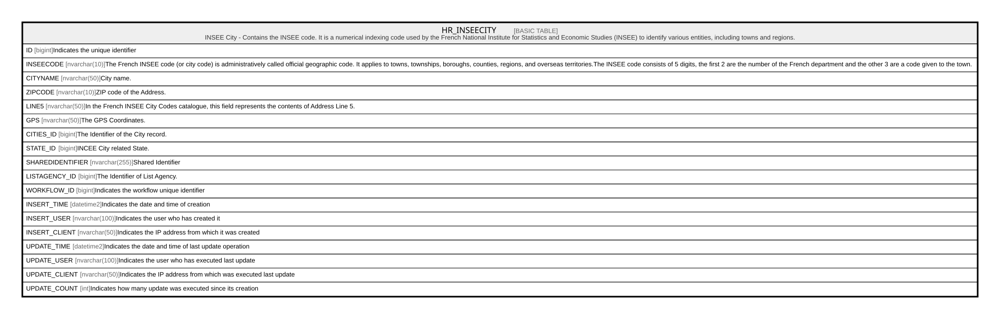

# HR_INSEECITY

## Description

INSEE City - Contains the INSEE code. It is a numerical indexing code used by the French National Institute for Statistics and Economic Studies (INSEE) to identify various entities, including towns and regions.  

## Columns

| Name | Type | Default | Nullable | Comment |
| ---- | ---- | ------- | -------- | ------- |
| ID | bigint |  | false | Indicates the unique identifier |
| INSEECODE | nvarchar(10) |  | true | The French INSEE code (or city code) is administratively called official geographic code. It applies to towns, townships, boroughs, counties, regions, and overseas territories.The INSEE code consists of 5 digits, the first 2 are the number of the French department and the other 3 are a code given to the town. |
| CITYNAME | nvarchar(50) |  | true | City name. |
| ZIPCODE | nvarchar(10) |  | true | ZIP code of the Address. |
| LINE5 | nvarchar(50) |  | true | In the French INSEE City Codes catalogue, this field represents the contents of Address Line 5. |
| GPS | nvarchar(50) |  | true | The GPS Coordinates. |
| CITIES_ID | bigint |  | true | The Identifier of the City record. |
| STATE_ID | bigint |  | true | INCEE City related State. |
| SHAREDIDENTIFIER | nvarchar(255) |  | true | Shared Identifier |
| LISTAGENCY_ID | bigint |  | true | The Identifier of List Agency. |
| WORKFLOW_ID | bigint |  | true | Indicates the workflow unique identifier |
| INSERT_TIME | datetime2 | (sysutcdatetime()) | false | Indicates the date and time of creation |
| INSERT_USER | nvarchar(100) | (N'MAIN') | false | Indicates the user who has created it |
| INSERT_CLIENT | nvarchar(50) | (N'localhost') | false | Indicates the IP address from which it was created |
| UPDATE_TIME | datetime2 | (sysutcdatetime()) | false | Indicates the date and time of last update operation |
| UPDATE_USER | nvarchar(100) | (N'MAIN') | false | Indicates the user who has executed last update |
| UPDATE_CLIENT | nvarchar(50) | (N'localhost') | false | Indicates the IP address from which was executed last update |
| UPDATE_COUNT | int | ((0)) | false | Indicates how many update was executed since its creation |

## Constraints

| Name | Type | Definition |
| ---- | ---- | ---------- |
| PK_INSEECITY | PRIMARY KEY | CLUSTERED, unique, part of a PRIMARY KEY constraint, [ ID ] |

## Indexes

| Name | Definition |
| ---- | ---------- |
| PK_INSEECITY | CLUSTERED, unique, part of a PRIMARY KEY constraint, [ ID ] |
| IDX_INSEECITY_CITIES | NONCLUSTERED, [ CITIES_ID ] |
| IDX_INSEECITY_STATE | NONCLUSTERED, [ STATE_ID ] |

## Relations

---

> Generated by [tbls](https://github.com/k1LoW/tbls)
