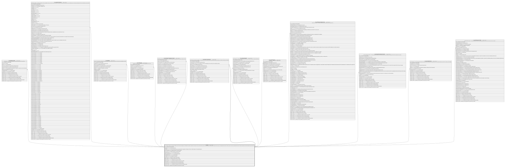

# HR_JOB

## Description

Job - Contains a collection of information relating to a job. A job can be thought of as a template for a position. A position is an instance of a job. Jobs describe the nature of the work, whereas related positions represent the time, place, and organizational structure in which a person or persons actually perform the work. Positions usually have a specific budget associated with them.  

## Columns

| Name | Type | Default | Nullable | Children | Comment |
| ---- | ---- | ------- | -------- | -------- | ------- |
| ID | bigint |  | false | [HR_JOBEDUCATION](HR_JOBEDUCATION.md) [HR_SHORTLISTEDCND](HR_SHORTLISTEDCND.md) [HR_JOBGRID](HR_JOBGRID.md) [HR_COURSEJOB](HR_COURSEJOB.md) [HR_MISCEMPLTERMINDUCTIONS](HR_MISCEMPLTERMINDUCTIONS.md) [HR_JOBACCOUNTABILITY](HR_JOBACCOUNTABILITY.md) [HR_JOBASSIGNMENT](HR_JOBASSIGNMENT.md) [HR_JOBATTRIBUTES](HR_JOBATTRIBUTES.md) [HR_APPRAISALFORMSECTION](HR_APPRAISALFORMSECTION.md) [HR_PREVEMPLOYMENTHISTORY](HR_PREVEMPLOYMENTHISTORY.md) [HR_JOBCOMPETENCY](HR_JOBCOMPETENCY.md) [HR_APPRAISALSECTION](HR_APPRAISALSECTION.md) | Indicates the unique identifier |
| JOBCODE | nvarchar(100) |  | false |  | The code of the Job. |
| JOBNAME | nvarchar(255) |  | false |  | Is the Job Name a person can be given within the organization. Examples are Director, Software Engineer, Purchasing Manager etc |
| EFFECTIVEFROM | date |  | false |  | The validity start date for an historical situation. |
| EFFECTIVETO | date |  | true |  | The validity end date for an historical situation. |
| JOBDESCRIPTION | nvarchar(MAX) |  | true |  | The decription of the Job. |
| JOBFULLDESCRIPTION | nvarchar(MAX) |  | true |  | Job Title full description |
| SHAREDIDENTIFIER | nvarchar(255) |  | true |  | Shared Identifier |
| LISTAGENCY_ID | bigint |  | true |  | The Identifier of List Agency. |
| WORKFLOW_ID | bigint |  | true |  | Indicates the workflow unique identifier |
| INSERT_TIME | datetime2 | (sysutcdatetime()) | false |  | Indicates the date and time of creation |
| INSERT_USER | nvarchar(100) | (N'MAIN') | false |  | Indicates the user who has created it |
| INSERT_CLIENT | nvarchar(50) | (N'localhost') | false |  | Indicates the IP address from which it was created |
| UPDATE_TIME | datetime2 | (sysutcdatetime()) | false |  | Indicates the date and time of last update operation |
| UPDATE_USER | nvarchar(100) | (N'MAIN') | false |  | Indicates the user who has executed last update |
| UPDATE_CLIENT | nvarchar(50) | (N'localhost') | false |  | Indicates the IP address from which was executed last update |
| UPDATE_COUNT | int | ((0)) | false |  | Indicates how many update was executed since its creation |

## Constraints

| Name | Type | Definition |
| ---- | ---- | ---------- |
| PK_JOB | PRIMARY KEY | CLUSTERED, unique, part of a PRIMARY KEY constraint, [ ID ] |

## Indexes

| Name | Definition |
| ---- | ---------- |
| PK_JOB | CLUSTERED, unique, part of a PRIMARY KEY constraint, [ ID ] |
| IDX_JOB_JOBCODE | NONCLUSTERED, unique, [ JOBCODE ] |
| IDX_JOB_SHAREDLISTAG | NONCLUSTERED, unique, [ SHAREDIDENTIFIER, LISTAGENCY_ID ] |

## Relations

---

> Generated by [tbls](https://github.com/k1LoW/tbls)
