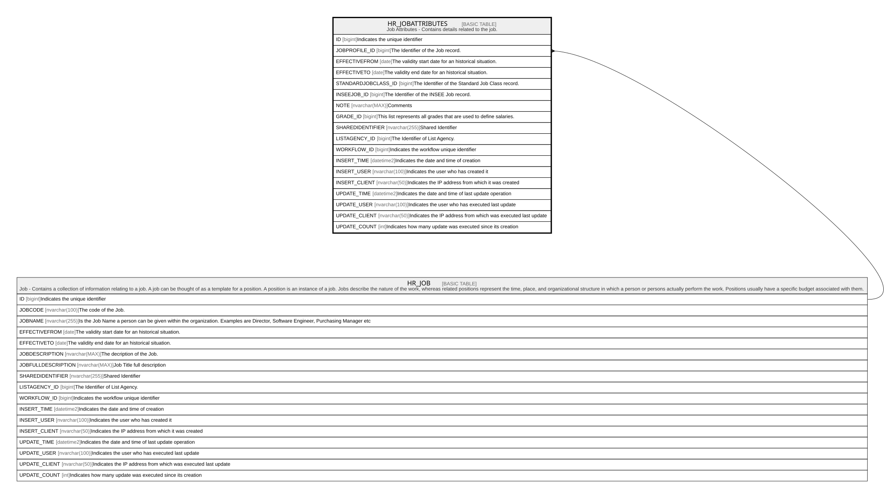

# HR_JOBATTRIBUTES

## Description

Job Attributes - Contains details related to the job.  

## Columns

| Name | Type | Default | Nullable | Parents | Comment |
| ---- | ---- | ------- | -------- | ------- | ------- |
| ID | bigint |  | false |  | Indicates the unique identifier |
| JOBPROFILE_ID | bigint |  | false | [HR_JOB](HR_JOB.md) | The Identifier of the Job record. |
| EFFECTIVEFROM | date |  | false |  | The validity start date for an historical situation. |
| EFFECTIVETO | date |  | true |  | The validity end date for an historical situation. |
| STANDARDJOBCLASS_ID | bigint |  | true |  | The Identifier of the Standard Job Class record. |
| INSEEJOB_ID | bigint |  | true |  | The Identifier of the INSEE Job record. |
| NOTE | nvarchar(MAX) |  | true |  | Comments |
| GRADE_ID | bigint |  | true |  | This list represents all grades that are used to define salaries. |
| SHAREDIDENTIFIER | nvarchar(255) |  | true |  | Shared Identifier |
| LISTAGENCY_ID | bigint |  | true |  | The Identifier of List Agency. |
| WORKFLOW_ID | bigint |  | true |  | Indicates the workflow unique identifier |
| INSERT_TIME | datetime2 | (sysutcdatetime()) | false |  | Indicates the date and time of creation |
| INSERT_USER | nvarchar(100) | (N'MAIN') | false |  | Indicates the user who has created it |
| INSERT_CLIENT | nvarchar(50) | (N'localhost') | false |  | Indicates the IP address from which it was created |
| UPDATE_TIME | datetime2 | (sysutcdatetime()) | false |  | Indicates the date and time of last update operation |
| UPDATE_USER | nvarchar(100) | (N'MAIN') | false |  | Indicates the user who has executed last update |
| UPDATE_CLIENT | nvarchar(50) | (N'localhost') | false |  | Indicates the IP address from which was executed last update |
| UPDATE_COUNT | int | ((0)) | false |  | Indicates how many update was executed since its creation |

## Constraints

| Name | Type | Definition |
| ---- | ---- | ---------- |
| PK_JOBATTRIBUTES | PRIMARY KEY | CLUSTERED, unique, part of a PRIMARY KEY constraint, [ ID ] |
| FK_JOBATTRIBUTES_JOB | FOREIGN KEY | FOREIGN KEY(JOBPROFILE_ID) REFERENCES HR_JOB(ID) ON UPDATE NO_ACTION ON DELETE NO_ACTION |

## Indexes

| Name | Definition |
| ---- | ---------- |
| PK_JOBATTRIBUTES | CLUSTERED, unique, part of a PRIMARY KEY constraint, [ ID ] |
| IDX_JOBATTRIBUTES_JOBPEFF | NONCLUSTERED, unique, [ JOBPROFILE_ID, EFFECTIVEFROM ] |
| IDX_JOBATTRIBUTES_INSEE | NONCLUSTERED, [ INSEEJOB_ID ] |
| IDX_JOBATTRIBUTES_JOBCLASS | NONCLUSTERED, [ STANDARDJOBCLASS_ID ] |

## Relations

---

> Generated by [tbls](https://github.com/k1LoW/tbls)
