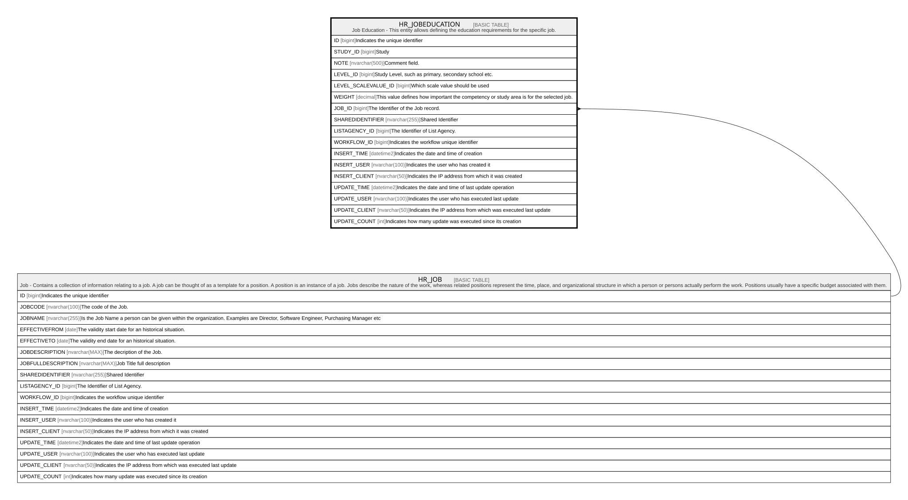

# HR_JOBEDUCATION

## Description

Job Education - This entity allows defining the education requirements for the specific job.  

## Columns

| Name | Type | Default | Nullable | Parents | Comment |
| ---- | ---- | ------- | -------- | ------- | ------- |
| ID | bigint |  | false |  | Indicates the unique identifier |
| STUDY_ID | bigint |  | false |  | Study |
| NOTE | nvarchar(500) |  | true |  | Comment field. |
| LEVEL_ID | bigint |  | true |  | Study Level, such as primary, secondary school etc. |
| LEVEL_SCALEVALUE_ID | bigint |  | true |  | Which scale value should be used |
| WEIGHT | decimal |  | true |  | This value defines how important the competency or study area is for the selected job. |
| JOB_ID | bigint |  | false | [HR_JOB](HR_JOB.md) | The Identifier of the Job record. |
| SHAREDIDENTIFIER | nvarchar(255) |  | true |  | Shared Identifier |
| LISTAGENCY_ID | bigint |  | true |  | The Identifier of List Agency. |
| WORKFLOW_ID | bigint |  | true |  | Indicates the workflow unique identifier |
| INSERT_TIME | datetime2 | (sysutcdatetime()) | false |  | Indicates the date and time of creation |
| INSERT_USER | nvarchar(100) | (N'MAIN') | false |  | Indicates the user who has created it |
| INSERT_CLIENT | nvarchar(50) | (N'localhost') | false |  | Indicates the IP address from which it was created |
| UPDATE_TIME | datetime2 | (sysutcdatetime()) | false |  | Indicates the date and time of last update operation |
| UPDATE_USER | nvarchar(100) | (N'MAIN') | false |  | Indicates the user who has executed last update |
| UPDATE_CLIENT | nvarchar(50) | (N'localhost') | false |  | Indicates the IP address from which was executed last update |
| UPDATE_COUNT | int | ((0)) | false |  | Indicates how many update was executed since its creation |

## Constraints

| Name | Type | Definition |
| ---- | ---- | ---------- |
| PK_HR_JOBEDUCATION | PRIMARY KEY | CLUSTERED, unique, part of a PRIMARY KEY constraint, [ ID ] |
| UQ_JOBEDUCATION | UNIQUE | NONCLUSTERED, unique, part of a UNIQUE constraint, [ JOB_ID, STUDY_ID ] |
| FK_HR_JOBEDUCATION_HR_JOB | FOREIGN KEY | FOREIGN KEY(JOB_ID) REFERENCES HR_JOB(ID) ON UPDATE NO_ACTION ON DELETE NO_ACTION |

## Indexes

| Name | Definition |
| ---- | ---------- |
| PK_HR_JOBEDUCATION | CLUSTERED, unique, part of a PRIMARY KEY constraint, [ ID ] |
| UQ_JOBEDUCATION | NONCLUSTERED, unique, part of a UNIQUE constraint, [ JOB_ID, STUDY_ID ] |

## Relations

---

> Generated by [tbls](https://github.com/k1LoW/tbls)
