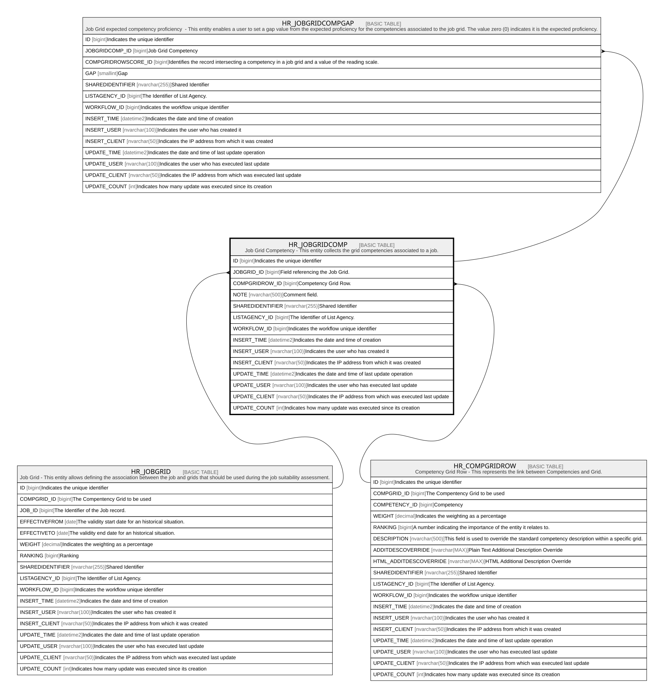

# HR_JOBGRIDCOMP

## Description

Job Grid Competency - This entity collects the grid competencies associated to a job.  

## Columns

| Name | Type | Default | Nullable | Children | Parents | Comment |
| ---- | ---- | ------- | -------- | -------- | ------- | ------- |
| ID | bigint |  | false | [HR_JOBGRIDCOMPGAP](HR_JOBGRIDCOMPGAP.md) |  | Indicates the unique identifier |
| JOBGRID_ID | bigint |  | false |  | [HR_JOBGRID](HR_JOBGRID.md) | Field referencing the Job Grid. |
| COMPGRIDROW_ID | bigint |  | false |  | [HR_COMPGRIDROW](HR_COMPGRIDROW.md) | Competency Grid Row. |
| NOTE | nvarchar(500) |  | true |  |  | Comment field. |
| SHAREDIDENTIFIER | nvarchar(255) |  | true |  |  | Shared Identifier |
| LISTAGENCY_ID | bigint |  | true |  |  | The Identifier of List Agency. |
| WORKFLOW_ID | bigint |  | true |  |  | Indicates the workflow unique identifier |
| INSERT_TIME | datetime2 | (sysutcdatetime()) | false |  |  | Indicates the date and time of creation |
| INSERT_USER | nvarchar(100) | (N'MAIN') | false |  |  | Indicates the user who has created it |
| INSERT_CLIENT | nvarchar(50) | (N'localhost') | false |  |  | Indicates the IP address from which it was created |
| UPDATE_TIME | datetime2 | (sysutcdatetime()) | false |  |  | Indicates the date and time of last update operation |
| UPDATE_USER | nvarchar(100) | (N'MAIN') | false |  |  | Indicates the user who has executed last update |
| UPDATE_CLIENT | nvarchar(50) | (N'localhost') | false |  |  | Indicates the IP address from which was executed last update |
| UPDATE_COUNT | int | ((0)) | false |  |  | Indicates how many update was executed since its creation |

## Constraints

| Name | Type | Definition |
| ---- | ---- | ---------- |
| PK_HR_JOBGRIDCOMP | PRIMARY KEY | CLUSTERED, unique, part of a PRIMARY KEY constraint, [ ID ] |
| UQ_JOBGRIDCOMP | UNIQUE | NONCLUSTERED, unique, part of a UNIQUE constraint, [ JOBGRID_ID, COMPGRIDROW_ID ] |
| FK_JOBGRIDCOMP_COMPGRIDROW | FOREIGN KEY | FOREIGN KEY(COMPGRIDROW_ID) REFERENCES HR_COMPGRIDROW(ID) ON UPDATE NO_ACTION ON DELETE NO_ACTION |
| FK_JOBGRIDCOMP_JOBGRID | FOREIGN KEY | FOREIGN KEY(JOBGRID_ID) REFERENCES HR_JOBGRID(ID) ON UPDATE NO_ACTION ON DELETE NO_ACTION |

## Indexes

| Name | Definition |
| ---- | ---------- |
| PK_HR_JOBGRIDCOMP | CLUSTERED, unique, part of a PRIMARY KEY constraint, [ ID ] |
| UQ_JOBGRIDCOMP | NONCLUSTERED, unique, part of a UNIQUE constraint, [ JOBGRID_ID, COMPGRIDROW_ID ] |

## Relations

---

> Generated by [tbls](https://github.com/k1LoW/tbls)
