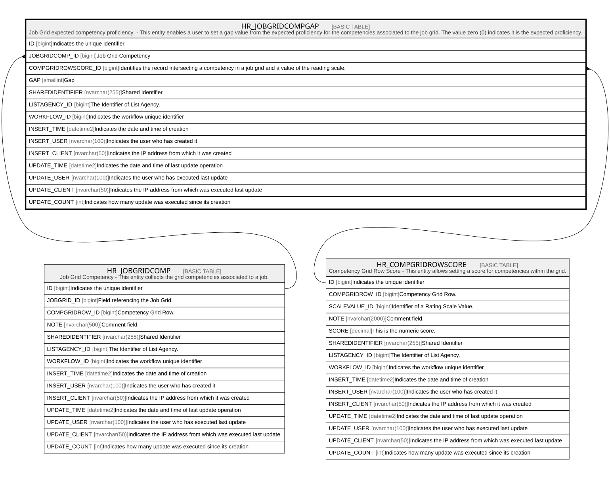

# HR_JOBGRIDCOMPGAP

## Description

Job Grid expected competency proficiency  - This entity enables a user to set a gap value from the expected proficiency for the competencies associated to the job grid. The value zero (0) indicates it is the expected proficiency.  

## Columns

| Name | Type | Default | Nullable | Parents | Comment |
| ---- | ---- | ------- | -------- | ------- | ------- |
| ID | bigint |  | false |  | Indicates the unique identifier |
| JOBGRIDCOMP_ID | bigint |  | false | [HR_JOBGRIDCOMP](HR_JOBGRIDCOMP.md) | Job Grid Competency |
| COMPGRIDROWSCORE_ID | bigint |  | false | [HR_COMPGRIDROWSCORE](HR_COMPGRIDROWSCORE.md) | Identifies the record intersecting a competency in a job grid and a value of the reading scale. |
| GAP | smallint |  | true |  | Gap |
| SHAREDIDENTIFIER | nvarchar(255) |  | true |  | Shared Identifier |
| LISTAGENCY_ID | bigint |  | true |  | The Identifier of List Agency. |
| WORKFLOW_ID | bigint |  | true |  | Indicates the workflow unique identifier |
| INSERT_TIME | datetime2 | (sysutcdatetime()) | false |  | Indicates the date and time of creation |
| INSERT_USER | nvarchar(100) | (N'MAIN') | false |  | Indicates the user who has created it |
| INSERT_CLIENT | nvarchar(50) | (N'localhost') | false |  | Indicates the IP address from which it was created |
| UPDATE_TIME | datetime2 | (sysutcdatetime()) | false |  | Indicates the date and time of last update operation |
| UPDATE_USER | nvarchar(100) | (N'MAIN') | false |  | Indicates the user who has executed last update |
| UPDATE_CLIENT | nvarchar(50) | (N'localhost') | false |  | Indicates the IP address from which was executed last update |
| UPDATE_COUNT | int | ((0)) | false |  | Indicates how many update was executed since its creation |

## Constraints

| Name | Type | Definition |
| ---- | ---- | ---------- |
| PK_HR_JOBCOMPGRIDGAP | PRIMARY KEY | CLUSTERED, unique, part of a PRIMARY KEY constraint, [ ID ] |
| UQ_JOBGRIDCOMPGAP | UNIQUE | NONCLUSTERED, unique, part of a UNIQUE constraint, [ JOBGRIDCOMP_ID, COMPGRIDROWSCORE_ID ] |
| FK_JOBCMPGRIDGAP_CMPGRIDROWSCR | FOREIGN KEY | FOREIGN KEY(COMPGRIDROWSCORE_ID) REFERENCES HR_COMPGRIDROWSCORE(ID) ON UPDATE NO_ACTION ON DELETE NO_ACTION |
| FK_JOBOMPGRIDGAP_JOBGRIDCMP | FOREIGN KEY | FOREIGN KEY(JOBGRIDCOMP_ID) REFERENCES HR_JOBGRIDCOMP(ID) ON UPDATE NO_ACTION ON DELETE NO_ACTION |

## Indexes

| Name | Definition |
| ---- | ---------- |
| PK_HR_JOBCOMPGRIDGAP | CLUSTERED, unique, part of a PRIMARY KEY constraint, [ ID ] |
| UQ_JOBGRIDCOMPGAP | NONCLUSTERED, unique, part of a UNIQUE constraint, [ JOBGRIDCOMP_ID, COMPGRIDROWSCORE_ID ] |
| IDX_JOBGRCMPGAP_CMPGRIROWSCO | NONCLUSTERED, [ COMPGRIDROWSCORE_ID, GAP ] |

## Relations

---

> Generated by [tbls](https://github.com/k1LoW/tbls)
