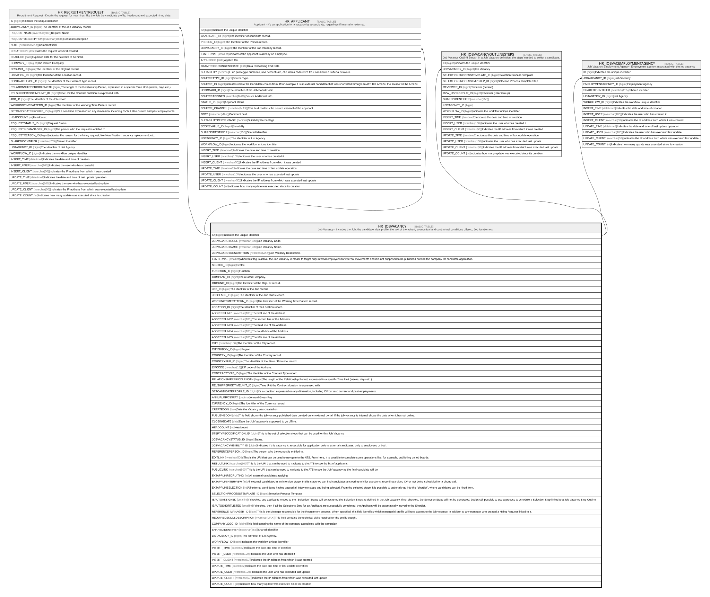

# HR_JOBVACANCY

## Description

Job Vacancy - Includes the Job, the candidate ideal profile, the text of the advert, economical and contractual conditions offered, Job location etc.  

## Columns

| Name | Type | Default | Nullable | Children | Comment |
| ---- | ---- | ------- | -------- | -------- | ------- |
| ID | bigint |  | false | [HR_RECRUITMENTREQUEST](HR_RECRUITMENTREQUEST.md) [HR_APPLICANT](HR_APPLICANT.md) [HR_JOBVACANCYOUTLINESTEPS](HR_JOBVACANCYOUTLINESTEPS.md) [HR_JOBVACEMPLOYMENTAGENCY](HR_JOBVACEMPLOYMENTAGENCY.md) | Indicates the unique identifier |
| JOBVACANCYCODE | nvarchar(100) |  | true |  | Job Vacancy Code. |
| JOBVACANCYNAME | nvarchar(100) |  | true |  | Job Vacancy Name. |
| JOBVACANCYDESCRIPTION | nvarchar(MAX) |  | true |  | Job Vacancy Description. |
| ISINTERNAL | smallint |  | true |  | When this flag is active, the Job Vacancy is meant to target only internal employees for internal movements and it is not supposed to be published outside the company for candidate application. |
| SECTOR_ID | bigint |  | true |  | Sector. |
| FUNCTION_ID | bigint |  | true |  | Function. |
| COMPANY_ID | bigint |  | true |  | The related Company. |
| ORGUNIT_ID | bigint |  | true |  | The Identifier of the OrgUnit record. |
| JOB_ID | bigint |  | true |  | The Identifier of the Job record. |
| JOBCLASS_ID | bigint |  | true |  | The Identifier of the Job Class record. |
| WORKINGTIMEPATTERN_ID | bigint |  | true |  | The Identifier of the Working Time Pattern record. |
| LOCATION_ID | bigint |  | true |  | The Identifier of the Location record. |
| ADDRESSLINE1 | nvarchar(100) |  | true |  | The first line of the Address.  |
| ADDRESSLINE2 | nvarchar(100) |  | true |  | The second line of the Address.  |
| ADDRESSLINE3 | nvarchar(100) |  | true |  | The third line of the Address.  |
| ADDRESSLINE4 | nvarchar(100) |  | true |  | The fourth line of the Address.  |
| ADDRESSLINE5 | nvarchar(100) |  | true |  | The fifth line of the Address.  |
| CITY | nvarchar(100) |  | true |  | The Identifier of the City record. |
| CITYSUBDIV_ID | bigint |  | true |  | Region |
| COUNTRY_ID | bigint |  | true |  | The Identifier of the Country record. |
| COUNTRYSUB_ID | bigint |  | true |  | The Identifier of the State / Province record. |
| ZIPCODE | nvarchar(16) |  | true |  | ZIP code of the Address. |
| CONTRACTTYPE_ID | bigint |  | true |  | The Identifier of the Contract Type record. |
| RELATIONSHIPPERIODLENGTH | bigint |  | true |  | The length of the Relationship Period, expressed in a specific Time Unit (weeks, days etc.). |
| RELSHIPPERIODTIMEUNIT_ID | bigint |  | true |  | Time Unit the Contract duration is expressed with. |
| SETCANDIDATEPROFILE_ID | bigint |  | true |  | It’s a condition expressed on any dimension, including CV but also current and past employments. |
| ANNUALGROSSPAY | decimal |  | true |  | Annual Gross Pay |
| CURRENCY_ID | bigint |  | true |  | The Identifier of the Currency record. |
| CREATEDON | date |  | true |  | Date the Vacancy was created on. |
| PUBLISHEDON | date |  | true |  | This field shows the job vacancy published date created on an external portal. If the job vacancy is internal shows the date when it has set online. |
| CLOSINGDATE | date |  | true |  | Date the Job Vacancy is supposed to go offline. |
| HEADCOUNT | int |  | true |  | Headcount. |
| STEPTYPECODIFICATION_ID | bigint |  | true |  | This is the set of selection steps that can be used for this Job Vacancy. |
| JOBVACANCYSTATUS_ID | bigint |  | true |  | Status. |
| JOBVACANCYVISIBILITY_ID | bigint |  | true |  | Indicates if this vacancy is accessible for application only to external candidates, only to employees or both. |
| REFERENCEPERSON_ID | bigint |  | true |  | The person who the request is entitled to. |
| EDITLINK | nvarchar(500) |  | true |  | This is the URI that can be used to navigate to the ATS. From here, it is possible to complete some operations like, for example, publishing on job boards. |
| RESULTLINK | nvarchar(500) |  | true |  | This is the URI that can be used to navigate to the ATS to see the list of applicants. |
| PUBLICLINK | nvarchar(500) |  | true |  | This is the URI that can be used to navigate to the ATS to see the Job Vacancy as the final candidate will do. |
| EXTAPPLINRECRUITING | int |  | true |  | All external candidates applying |
| EXTAPPLININTERVIEW | int |  | true |  | All external candidates in an interview stage. In this stage we can find candidates answering to killer questions, recording a video CV or just being scheduled for a phone call. |
| EXTAPPLINSELECTION | int |  | true |  | All external candidates having passed all interview steps and being selected. From the selected stage, it is possible to optionally go into the “shortlist”, where candidates can be hired from. |
| SELECTIONPROCESSTEMPLATE_ID | bigint |  | true |  | Selection Process Template |
| ISAUTOASSIGNED | smallint |  | true |  | If checked, any applicants moved to the “Selection” Status will be assigned the Selection Steps as defined in the Job Vacancy. If not checked, the Selection Steps will not be generated, but it's still possible to use a process to schedule a Selection Step linked to a Job Vacancy Step Outline |
| ISAUTOSHORTLISTED | smallint |  | true |  | If checked, then if all the Selections Step for an Applicant are successfully completed, the Applicant will be automatically moved to the Shortlist. |
| REFERENCE_MANAGER_ID | bigint |  | true |  | This is the Manager responsible for the Recruitment process. When specified, this field identifies which managerial profile will have access to the job vacancy, in addition to any manager who created a Hiring Request linked to it. |
| REQUIREDSKILLSDESCRIPTION | nvarchar(MAX) |  | true |  | This field contains the technical skills required for the profile sought. |
| COMPANYLOGO_ID | bigint |  | true |  | This field contains the name of the company associated with the campaign |
| SHAREDIDENTIFIER | nvarchar(255) |  | true |  | Shared Identifier |
| LISTAGENCY_ID | bigint |  | true |  | The Identifier of List Agency. |
| WORKFLOW_ID | bigint |  | true |  | Indicates the workflow unique identifier |
| INSERT_TIME | datetime2 |  | false |  | Indicates the date and time of creation |
| INSERT_USER | nvarchar(100) |  | false |  | Indicates the user who has created it |
| INSERT_CLIENT | nvarchar(50) |  | false |  | Indicates the IP address from which it was created |
| UPDATE_TIME | datetime2 |  | false |  | Indicates the date and time of last update operation |
| UPDATE_USER | nvarchar(100) |  | false |  | Indicates the user who has executed last update |
| UPDATE_CLIENT | nvarchar(50) |  | false |  | Indicates the IP address from which was executed last update |
| UPDATE_COUNT | int |  | false |  | Indicates how many update was executed since its creation |

## Constraints

| Name | Type | Definition |
| ---- | ---- | ---------- |
| PK_JOBVACANCY | PRIMARY KEY | CLUSTERED, unique, part of a PRIMARY KEY constraint, [ ID ] |
| UQ_JOBVACANCY | UNIQUE | NONCLUSTERED, unique, part of a UNIQUE constraint, [ JOBVACANCYCODE ] |

## Indexes

| Name | Definition |
| ---- | ---------- |
| PK_JOBVACANCY | CLUSTERED, unique, part of a PRIMARY KEY constraint, [ ID ] |
| UQ_JOBVACANCY | NONCLUSTERED, unique, part of a UNIQUE constraint, [ JOBVACANCYCODE ] |
| IDX_JOBVACANCY_SHRID_AGEN | NONCLUSTERED, [ SHAREDIDENTIFIER, LISTAGENCY_ID ] |

## Relations

---

> Generated by [tbls](https://github.com/k1LoW/tbls)
