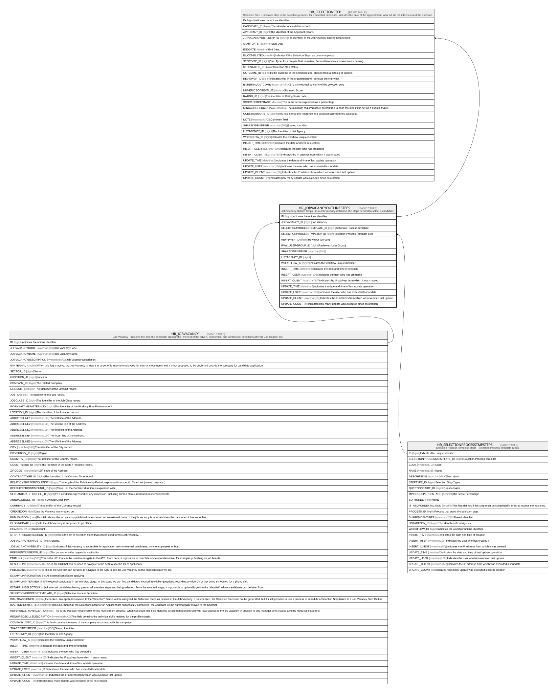

# HR_JOBVACANCYOUTLINESTEPS

## Description

Job Vacancy Outline Steps - In a Job Vacancy definition, the steps needed to select a candidate.  

## Columns

| Name | Type | Default | Nullable | Children | Parents | Comment |
| ---- | ---- | ------- | -------- | -------- | ------- | ------- |
| ID | bigint |  | false | [HR_SELECTIONSTEP](HR_SELECTIONSTEP.md) |  | Indicates the unique identifier |
| JOBVACANCY_ID | bigint |  | false |  | [HR_JOBVACANCY](HR_JOBVACANCY.md) | Job Vacancy |
| SELECTIONPROCESSTEMPLATE_ID | bigint |  | false |  |  | Selection Process Template |
| SELECTIONPROCESSTMPSTEP_ID | bigint |  | false |  | [HR_SELECTIONPROCESSTMPSTEPS](HR_SELECTIONPROCESSTMPSTEPS.md) | Selection Process Template Step |
| REVIEWER_ID | bigint |  | true |  |  | Reviewer (person) |
| RVW_USERGROUP_ID | bigint |  | true |  |  | Reviewer (User Group) |
| SHAREDIDENTIFIER | nvarchar(255) |  | true |  |  |  |
| LISTAGENCY_ID | bigint |  | true |  |  |  |
| WORKFLOW_ID | bigint |  | true |  |  | Indicates the workflow unique identifier |
| INSERT_TIME | datetime2 | (sysutcdatetime()) | false |  |  | Indicates the date and time of creation |
| INSERT_USER | nvarchar(100) |  | false |  |  | Indicates the user who has created it |
| INSERT_CLIENT | nvarchar(50) | (N'localhost') | false |  |  | Indicates the IP address from which it was created |
| UPDATE_TIME | datetime2 | (sysutcdatetime()) | false |  |  | Indicates the date and time of last update operation |
| UPDATE_USER | nvarchar(100) |  | false |  |  | Indicates the user who has executed last update |
| UPDATE_CLIENT | nvarchar(50) | (N'localhost') | false |  |  | Indicates the IP address from which was executed last update |
| UPDATE_COUNT | int | ((0)) | false |  |  | Indicates how many update was executed since its creation |

## Constraints

| Name | Type | Definition |
| ---- | ---- | ---------- |
| PK_JOBVACANCYOUTLINESTEPS | PRIMARY KEY | CLUSTERED, unique, part of a PRIMARY KEY constraint, [ ID ] |
| UQ_JOBVACANCYOUTLINESTEPS | UNIQUE | NONCLUSTERED, unique, part of a UNIQUE constraint, [ JOBVACANCY_ID, SELECTIONPROCESSTEMPLATE_ID, SELECTIONPROCESSTMPSTEP_ID ] |
| FK_JVOUTLINESTEPS_JOBVACANCY | FOREIGN KEY | FOREIGN KEY(JOBVACANCY_ID) REFERENCES HR_JOBVACANCY(ID) ON UPDATE NO_ACTION ON DELETE CASCADE |
| FK_JVOUTLINESTEPS_SELPROCSTEPS | FOREIGN KEY | FOREIGN KEY(SELECTIONPROCESSTMPSTEP_ID) REFERENCES HR_SELECTIONPROCESSTMPSTEPS(ID) ON UPDATE NO_ACTION ON DELETE NO_ACTION |

## Indexes

| Name | Definition |
| ---- | ---------- |
| PK_JOBVACANCYOUTLINESTEPS | CLUSTERED, unique, part of a PRIMARY KEY constraint, [ ID ] |
| UQ_JOBVACANCYOUTLINESTEPS | NONCLUSTERED, unique, part of a UNIQUE constraint, [ JOBVACANCY_ID, SELECTIONPROCESSTEMPLATE_ID, SELECTIONPROCESSTMPSTEP_ID ] |

## Relations

---

> Generated by [tbls](https://github.com/k1LoW/tbls)
