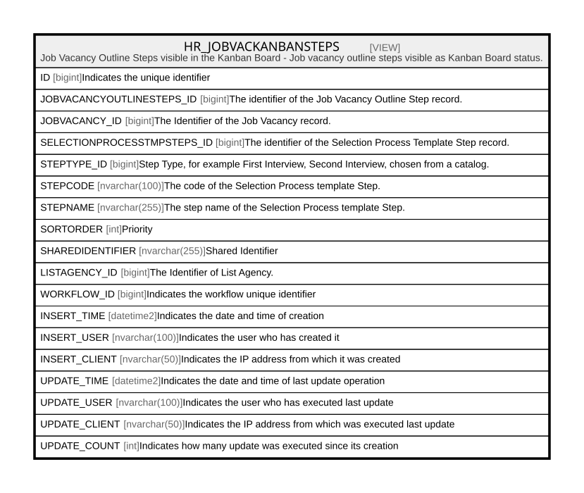

# HR_JOBVACKANBANSTEPS

## Description

Job Vacancy Outline Steps visible in the Kanban Board - Job vacancy outline steps visible as Kanban Board status.  


<details>
<summary><strong>Table Definition</strong></summary>

```sql
-- Talentia Software - All right reserved
-- Type: VIEW                     Name: HR_JOBVACKANBANSTEPS
-- Date: 09-04-2026 07:27:59 (UTC)
-- 
-- ChangeLogId: 00000000-0000-0000-0000-000000000000
-- ChangeSetId: f25b3dc8-3157-4d59-98d3-713c85e06993
-- Original file name: C:\repos\Talentia-Software\hcm-core/DB/ProductDB/EDM\Schema\Views\HR_JOBVACKANBANSTEPS.xml


CREATE VIEW [HR_JOBVACKANBANSTEPS]
 ( ID, JOBVACANCYOUTLINESTEPS_ID, JOBVACANCY_ID, SELECTIONPROCESSTMPSTEPS_ID, STEPTYPE_ID, STEPCODE, STEPNAME, SORTORDER, SHAREDIDENTIFIER, LISTAGENCY_ID, WORKFLOW_ID, INSERT_TIME, INSERT_USER, INSERT_CLIENT, UPDATE_TIME, UPDATE_USER, UPDATE_CLIENT, UPDATE_COUNT ) 
 AS 
( select ROW_NUMBER() OVER ( ORDER BY JOBVACANCYOUTLINESTEPS_ID ) as ID, * from (
select 
HR_JOBVACANCYOUTLINESTEPS.ID AS JOBVACANCYOUTLINESTEPS_ID,
HR_JOBVACANCYOUTLINESTEPS.JOBVACANCY_ID, 
HR_SELECTIONPROCESSTMPSTEPS.ID AS SELECTIONPROCESSTMPSTEPS_ID,
HR_SELECTIONPROCESSTMPSTEPS.STEPTYPE_ID as STEPTYPE_ID,
HR_SELECTIONPROCESSTMPSTEPS.CODE AS STEPCODE,
HR_SELECTIONPROCESSTMPSTEPS.NAME AS STEPNAME,
HR_SELECTIONPROCESSTMPSTEPS.SORTORDER as SORTORDER,
HR_JOBVACANCYOUTLINESTEPS.SHAREDIDENTIFIER, 
HR_JOBVACANCYOUTLINESTEPS.LISTAGENCY_ID, 
HR_JOBVACANCYOUTLINESTEPS.WORKFLOW_ID, 
HR_JOBVACANCYOUTLINESTEPS.INSERT_TIME,
HR_JOBVACANCYOUTLINESTEPS.INSERT_USER,
HR_JOBVACANCYOUTLINESTEPS.INSERT_CLIENT,
HR_JOBVACANCYOUTLINESTEPS.UPDATE_TIME,
HR_JOBVACANCYOUTLINESTEPS.UPDATE_USER,
HR_JOBVACANCYOUTLINESTEPS.UPDATE_CLIENT,
HR_JOBVACANCYOUTLINESTEPS.UPDATE_COUNT
FROM HR_JOBVACANCYOUTLINESTEPS
left outer join HR_SELECTIONPROCESSTMPSTEPS ON HR_SELECTIONPROCESSTMPSTEPS.ID = HR_JOBVACANCYOUTLINESTEPS.SELECTIONPROCESSTMPSTEP_ID

UNION ALL

select 
2 AS JOBVACANCYOUTLINESTEPS_ID,
HR_APPLICANT.JOBVACANCY_ID, 
NULL AS SELECTIONPROCESSTMPSTEPS_ID,
2 as STEPTYPE_ID,
'2' AS STEPCODE,
'Other' as STEPNAME,
999 as SORTORDER,
HR_SELECTIONSTEP.SHAREDIDENTIFIER, 
HR_SELECTIONSTEP.LISTAGENCY_ID, 
HR_SELECTIONSTEP.WORKFLOW_ID, 
HR_SELECTIONSTEP.INSERT_TIME,
HR_SELECTIONSTEP.INSERT_USER,
HR_SELECTIONSTEP.INSERT_CLIENT,
HR_SELECTIONSTEP.UPDATE_TIME,
HR_SELECTIONSTEP.UPDATE_USER,
HR_SELECTIONSTEP.UPDATE_CLIENT,
HR_SELECTIONSTEP.UPDATE_COUNT
FROM HR_SELECTIONSTEP
INNER JOIN HR_APPLICANT ON HR_APPLICANT.ID = HR_SELECTIONSTEP.APPLICANT_ID
INNER JOIN HR_CANDIDATE CANDIDATE WITH (NOLOCK) ON CANDIDATE.ID = HR_APPLICANT.CANDIDATE_ID AND CANDIDATE.IS_ANONYMIZED = 0
where HR_SELECTIONSTEP.JOBVACANCYOUTLSTEP_ID IS NULL 

UNION ALL

SELECT
1 AS JOBVACANCYOUTLINESTEPS_ID,
HR_JOBVACANCY.ID AS JOBVACANCY_ID, 
NULL AS SELECTIONPROCESSTMPSTEPS_ID,
1 as STEPTYPE_ID,
'1' AS STEPCODE,
'Job Offer' as STEPNAME,
1000 as SORTORDER,
HR_JOBVACANCY.SHAREDIDENTIFIER, 
HR_JOBVACANCY.LISTAGENCY_ID, 
HR_JOBVACANCY.WORKFLOW_ID, 
HR_JOBVACANCY.INSERT_TIME,
HR_JOBVACANCY.INSERT_USER,
HR_JOBVACANCY.INSERT_CLIENT,
HR_JOBVACANCY.UPDATE_TIME,
HR_JOBVACANCY.UPDATE_USER,
HR_JOBVACANCY.UPDATE_CLIENT,
HR_JOBVACANCY.UPDATE_COUNT
FROM HR_JOBVACANCY
LEFT OUTER join HR_SHORTLISTEDCND ON HR_SHORTLISTEDCND.VACANCY_ID = HR_JOBVACANCY.ID ) HR_JOBVACANCYOUTLINESTEPS )

```

</details>

## Columns

| Name | Type | Default | Nullable | Comment |
| ---- | ---- | ------- | -------- | ------- |
| ID | bigint |  | true | Indicates the unique identifier |
| JOBVACANCYOUTLINESTEPS_ID | bigint |  | false | The identifier of the Job Vacancy Outline Step record. |
| JOBVACANCY_ID | bigint |  | false | The Identifier of the Job Vacancy record. |
| SELECTIONPROCESSTMPSTEPS_ID | bigint |  | true | The identifier of the Selection Process Template Step record. |
| STEPTYPE_ID | bigint |  | true | Step Type, for example First Interview, Second Interview, chosen from a catalog. |
| STEPCODE | nvarchar(100) |  | true | The code of the Selection Process template Step. |
| STEPNAME | nvarchar(255) |  | true | The step name of the Selection Process template Step. |
| SORTORDER | int |  | true | Priority |
| SHAREDIDENTIFIER | nvarchar(255) |  | true | Shared Identifier |
| LISTAGENCY_ID | bigint |  | true | The Identifier of List Agency. |
| WORKFLOW_ID | bigint |  | true | Indicates the workflow unique identifier |
| INSERT_TIME | datetime2 |  | false | Indicates the date and time of creation |
| INSERT_USER | nvarchar(100) |  | false | Indicates the user who has created it |
| INSERT_CLIENT | nvarchar(50) |  | false | Indicates the IP address from which it was created |
| UPDATE_TIME | datetime2 |  | false | Indicates the date and time of last update operation |
| UPDATE_USER | nvarchar(100) |  | false | Indicates the user who has executed last update |
| UPDATE_CLIENT | nvarchar(50) |  | false | Indicates the IP address from which was executed last update |
| UPDATE_COUNT | int |  | false | Indicates how many update was executed since its creation |

## Referenced Tables

| Name | Columns | Comment | Type |
| ---- | ------- | ------- | ---- |
| [HR_JOBVACANCYOUTLINESTEPS](HR_JOBVACANCYOUTLINESTEPS.md) | 16 | Job Vacancy Outline Steps - In a Job Vacancy definition, the steps needed to select a candidate.<br /> | BASIC TABLE |
| [HR_SELECTIONPROCESSTMPSTEPS](HR_SELECTIONPROCESSTMPSTEPS.md) | 21 | Selection Process Template Steps - Selection Process Template Steps<br /> | BASIC TABLE |
| [HR_SELECTIONSTEP](HR_SELECTIONSTEP.md) | 28 | Selection Step - Indicates step in the selection process, for a selected candidate. Includes the date of the appointment, who will do the interview and the outcome.<br /> | BASIC TABLE |
| [HR_APPLICANT](HR_APPLICANT.md) | 27 | Applicant - It’s an application for a vacancy by a candidate, regardless if internal or external.<br /> | BASIC TABLE |
| [HR_CANDIDATE](HR_CANDIDATE.md) | 50 | External Candidate - External Candidate Entity.<br /> | BASIC TABLE |
| [HR_JOBVACANCY](HR_JOBVACANCY.md) | 59 | Job Vacancy - Includes the Job, the candidate ideal profile, the text of the advert, economical and contractual conditions offered, Job location etc.<br /> | BASIC TABLE |
| [HR_SHORTLISTEDCND](HR_SHORTLISTEDCND.md) | 117 | Shortlisted Candidates - Shortlisted candidates are those candidates, internal or external, to whom a Job offer for a specific Vacancy has been proposed. For each candidate, basic contractual and deployment terms and conditions are also specified.<br /> | BASIC TABLE |

## Relations



---

> Generated by [tbls](https://github.com/k1LoW/tbls)
