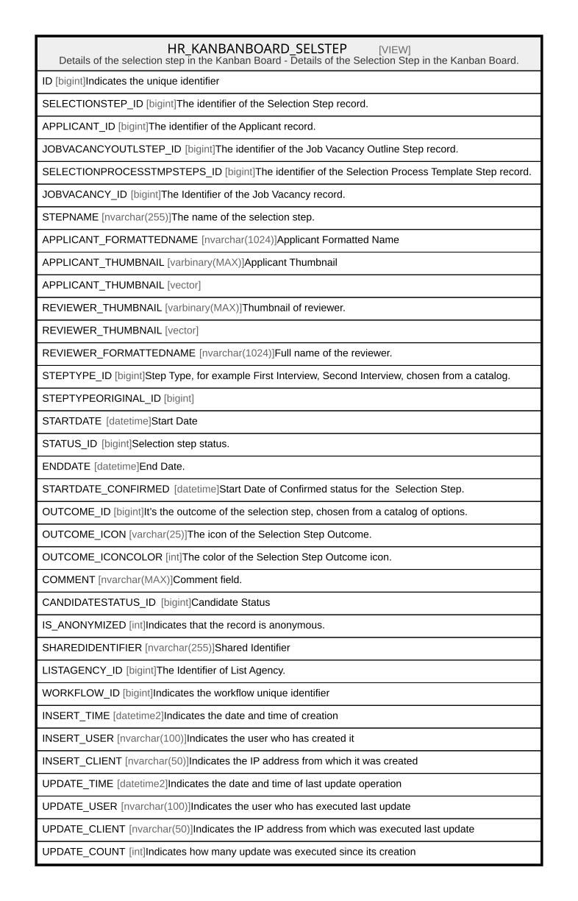

# HR_KANBANBOARD_SELSTEP

## Description

Details of the selection step in the Kanban Board - Details of the Selection Step in the Kanban Board.  


<details>
<summary><strong>Table Definition</strong></summary>

```sql
-- Talentia Software - All right reserved
-- Type: VIEW                     Name: HR_KANBANBOARD_SELSTEP
-- Date: 09-04-2026 07:27:59 (UTC)
-- 
-- ChangeLogId: 00000000-0000-0000-0000-000000000000
-- ChangeSetId: 063d5336-4e20-4a5f-a0b1-6dc3fe44ef8e
-- Original file name: C:\repos\Talentia-Software\hcm-core/DB/ProductDB/EDM\Schema\Views\HR_KANBANBOARD_SELSTEP.xml


CREATE VIEW [HR_KANBANBOARD_SELSTEP]
 ( ID, SELECTIONSTEP_ID, APPLICANT_ID, JOBVACANCYOUTLSTEP_ID, SELECTIONPROCESSTMPSTEPS_ID, JOBVACANCY_ID, STEPNAME, APPLICANT_FORMATTEDNAME, APPLICANT_THUMBNAIL, REVIEWER_THUMBNAIL, REVIEWER_FORMATTEDNAME, STEPTYPE_ID, STEPTYPEORIGINAL_ID, STARTDATE, STATUS_ID, ENDDATE, STARTDATE_CONFIRMED, OUTCOME_ID, OUTCOME_ICON, OUTCOME_ICONCOLOR, COMMENT, CANDIDATESTATUS_ID, IS_ANONYMIZED, SHAREDIDENTIFIER, LISTAGENCY_ID, WORKFLOW_ID, INSERT_TIME, INSERT_USER, INSERT_CLIENT, UPDATE_TIME, UPDATE_USER, UPDATE_CLIENT, UPDATE_COUNT ) 
 AS 
( select ROW_NUMBER() OVER ( ORDER BY SELECTIONSTEP_ID ) as ID, 
* from (select 
	HR_SELECTIONSTEP.ID as SELECTIONSTEP_ID, 
	HR_SELECTIONSTEP.APPLICANT_ID, 
	(CASE WHEN (HR_JOBVACANCY.SELECTIONPROCESSTEMPLATE_ID IS NOT NULL AND HR_SELECTIONSTEP.JOBVACANCYOUTLSTEP_ID IS NULL) THEN 2 ELSE HR_SELECTIONSTEP.JOBVACANCYOUTLSTEP_ID END) AS JOBVACANCYOUTLSTEP_ID, 
	HR_SELECTIONPROCESSTMPSTEPS.ID AS SELECTIONPROCESSTMPSTEPS_ID,
	HR_APPLICANT.JOBVACANCY_ID AS JOBVACANCY_ID,
	(CASE WHEN (HR_JOBVACANCY.SELECTIONPROCESSTEMPLATE_ID IS NOT NULL AND HR_SELECTIONSTEP.JOBVACANCYOUTLSTEP_ID IS NULL) THEN 'Other' ELSE HR_SELECTIONPROCESSTMPSTEPS.NAME END) AS STEPNAME,
	CANDIDATE.FORMATTEDNAME AS APPLICANT_FORMATTEDNAME, 
	CANDIDATE.THUMBNAIL AS APPLICANT_THUMBNAIL,
	HR_PERSON.THUMBNAIL AS REVIEWER_THUMBNAIL,
	HR_PERSON.FORMATTEDNAME AS REVIEWER_FORMATTEDNAME,
	(CASE WHEN (HR_JOBVACANCY.SELECTIONPROCESSTEMPLATE_ID IS NOT NULL AND HR_SELECTIONSTEP.JOBVACANCYOUTLSTEP_ID IS NULL) THEN 2 ELSE HR_SELECTIONSTEP.STEPTYPE_ID END) AS STEPTYPE_ID, 
	HR_SELECTIONSTEP.STEPTYPE_ID AS STEPTYPEORIGINAL_ID,
	HR_SELECTIONSTEP.STARTDATE AS STARTDATE, 
	HR_SELECTIONSTEP.STEPSTATUS_ID AS STATUS_ID,
	HR_SELECTIONSTEP.ENDDATE AS ENDDATE, 
	(CASE WHEN HR_SELECTIONSTEP.STEPSTATUS_ID = 1156020 THEN HR_SELECTIONSTEP.STARTDATE ELSE NULL END) AS STARTDATE_CONFIRMED,
	HR_SELECTIONSTEP.OUTCOME_ID AS OUTCOME_ID,
	(CASE WHEN HR_SELECTIONSTEP.OUTCOME_ID = 1156023 THEN 'fad fa-check-circle' WHEN HR_SELECTIONSTEP.OUTCOME_ID = 1156024 THEN 'fad fa-exclamation-circle' ELSE NULL END) AS OUTCOME_ICON,
	(CASE WHEN HR_SELECTIONSTEP.OUTCOME_ID = 1156023 THEN 276 WHEN HR_SELECTIONSTEP.OUTCOME_ID = 1156024 THEN 154 ELSE NULL END) AS OUTCOME_ICONCOLOR,  
	HR_SELECTIONSTEP.NOTE AS COMMENT,
	NULL AS CANDIDATESTATUS_ID,
	CANDIDATE.IS_ANONYMIZED AS IS_ANONYMIZED,
	HR_SELECTIONSTEP.SHAREDIDENTIFIER AS SHAREDIDENTIFIER, 
	HR_SELECTIONSTEP.LISTAGENCY_ID AS LISTAGENCY_ID,	
	HR_SELECTIONSTEP.WORKFLOW_ID AS WORKFLOWID,
	HR_SELECTIONSTEP.INSERT_TIME AS INSERTTIME,
	HR_SELECTIONSTEP.INSERT_USER AS INSERTUSER,
	HR_SELECTIONSTEP.INSERT_CLIENT AS INSERTCLIENT,
	HR_SELECTIONSTEP.UPDATE_TIME AS UPDATETIME,
	HR_SELECTIONSTEP.UPDATE_USER AS UPDATEUSER,
	HR_SELECTIONSTEP.UPDATE_CLIENT AS UPDATECLIENT,
	HR_SELECTIONSTEP.UPDATE_COUNT AS UPDATECOUNT
	from HR_SELECTIONSTEP
	INNER JOIN HR_APPLICANT on HR_APPLICANT.ID = HR_SELECTIONSTEP.APPLICANT_ID
	INNER JOIN HR_JOBVACANCY ON HR_APPLICANT.JOBVACANCY_ID = HR_JOBVACANCY.ID
	LEFT OUTER JOIN HR_CANDIDATE_VIEW CANDIDATE ON HR_SELECTIONSTEP.CANDIDATE_ID = CANDIDATE.ID
	LEFT OUTER JOIN HR_PERSON ON HR_SELECTIONSTEP.REVIEWER_ID = HR_PERSON.ID
	LEFT OUTER JOIN HR_JOBVACANCYOUTLINESTEPS on HR_JOBVACANCYOUTLINESTEPS.ID = HR_SELECTIONSTEP.JOBVACANCYOUTLSTEP_ID
	left outer join HR_SELECTIONPROCESSTMPSTEPS ON HR_SELECTIONPROCESSTMPSTEPS.ID = HR_JOBVACANCYOUTLINESTEPS.SELECTIONPROCESSTMPSTEP_ID
	
	union all
	
	SELECT
	HR_SHORTLISTEDCND.ID AS SELECTIONSTEP_ID,
	HR_APPLICANT.ID AS APPLICANT_ID,
	1 AS JOBVACANCYOUTLSTEP_ID,
	NULL AS SELECTIONPROCESSTMPSTEPS_ID,
	HR_SHORTLISTEDCND.VACANCY_ID AS JOBVACANCY_ID,
	'Job Offer' as STEPNAME,
	CANDIDATE.FORMATTEDNAME AS APPLICANT_FORMATTEDNAME,
	CANDIDATE.THUMBNAIL AS APPLICANT_THUMBNAIL,
	NULL AS REVIEWER_THUMBNAIL,
	NULL AS REVIEWER_FORMATTEDNAME,
	1 as STEPTYPE_ID,
	1 AS STEPTYPEORIGINAL_ID,
	HR_SHORTLISTEDCND.HIREDATE AS STARTDATE, 
	NULL AS STATUS_ID,
	NULL AS ENDDATE, 
	(CASE WHEN HR_SHORTLISTEDCND.CANDIDATESTATUS_ID <> 1109192 THEN HR_SHORTLISTEDCND.HIREDATE ELSE NULL END) AS STARTDATE_CONFIRMED,
	HR_SHORTLISTEDCND.REJECTREASON_ID AS OUTCOME_ID,
	(CASE WHEN HR_SHORTLISTEDCND.CANDIDATESTATUS_ID = 1109192 THEN 'fad fa-user-times' WHEN HR_SHORTLISTEDCND.CANDIDATESTATUS_ID = 1109193 THEN 'fad fa-user-clock' WHEN HR_SHORTLISTEDCND.CANDIDATESTATUS_ID = 1109194 THEN 'fad fa-user-check' ELSE NULL END) AS OUTCOME_ICON,
	(CASE WHEN HR_SHORTLISTEDCND.CANDIDATESTATUS_ID = 1109192 THEN 154 WHEN HR_SHORTLISTEDCND.CANDIDATESTATUS_ID = 1109194 THEN 306 ELSE 9 END) AS OUTCOME_ICONCOLOR,
	NULL AS COMMENT,
	HR_SHORTLISTEDCND.CANDIDATESTATUS_ID AS CANDIDATESTATUS_ID,
	CANDIDATE.IS_ANONYMIZED AS IS_ANONYMIZED,
	HR_SHORTLISTEDCND.SHAREDIDENTIFIER AS SHAREDIDENTIFIER, 
	HR_SHORTLISTEDCND.LISTAGENCY_ID AS LISTAGENCY_ID,
	HR_SHORTLISTEDCND.WORKFLOW_ID AS WORKFLOWID,
	HR_SHORTLISTEDCND.INSERT_TIME AS INSERTTIME,
	HR_SHORTLISTEDCND.INSERT_USER AS INSERTUSER,
	HR_SHORTLISTEDCND.INSERT_CLIENT AS INSERTCLIENT,
	HR_SHORTLISTEDCND.UPDATE_TIME AS UPDATETIME,
	HR_SHORTLISTEDCND.UPDATE_USER AS UPDATEUSER,
	HR_SHORTLISTEDCND.UPDATE_CLIENT AS UPDATECLIENT,
	HR_SHORTLISTEDCND.UPDATE_COUNT AS UPDATECOUNT
	FROM HR_APPLICANT
	INNER JOIN HR_SHORTLISTEDCND ON HR_SHORTLISTEDCND.APPLICANT_ID = HR_APPLICANT.ID
	LEFT OUTER JOIN HR_CANDIDATE_VIEW CANDIDATE ON CANDIDATE.ID = HR_SHORTLISTEDCND.CANDIDATE_ID ) HR_SELECTIONSTEP )

```

</details>

## Columns

| Name | Type | Default | Nullable | Comment |
| ---- | ---- | ------- | -------- | ------- |
| ID | bigint |  | true | Indicates the unique identifier |
| SELECTIONSTEP_ID | bigint |  | false | The identifier of the Selection Step record. |
| APPLICANT_ID | bigint |  | true | The identifier of the Applicant record. |
| JOBVACANCYOUTLSTEP_ID | bigint |  | true | The identifier of the Job Vacancy Outline Step record. |
| SELECTIONPROCESSTMPSTEPS_ID | bigint |  | true | The identifier of the Selection Process Template Step record. |
| JOBVACANCY_ID | bigint |  | true | The Identifier of the Job Vacancy record. |
| STEPNAME | nvarchar(255) |  | true | The name of the selection step. |
| APPLICANT_FORMATTEDNAME | nvarchar(1024) |  | true | Applicant Formatted Name |
| APPLICANT_THUMBNAIL | varbinary(MAX) |  | true | Applicant Thumbnail |
| APPLICANT_THUMBNAIL | vector |  | true |  |
| REVIEWER_THUMBNAIL | varbinary(MAX) |  | true | Thumbnail of reviewer. |
| REVIEWER_THUMBNAIL | vector |  | true |  |
| REVIEWER_FORMATTEDNAME | nvarchar(1024) |  | true | Full name of the reviewer. |
| STEPTYPE_ID | bigint |  | true | Step Type, for example First Interview, Second Interview, chosen from a catalog. |
| STEPTYPEORIGINAL_ID | bigint |  | true |  |
| STARTDATE | datetime |  | true | Start Date |
| STATUS_ID | bigint |  | true | Selection step status. |
| ENDDATE | datetime |  | true | End Date. |
| STARTDATE_CONFIRMED | datetime |  | true | Start Date of Confirmed status for the  Selection Step. |
| OUTCOME_ID | bigint |  | true | It’s the outcome of the selection step, chosen from a catalog of options. |
| OUTCOME_ICON | varchar(25) |  | true | The icon of the Selection Step Outcome. |
| OUTCOME_ICONCOLOR | int |  | true | The color of the Selection Step Outcome icon. |
| COMMENT | nvarchar(MAX) |  | true | Comment field. |
| CANDIDATESTATUS_ID | bigint |  | true | Candidate Status |
| IS_ANONYMIZED | int |  | true | Indicates that the record is anonymous. |
| SHAREDIDENTIFIER | nvarchar(255) |  | true | Shared Identifier |
| LISTAGENCY_ID | bigint |  | true | The Identifier of List Agency. |
| WORKFLOW_ID | bigint |  | true | Indicates the workflow unique identifier |
| INSERT_TIME | datetime2 |  | false | Indicates the date and time of creation |
| INSERT_USER | nvarchar(100) |  | false | Indicates the user who has created it |
| INSERT_CLIENT | nvarchar(50) |  | false | Indicates the IP address from which it was created |
| UPDATE_TIME | datetime2 |  | false | Indicates the date and time of last update operation |
| UPDATE_USER | nvarchar(100) |  | false | Indicates the user who has executed last update |
| UPDATE_CLIENT | nvarchar(50) |  | false | Indicates the IP address from which was executed last update |
| UPDATE_COUNT | int |  | false | Indicates how many update was executed since its creation |

## Referenced Tables

| Name | Columns | Comment | Type |
| ---- | ------- | ------- | ---- |
| [HR_SELECTIONSTEP](HR_SELECTIONSTEP.md) | 28 | Selection Step - Indicates step in the selection process, for a selected candidate. Includes the date of the appointment, who will do the interview and the outcome.<br /> | BASIC TABLE |
| [HR_APPLICANT](HR_APPLICANT.md) | 27 | Applicant - It’s an application for a vacancy by a candidate, regardless if internal or external.<br /> | BASIC TABLE |
| [HR_JOBVACANCY](HR_JOBVACANCY.md) | 59 | Job Vacancy - Includes the Job, the candidate ideal profile, the text of the advert, economical and contractual conditions offered, Job location etc.<br /> | BASIC TABLE |
| [HR_CANDIDATE_VIEW](HR_CANDIDATE_VIEW.md) | 53 |  | VIEW |
| [HR_PERSON](HR_PERSON.md) | 56 | Person - Contains information identifying the person.<br /> | BASIC TABLE |
| [HR_JOBVACANCYOUTLINESTEPS](HR_JOBVACANCYOUTLINESTEPS.md) | 16 | Job Vacancy Outline Steps - In a Job Vacancy definition, the steps needed to select a candidate.<br /> | BASIC TABLE |
| [HR_SELECTIONPROCESSTMPSTEPS](HR_SELECTIONPROCESSTMPSTEPS.md) | 21 | Selection Process Template Steps - Selection Process Template Steps<br /> | BASIC TABLE |
| [HR_SHORTLISTEDCND](HR_SHORTLISTEDCND.md) | 117 | Shortlisted Candidates - Shortlisted candidates are those candidates, internal or external, to whom a Job offer for a specific Vacancy has been proposed. For each candidate, basic contractual and deployment terms and conditions are also specified.<br /> | BASIC TABLE |

## Relations



---

> Generated by [tbls](https://github.com/k1LoW/tbls)
