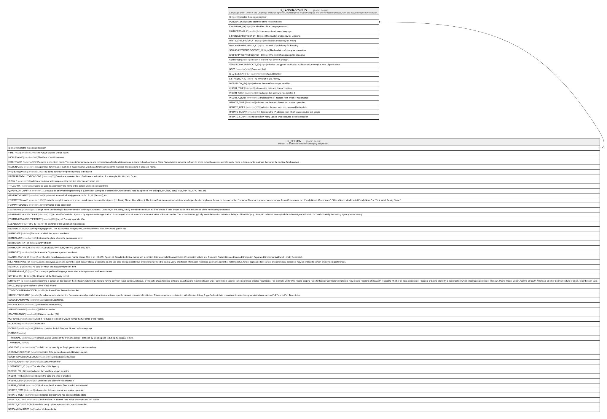

# HR_LANGUAGESKILLS

## Description

Language Skills - A list of the Language Skills for a person, including their mother tongues and any foreign languages, with the associated proficiency level.  

## Columns

| Name | Type | Default | Nullable | Parents | Comment |
| ---- | ---- | ------- | -------- | ------- | ------- |
| ID | bigint |  | false |  | Indicates the unique identifier |
| PERSON_ID | bigint |  | false | [HR_PERSON](HR_PERSON.md) | The Identifier of the Person record. |
| LANGUAGE_ID | bigint |  | false |  | The Identifier of the Language record. |
| MOTHERTONGUE | smallint |  | true |  | Indicates a mother tongue language.  |
| LISTENINGPROFICIENCY_ID | bigint |  | true |  | The level of proficiency for Listening |
| WRITINGPROFICIENCY_ID | bigint |  | true |  | The level of proficiency for Writing |
| READINGPROFICIENCY_ID | bigint |  | true |  | The level of proficiency for Reading |
| SPOKENINTERPROFICIENCY_ID | bigint |  | true |  | The level of proficiency for Interaction |
| SPOKENPRODPROFICIENCY_ID | bigint |  | true |  | The level of proficiency for Speaking |
| CERTIFIED | smallint |  | true |  | Indicates if the Skill has been “Certified”. |
| VERIFIEDBYCERTIFICATE_ID | bigint |  | true |  | Indicates the type of certificate / achievement proving the level of proficiency. |
| NOTE | nvarchar(MAX) |  | true |  | Comment field. |
| SHAREDIDENTIFIER | nvarchar(255) |  | true |  | Shared Identifier |
| LISTAGENCY_ID | bigint |  | true |  | The Identifier of List Agency. |
| WORKFLOW_ID | bigint |  | true |  | Indicates the workflow unique identifier |
| INSERT_TIME | datetime2 | (sysutcdatetime()) | false |  | Indicates the date and time of creation |
| INSERT_USER | nvarchar(100) | (N'MAIN') | false |  | Indicates the user who has created it |
| INSERT_CLIENT | nvarchar(50) | (N'localhost') | false |  | Indicates the IP address from which it was created |
| UPDATE_TIME | datetime2 | (sysutcdatetime()) | false |  | Indicates the date and time of last update operation |
| UPDATE_USER | nvarchar(100) | (N'MAIN') | false |  | Indicates the user who has executed last update |
| UPDATE_CLIENT | nvarchar(50) | (N'localhost') | false |  | Indicates the IP address from which was executed last update |
| UPDATE_COUNT | int | ((0)) | false |  | Indicates how many update was executed since its creation |

## Constraints

| Name | Type | Definition |
| ---- | ---- | ---------- |
| PK_HR_LANGUAGESKILLS | PRIMARY KEY | CLUSTERED, unique, part of a PRIMARY KEY constraint, [ ID ] |
| FK_PERSON_LANGSKILLS | FOREIGN KEY | FOREIGN KEY(PERSON_ID) REFERENCES HR_PERSON(ID) ON UPDATE NO_ACTION ON DELETE CASCADE |

## Indexes

| Name | Definition |
| ---- | ---------- |
| PK_HR_LANGUAGESKILLS | CLUSTERED, unique, part of a PRIMARY KEY constraint, [ ID ] |

## Relations

---

> Generated by [tbls](https://github.com/k1LoW/tbls)
