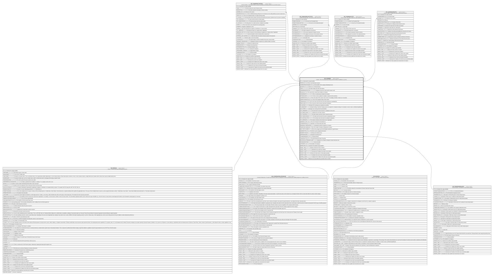

# HR_LEARNER

## Description

Learner - This is the entity representing a person enrolled or candidate to a course.  

## Columns

| Name | Type | Default | Nullable | Children | Parents | Comment |
| ---- | ---- | ------- | -------- | -------- | ------- | ------- |
| ID | bigint |  | false | [HR_LEARNERACTIVITIES](HR_LEARNERACTIVITIES.md) [HR_LERNFORECASTCOSTS](HR_LERNFORECASTCOSTS.md) [HR_LEARNERCOSTS](HR_LEARNERCOSTS.md) [HR_LEARNERCREDITS](HR_LEARNERCREDITS.md) |  | Indicates the unique identifier |
| PERSON_ID | bigint |  | false |  | [HR_PERSON](HR_PERSON.md) | Person associated with a learner. |
| COMPANYRELATIONSHIP_ID | bigint |  | true |  | [HR_COMPANYRELATIONSHIP](HR_COMPANYRELATIONSHIP.md) | The identifier of the company relationship record. |
| SESSION_ID | bigint |  | false |  | [HR_SESSION](HR_SESSION.md) | A reference to a Training Session. |
| CODE | nvarchar(MAX) |  | true |  |  | This field contains the code of the learner. |
| LEARNERDESCRIPTION | nvarchar(MAX) |  | true |  |  | Displays the person's name and the session code. |
| REASON_ID | bigint |  | true |  |  | The reason why a Learner was enrolled on a Session. |
| LEARNERNOTE | nvarchar(MAX) |  | true |  |  | This is a note/comment related to the learner.  |
| APPROVALNOTE | nvarchar(MAX) |  | true |  |  | This is a note to justify, for example, a rejection of the enrolment. |
| LEARNERSTATUS_ID | bigint |  | true |  |  | This is the status of the Learner, from a choice of Candidate, Enrolled, In Wait List or Cancelled. |
| COMPLETIONSTATUS_ID | bigint |  | true |  |  | This is the completion status of the Learner. |
| CANDIDATEBY_ID | bigint |  | true |  |  | This is the source who the learner has been proposed as candidated by. |
| ENROLLEDBY_ID | bigint |  | true |  |  | This is the source who the learner hase been enrolled by. |
| IS_SUCCESS | smallint |  | true |  |  | Indicates if the Learning was completed successfully. |
| IS_MANDATORY | smallint |  | true |  |  | Activate this flag to mark this Training resource as required for compulsory training. For example, to renew or take a certification/qualification. |
| AVG_SCORE | decimal |  | true |  |  | Average score coming from all scored activities. |
| DTA_JOINEDDON | datetime2 |  | true |  |  | The date when the person became a candidate for the course. |
| DTA_ENROLLEDON | datetime2 |  | true |  |  | Indicates the enrol date of learner. |
| DTA_STARTEDON | datetime2 |  | true |  |  | The date and time when the Learner started the activity. |
| DTA_COMPLETEDON | datetime2 |  | true |  |  | The date and time when the Learner completed the course. |
| DTA_WAITINGLISTON | datetime2 |  | true |  |  | This indicates when the learner was added to waiting list. |
| TOT_ABSENCES | decimal |  | true |  |  | The number of absences that a learner took, if applicable. |
| ABSENCES_UNIT_ID | bigint |  | true |  |  | The unit of measure for total absences. |
| COURSERATING_ID | bigint |  | true |  |  | Identifier of a 5-levels rating scale value. |
| PROGRESS_PERCENTAGE | decimal |  | true |  |  | Indicates the learner's progress in a session. |
| COMPLETED_MODULES | int |  | true |  |  | This is the number of activities completed by a Learner. |
| AVG_TESTS_SCORE | decimal |  | true |  |  | This is the average score for all Test/Quiz activities for a given learner. |
| LEARNERTYPE_ID | bigint |  | true |  |  | This field is used to categorise the learner.  |
| INDEMNITYHOURS | decimal |  | true |  |  | Indicates the idemnity hours. |
| WORKINGHOURS | decimal |  | true |  |  | Indicates the working hours. |
| TRAININGREQUEST_ID | bigint |  | true |  | [HR_TRAININGREQUEST](HR_TRAININGREQUEST.md) | Training Request |
| FINANCINGTYPE_ID | bigint |  | true |  |  | This field indicates the type of financing |
| INVITATION_ATTENDANCE_SENT | smallint |  | true |  |  | Indicates if an e-Mail for inviting the Learner has been sent. |
| SHAREDIDENTIFIER | nvarchar(255) |  | true |  |  | Shared Identifier |
| LISTAGENCY_ID | bigint |  | true |  |  | The Identifier of List Agency. |
| WORKFLOW_ID | bigint |  | true |  |  | Indicates the workflow unique identifier |
| INSERT_TIME | datetime2 | (sysutcdatetime()) | false |  |  | Indicates the date and time of creation |
| INSERT_USER | nvarchar(100) | (N'MAIN') | false |  |  | Indicates the user who has created it |
| INSERT_CLIENT | nvarchar(50) | (N'localhost') | false |  |  | Indicates the IP address from which it was created |
| UPDATE_TIME | datetime2 | (sysutcdatetime()) | false |  |  | Indicates the date and time of last update operation |
| UPDATE_USER | nvarchar(100) | (N'MAIN') | false |  |  | Indicates the user who has executed last update |
| UPDATE_CLIENT | nvarchar(50) | (N'localhost') | false |  |  | Indicates the IP address from which was executed last update |
| UPDATE_COUNT | int | ((0)) | false |  |  | Indicates how many update was executed since its creation |

## Constraints

| Name | Type | Definition |
| ---- | ---- | ---------- |
| PK_HR_LEARNER | PRIMARY KEY | CLUSTERED, unique, part of a PRIMARY KEY constraint, [ ID ] |
| UQ_HR_LEARNER | UNIQUE | NONCLUSTERED, unique, part of a UNIQUE constraint, [ PERSON_ID, SESSION_ID ] |
| FK_HR_LEARNER_HR_COMPREL | FOREIGN KEY | FOREIGN KEY(COMPANYRELATIONSHIP_ID) REFERENCES HR_COMPANYRELATIONSHIP(ID) ON UPDATE NO_ACTION ON DELETE NO_ACTION |
| FK_HR_LEARNER_HR_PERSON | FOREIGN KEY | FOREIGN KEY(PERSON_ID) REFERENCES HR_PERSON(ID) ON UPDATE NO_ACTION ON DELETE NO_ACTION |
| FK_HR_LEARNER_HR_SESSION | FOREIGN KEY | FOREIGN KEY(SESSION_ID) REFERENCES HR_SESSION(ID) ON UPDATE NO_ACTION ON DELETE NO_ACTION |
| FK_LEARNER_TRAREQUEST | FOREIGN KEY | FOREIGN KEY(TRAININGREQUEST_ID) REFERENCES HR_TRAININGREQUEST(ID) ON UPDATE NO_ACTION ON DELETE NO_ACTION |

## Indexes

| Name | Definition |
| ---- | ---------- |
| PK_HR_LEARNER | CLUSTERED, unique, part of a PRIMARY KEY constraint, [ ID ] |
| UQ_HR_LEARNER | NONCLUSTERED, unique, part of a UNIQUE constraint, [ PERSON_ID, SESSION_ID ] |
| IDX_HR_LEARNER_REQ | NONCLUSTERED, [ LEARNERSTATUS_ID, DTA_STARTEDON, DTA_COMPLETEDON, TRAININGREQUEST_ID ] |
| IDX_HR_LEARNER_INDEX | NONCLUSTERED, [ COURSERATING_ID, SESSION_ID ] |
| IDX_HR_LEARNER_INDEX2 | NONCLUSTERED, [ SESSION_ID, LEARNERSTATUS_ID, COMPLETIONSTATUS_ID ] |

## Relations

---

> Generated by [tbls](https://github.com/k1LoW/tbls)
