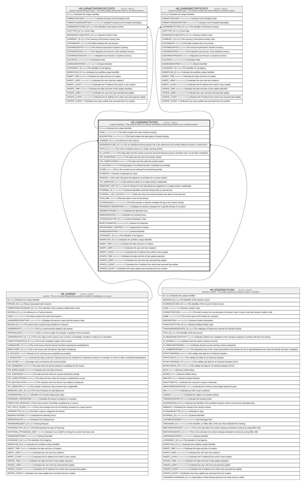

# HR_LEARNERACTIVITIES

## Description

Learner Activities - This entity is child of a Learner and details all learning activities for an enrolled Learner.  

## Columns

| Name | Type | Default | Nullable | Children | Parents | Comment |
| ---- | ---- | ------- | -------- | -------- | ------- | ------- |
| ID | bigint |  | false | [HR_LERNACTIVFORECASTCOSTS](HR_LERNACTIVFORECASTCOSTS.md) [HR_LEARNERACTIVITYCOSTS](HR_LEARNERACTIVITYCOSTS.md) |  | Indicates the unique identifier |
| CODE | nvarchar(MAX) |  | true |  |  | This field contains the code of learner activity. |
| DESCRIPTION | nvarchar(MAX) |  | true |  |  | This field contains the description of learner activity. |
| LEARNER_ID | bigint |  | false |  | [HR_LEARNER](HR_LEARNER.md) | A reference to the Learner. |
| SESSIONOUTLINE_ID | bigint |  | false |  | [HR_SESSIONOUTLINE](HR_SESSIONOUTLINE.md) | On an individual learning activity, this is the reference to the activity defined at session content level. |
| STATUS_ID | bigint |  | true |  |  | This is the completion status of a single Learning activity. |
| IS_LOCKED | smallint |  | true |  |  | This flag states that the activity cannot be launched because previous activities have not yet been completed. |
| DTA_STARTEDON | datetime2 |  | true |  |  | The date and time when the activity started. |
| DTA_COMPLETEDON | datetime2 |  | true |  |  | The date and time when the activity ended. |
| IS_SUCCESS | smallint |  | true |  |  | This flag states if an activity has been completed successfully. |
| SCORE | decimal |  | true |  |  | This is the numeric score achieved for the learning activity. |
| ATTEMPTS | int |  | true |  |  | Number of attempts for a test. |
| RANKING | int |  | true |  |  | Sort order that gives the sequence of activities for a course session. |
| TOT_ABSENCES | decimal |  | true |  |  | Total absences taken for a single activity, if applicable. |
| ABSENCES_UNIT_ID | bigint |  | true |  |  | Unit of measure for the total absences registered on a single activity, if applicable. |
| EXTERNAL_ID | nvarchar(255) |  | true |  |  | External Identifier to link the Activity with an external tool. |
| EXTERNAL_LAST_ACCESS | datetime2 |  | true |  |  | Date time when the external activity was taken for the last time. |
| TOTALTIME | decimal |  | true |  |  | Total time taken so far for the Activity. |
| EXTERNALBAG | nvarchar(MAX) |  | true |  |  | This field includes a machine readable full log of the Learner Activity. |
| PROGRESS_PERCENTAGE | decimal |  | true |  |  | Displays the learner's progress for a specific Activity of a session. |
| INDEMNITYHOURS | decimal |  | true |  |  | Indicates the idemnity hours. |
| WORKINGHOURS | decimal |  | true |  |  | Indicates the working hours. |
| ATTENDANCETYPE_ID | bigint |  | true |  |  | Activity Attendance Type |
| REJECTIONNOTES | nvarchar(MAX) |  | true |  |  | Reason for Rejection  |
| APPOINTMENT_CREATED | smallint |  | true |  |  | Appointment Created |
| SHAREDIDENTIFIER | nvarchar(255) |  | true |  |  | Shared Identifier |
| LISTAGENCY_ID | bigint |  | true |  |  | The Identifier of List Agency. |
| WORKFLOW_ID | bigint |  | true |  |  | Indicates the workflow unique identifier |
| INSERT_TIME | datetime2 | (sysutcdatetime()) | false |  |  | Indicates the date and time of creation |
| INSERT_USER | nvarchar(100) | (N'MAIN') | false |  |  | Indicates the user who has created it |
| INSERT_CLIENT | nvarchar(50) | (N'localhost') | false |  |  | Indicates the IP address from which it was created |
| UPDATE_TIME | datetime2 | (sysutcdatetime()) | false |  |  | Indicates the date and time of last update operation |
| UPDATE_USER | nvarchar(100) | (N'MAIN') | false |  |  | Indicates the user who has executed last update |
| UPDATE_CLIENT | nvarchar(50) | (N'localhost') | false |  |  | Indicates the IP address from which was executed last update |
| UPDATE_COUNT | int | ((0)) | false |  |  | Indicates how many update was executed since its creation |

## Constraints

| Name | Type | Definition |
| ---- | ---- | ---------- |
| PK_HR_LEARNERACTIVITIES | PRIMARY KEY | CLUSTERED, unique, part of a PRIMARY KEY constraint, [ ID ] |
| UQ_HR_LEARNERACTIVITIES | UNIQUE | NONCLUSTERED, unique, part of a UNIQUE constraint, [ LEARNER_ID, SESSIONOUTLINE_ID ] |
| FK_LEARNACTS_HR_LEARNER | FOREIGN KEY | FOREIGN KEY(LEARNER_ID) REFERENCES HR_LEARNER(ID) ON UPDATE NO_ACTION ON DELETE CASCADE |
| FK_LEARNACTS_SESSIONOUTLINE | FOREIGN KEY | FOREIGN KEY(SESSIONOUTLINE_ID) REFERENCES HR_SESSIONOUTLINE(ID) ON UPDATE NO_ACTION ON DELETE NO_ACTION |

## Indexes

| Name | Definition |
| ---- | ---------- |
| PK_HR_LEARNERACTIVITIES | CLUSTERED, unique, part of a PRIMARY KEY constraint, [ ID ] |
| UQ_HR_LEARNERACTIVITIES | NONCLUSTERED, unique, part of a UNIQUE constraint, [ LEARNER_ID, SESSIONOUTLINE_ID ] |

## Triggers

| Name | Definition |
| ---- | ---------- |
| DELETELEARNQUESTIONNAIRES | -- Talentia Software - All right reserved -- Type: TRIGGER                  Name: DELETELEARNQUESTIONNAIRES -- Date: 09-04-2026 07:27:59 (UTC) --  -- ChangeLogId: 00000000-0000-0000-0000-000000000000 -- ChangeSetId: aa5a33df-814d-42c3-8618-2ccdd4ef9882 -- Original file name: C:\repos\Talentia-Software\hcm-core/DB/ProductDB/EDM\Schema\Triggers\DELETELEARNQUESTIONNAIRES.xml   CREATE TRIGGER DELETELEARNQUESTIONNAIRES ON HR_LEARNERACTIVITIES AFTER DELETE AS BEGIN     SET NOCOUNT ON;     DELETE TF_QSTRT_QUESTIONNAIRES     FROM DELETED D     WHERE TF_QSTRT_QUESTIONNAIRES.QSTRT_PARENT_ID = D.ID 	AND TF_QSTRT_QUESTIONNAIRES.QSTRT_PARENT_ENTITY_ID = '743cb44d-a666-497d-ae5b-3d84273409fd' END   |

## Relations

---

> Generated by [tbls](https://github.com/k1LoW/tbls)
