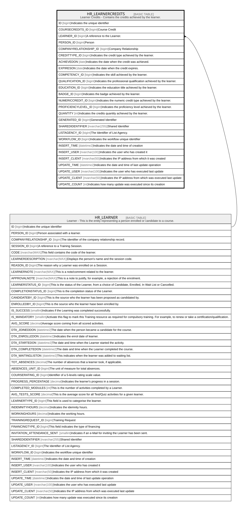

# HR_LEARNERCREDITS

## Description

Learner Credits - Contains the credits achieved by the learner.  

## Columns

| Name | Type | Default | Nullable | Parents | Comment |
| ---- | ---- | ------- | -------- | ------- | ------- |
| ID | bigint |  | false |  | Indicates the unique identifier |
| COURSECREDITS_ID | bigint |  | true |  | Course Credit |
| LEARNER_ID | bigint |  | false | [HR_LEARNER](HR_LEARNER.md) | A reference to the Learner. |
| PERSON_ID | bigint |  | true |  | Person |
| COMPANYRELATIONSHIP_ID | bigint |  | true |  | Company Relationship |
| CREDITTYPE_ID | bigint |  | false |  | Indicates the credit type achieved by the learner. |
| ACHIEVEDON | date |  | true |  | Indicates the date when the credit was achieved. |
| EXPIRESON | date |  | true |  | Indicates the date when the credit expires. |
| COMPETENCY_ID | bigint |  | true |  | Indicates the skill achieved by the learner. |
| QUALIFICATION_ID | bigint |  | true |  | Indicates the professional qualification achieved by the learner. |
| EDUCATION_ID | bigint |  | true |  | Indicates the education title achieved by the learner. |
| BADGE_ID | bigint |  | true |  | Indicates the badge achieved by the learner. |
| NUMERICCREDIT_ID | bigint |  | true |  | Indicates the numeric credit type achieved by the learner. |
| PROFICIENCYLEVEL_ID | bigint |  | true |  | Indicates the proficiency level achieved by the learner. |
| QUANTITY | int |  | true |  | Indicates the credits quantity achieved by the learner. |
| GENERATED_ID | bigint |  | true |  | Generated Identifier |
| SHAREDIDENTIFIER | nvarchar(255) |  | true |  | Shared Identifier |
| LISTAGENCY_ID | bigint |  | true |  | The Identifier of List Agency. |
| WORKFLOW_ID | bigint |  | true |  | Indicates the workflow unique identifier |
| INSERT_TIME | datetime2 | (sysutcdatetime()) | false |  | Indicates the date and time of creation |
| INSERT_USER | nvarchar(100) | (N'MAIN') | false |  | Indicates the user who has created it |
| INSERT_CLIENT | nvarchar(50) | (N'localhost') | false |  | Indicates the IP address from which it was created |
| UPDATE_TIME | datetime2 | (sysutcdatetime()) | false |  | Indicates the date and time of last update operation |
| UPDATE_USER | nvarchar(100) | (N'MAIN') | false |  | Indicates the user who has executed last update |
| UPDATE_CLIENT | nvarchar(50) | (N'localhost') | false |  | Indicates the IP address from which was executed last update |
| UPDATE_COUNT | int | ((0)) | false |  | Indicates how many update was executed since its creation |

## Constraints

| Name | Type | Definition |
| ---- | ---- | ---------- |
| PK_HR_LEARNERCREDITS | PRIMARY KEY | CLUSTERED, unique, part of a PRIMARY KEY constraint, [ ID ] |
| FK_LEARNERCREDITS_LEARNER | FOREIGN KEY | FOREIGN KEY(LEARNER_ID) REFERENCES HR_LEARNER(ID) ON UPDATE NO_ACTION ON DELETE CASCADE |

## Indexes

| Name | Definition |
| ---- | ---------- |
| PK_HR_LEARNERCREDITS | CLUSTERED, unique, part of a PRIMARY KEY constraint, [ ID ] |

## Relations

---

> Generated by [tbls](https://github.com/k1LoW/tbls)
