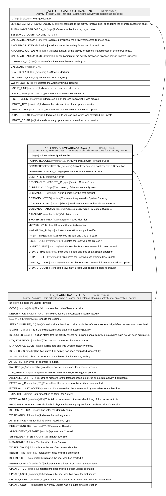

# HR_LERNACTIVFORECASTCOSTS

## Description

Learner Activity Forecast Costs - This entity details all forecast costs for an activity learner.  

## Columns

| Name | Type | Default | Nullable | Children | Parents | Comment |
| ---- | ---- | ------- | -------- | -------- | ------- | ------- |
| ID | bigint |  | false | [HR_ACTFORECASTCOSTFINANCING](HR_ACTFORECASTCOSTFINANCING.md) |  | Indicates the unique identifier |
| FORMATTEDCODE | nvarchar(100) |  | true |  |  | Activity Forecast Cost Formatted Code |
| FORMATTEDDESCRIPTION | nvarchar(255) |  | true |  |  | Activity Forecast Cost Formatted Description |
| LEARNERACTIVITIES_ID | bigint |  | false |  | [HR_LEARNERACTIVITIES](HR_LEARNERACTIVITIES.md) | The identifier of the learner activity |
| COSTTYPE_ID | bigint |  | false |  |  | Cost Type |
| SESSIONOUTLINECOSTS_ID | bigint |  | true |  |  | Session Outline Costs |
| CURRENCY_ID | bigint |  | true |  |  | The currency of the learner actvity costs |
| COSTAMOUNT | decimal |  | true |  |  | This field containes the cost amount. |
| COSTAMOUNTSYS | decimal |  | true |  |  | The amount expressed in System Currency. |
| COSTAMOUNTADJ | decimal |  | true |  |  | The adjusted cost amount, in the selected currency. |
| COSTAMOUNTADJSYS | decimal |  | true |  |  |  Adjusted Cost Amount, in System Currency. |
| CALCNOTE | nvarchar(MAX) |  | true |  |  | Calculation Note |
| SHAREDIDENTIFIER | nvarchar(255) |  | true |  |  | Shared Identifier |
| LISTAGENCY_ID | bigint |  | true |  |  | The Identifier of List Agency. |
| WORKFLOW_ID | bigint |  | true |  |  | Indicates the workflow unique identifier |
| INSERT_TIME | datetime2 | (sysutcdatetime()) | false |  |  | Indicates the date and time of creation |
| INSERT_USER | nvarchar(100) | (N'MAIN') | false |  |  | Indicates the user who has created it |
| INSERT_CLIENT | nvarchar(50) | (N'localhost') | false |  |  | Indicates the IP address from which it was created |
| UPDATE_TIME | datetime2 | (sysutcdatetime()) | false |  |  | Indicates the date and time of last update operation |
| UPDATE_USER | nvarchar(100) | (N'MAIN') | false |  |  | Indicates the user who has executed last update |
| UPDATE_CLIENT | nvarchar(50) | (N'localhost') | false |  |  | Indicates the IP address from which was executed last update |
| UPDATE_COUNT | int | ((0)) | false |  |  | Indicates how many update was executed since its creation |

## Constraints

| Name | Type | Definition |
| ---- | ---- | ---------- |
| PK_LERNACTIVFORECASTCOSTS | PRIMARY KEY | CLUSTERED, unique, part of a PRIMARY KEY constraint, [ ID ] |
| UQ_LERNACTIVFORECASTCOSTS | UNIQUE | NONCLUSTERED, unique, part of a UNIQUE constraint, [ LEARNERACTIVITIES_ID, COSTTYPE_ID, SESSIONOUTLINECOSTS_ID ] |
| FK_LRNACTIVFORCOST_LACTIVITY | FOREIGN KEY | FOREIGN KEY(LEARNERACTIVITIES_ID) REFERENCES HR_LEARNERACTIVITIES(ID) ON UPDATE NO_ACTION ON DELETE CASCADE |

## Indexes

| Name | Definition |
| ---- | ---------- |
| PK_LERNACTIVFORECASTCOSTS | CLUSTERED, unique, part of a PRIMARY KEY constraint, [ ID ] |
| UQ_LERNACTIVFORECASTCOSTS | NONCLUSTERED, unique, part of a UNIQUE constraint, [ LEARNERACTIVITIES_ID, COSTTYPE_ID, SESSIONOUTLINECOSTS_ID ] |

## Relations

---

> Generated by [tbls](https://github.com/k1LoW/tbls)
