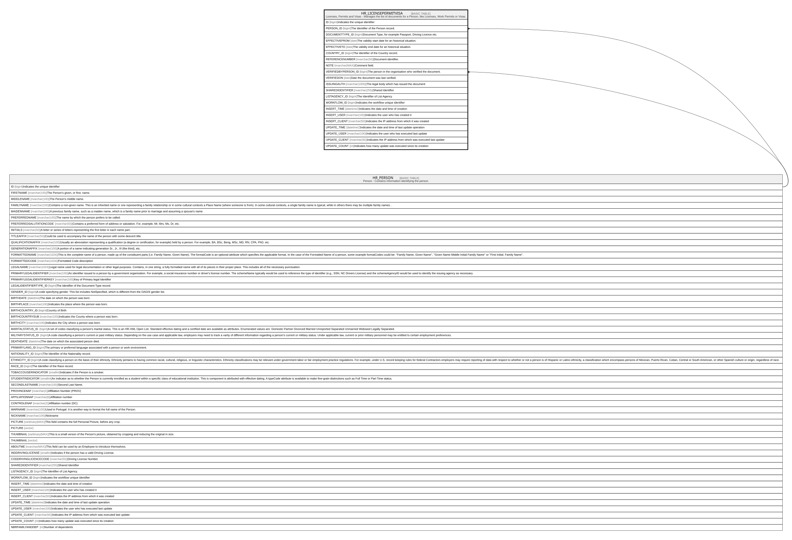

# HR_LICENSEPERMITVISA

## Description

Licenses, Permits and Visas - Manages the list of documents for a Person, like Licenses, Work Permits or Visas.  

## Columns

| Name | Type | Default | Nullable | Parents | Comment |
| ---- | ---- | ------- | -------- | ------- | ------- |
| ID | bigint |  | false |  | Indicates the unique identifier |
| PERSON_ID | bigint |  | false | [HR_PERSON](HR_PERSON.md) | The Identifier of the Person record. |
| DOCUMENTTYPE_ID | bigint |  | false |  | Document Type, for example Passport, Driving Licence etc. |
| EFFECTIVEFROM | date |  | false |  | The validity start date for an historical situation. |
| EFFECTIVETO | date |  | true |  | The validity end date for an historical situation. |
| COUNTRY_ID | bigint |  | true |  | The Identifier of the Country record. |
| REFERENCENUMBER | nvarchar(50) |  | true |  | Document identifier. |
| NOTE | nvarchar(MAX) |  | true |  | Comment field. |
| VERIFIEDBYPERSON_ID | bigint |  | true | [HR_PERSON](HR_PERSON.md) | The person in the organisation who verified the document. |
| VERIFIEDON | date |  | true |  | Date the document was last verified. |
| ISSUINGAUTH | nvarchar(1000) |  | true |  | The legal body which has issued the document |
| SHAREDIDENTIFIER | nvarchar(255) |  | true |  | Shared Identifier |
| LISTAGENCY_ID | bigint |  | true |  | The Identifier of List Agency. |
| WORKFLOW_ID | bigint |  | true |  | Indicates the workflow unique identifier |
| INSERT_TIME | datetime2 | (sysutcdatetime()) | false |  | Indicates the date and time of creation |
| INSERT_USER | nvarchar(100) | (N'MAIN') | false |  | Indicates the user who has created it |
| INSERT_CLIENT | nvarchar(50) | (N'localhost') | false |  | Indicates the IP address from which it was created |
| UPDATE_TIME | datetime2 | (sysutcdatetime()) | false |  | Indicates the date and time of last update operation |
| UPDATE_USER | nvarchar(100) | (N'MAIN') | false |  | Indicates the user who has executed last update |
| UPDATE_CLIENT | nvarchar(50) | (N'localhost') | false |  | Indicates the IP address from which was executed last update |
| UPDATE_COUNT | int | ((0)) | false |  | Indicates how many update was executed since its creation |

## Constraints

| Name | Type | Definition |
| ---- | ---- | ---------- |
| PK_HR_LICENSEPERMITVISA | PRIMARY KEY | CLUSTERED, unique, part of a PRIMARY KEY constraint, [ ID ] |
| FK_HR_LICPERVISA_HR_PERSON | FOREIGN KEY | FOREIGN KEY(PERSON_ID) REFERENCES HR_PERSON(ID) ON UPDATE NO_ACTION ON DELETE CASCADE |
| FK_HR_LICPERVISA_HR_PERSON_V | FOREIGN KEY | FOREIGN KEY(VERIFIEDBYPERSON_ID) REFERENCES HR_PERSON(ID) ON UPDATE NO_ACTION ON DELETE NO_ACTION |

## Indexes

| Name | Definition |
| ---- | ---------- |
| PK_HR_LICENSEPERMITVISA | CLUSTERED, unique, part of a PRIMARY KEY constraint, [ ID ] |
| IDX_HR_LICENSEPERMITVISA | NONCLUSTERED, unique, [ PERSON_ID, EFFECTIVEFROM, DOCUMENTTYPE_ID, REFERENCENUMBER ] |

## Relations

---

> Generated by [tbls](https://github.com/k1LoW/tbls)
