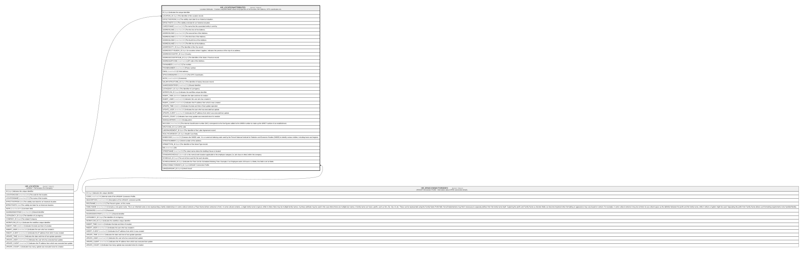

# HR_LOCATIONATTRIBUTES

## Description

Location Attributes - Contains required details about the properties of the location, like address, GPS coordinates etc.  

## Columns

| Name | Type | Default | Nullable | Parents | Comment |
| ---- | ---- | ------- | -------- | ------- | ------- |
| ID | bigint |  | false |  | Indicates the unique identifier |
| LOCATION_ID | bigint |  | false | [HR_LOCATION](HR_LOCATION.md) | The Identifier of the Location record. |
| EFFECTIVEFROM | date |  | false |  | The validity start date for an historical situation. |
| EFFECTIVETO | date |  | true |  | The validity end date for an historical situation. |
| CAREOFNAME | nvarchar(100) |  | true |  | The name that the associated entity is sent by. |
| ADDRESSLINE1 | nvarchar(100) |  | true |  | The first line of the Address.  |
| ADDRESSLINE2 | nvarchar(100) |  | true |  | The second line of the Address.  |
| ADDRESSLINE3 | nvarchar(100) |  | true |  | The third line of the Address.  |
| ADDRESSLINE4 | nvarchar(100) |  | true |  | The fourth line of the Address.  |
| ADDRESSLINE5 | nvarchar(100) |  | true |  | The fifth line of the Address.  |
| ADDRESSCITY_ID | bigint |  | true |  | The Identifier of the City record. |
| ADDRESSCITYSUBDIV_ID | bigint |  | true |  | In countries where it applies, indicates the province of the city of an address. |
| ADDRESSCOUNTRY_ID | bigint |  | false |  | Country |
| ADDRESSCOUNTRYSUB_ID | bigint |  | true |  | The Identifier of the State / Province record. |
| ADDRESSZIPCODE | nvarchar(16) |  | true |  | ZIP code of the Address. |
| FAXNUMBER | nvarchar(20) |  | true |  | Fax number. |
| PHONENUMBER | nvarchar(20) |  | true |  | Phone number. |
| EMAIL | nvarchar(50) |  | true |  | E-Mail address. |
| GPSCOORDINATES | nvarchar(50) |  | true |  | The GPS Coordinates. |
| NOTE | nvarchar(MAX) |  | true |  | Comments |
| SALARYSTRUCTURE_ID | bigint |  | true |  | The identifier of Salary Structure record. |
| SHAREDIDENTIFIER | nvarchar(255) |  | true |  | Shared Identifier |
| LISTAGENCY_ID | bigint |  | true |  | The Identifier of List Agency. |
| WORKFLOW_ID | bigint |  | true |  | Indicates the workflow unique identifier |
| INSERT_TIME | datetime2 | (sysutcdatetime()) | false |  | Indicates the date and time of creation |
| INSERT_USER | nvarchar(100) | (N'MAIN') | false |  | Indicates the user who has created it |
| INSERT_CLIENT | nvarchar(50) | (N'localhost') | false |  | Indicates the IP address from which it was created |
| UPDATE_TIME | datetime2 | (sysutcdatetime()) | false |  | Indicates the date and time of last update operation |
| UPDATE_USER | nvarchar(100) | (N'MAIN') | false |  | Indicates the user who has executed last update |
| UPDATE_CLIENT | nvarchar(50) | (N'localhost') | false |  | Indicates the IP address from which was executed last update |
| UPDATE_COUNT | int | ((0)) | false |  | Indicates how many update was executed since its creation |
| HEADQUARTERS | smallint |  | true |  | Headquarters |
| NICCODE | nvarchar(100) |  | true |  | The internal classification number (NIC) corresponds to the five figures added to the SIREN number to make up the SIRET number of an establishment. |
| APETCODE_ID | bigint |  | true |  | APE code |
| LABORAGREMENT_ID | bigint |  | true |  | The Identifier of the Labor Agreement record. |
| HEALTHCAREBODY_ID | bigint |  | true |  | Health Care Body |
| INSEECODE | nvarchar(50) |  | true |  | Contains the INSEE code. It is a numerical indexing code used by the French National Institute for Statistics and Economic Studies (INSEE) to identify various entities, including towns and regions. |
| STREETNUMBER | bigint |  | true |  | Street number of the address. |
| STREETTYPE_ID | bigint |  | true |  | The Identifier of the Street Type record. |
| BIS | nvarchar(1) |  | true |  | Bis |
| STREETNAME | nvarchar(50) |  | true |  | The street name where the building/ house is located |
| STANDARSCHEDULE | decimal |  | true |  | It is the normal work duration applicable to the employee category (i.e. job class or other) within the company. |
| SCHEDULE_ID | bigint |  | true |  | The unit of time used for the work duration. |
| SCHEDULEBASIS_ID | bigint |  | true |  | Indicates the Time Unit for Scheduled Working Time. Example, if an Employee works 40 hours in a Week, this field is set to Week. |
| DPAECONNECTORSINFO_ID | bigint |  | true | [HR_DPAECONNECTORSINFO](HR_DPAECONNECTORSINFO.md) | URSSAF Connection Profile |
| LINKEDURSSAF_ID | bigint |  | true |  | Linked Urssaf |

## Constraints

| Name | Type | Definition |
| ---- | ---- | ---------- |
| PK_LOCATIONATTRIBUTES | PRIMARY KEY | CLUSTERED, unique, part of a PRIMARY KEY constraint, [ ID ] |
| FK_LOCATIONATTRIBUTES_DPAECI | FOREIGN KEY | FOREIGN KEY(DPAECONNECTORSINFO_ID) REFERENCES HR_DPAECONNECTORSINFO(ID) ON UPDATE NO_ACTION ON DELETE NO_ACTION |
| FK_LOCATIONATTRIBUTES_LOCATION | FOREIGN KEY | FOREIGN KEY(LOCATION_ID) REFERENCES HR_LOCATION(ID) ON UPDATE NO_ACTION ON DELETE NO_ACTION |

## Indexes

| Name | Definition |
| ---- | ---------- |
| PK_LOCATIONATTRIBUTES | CLUSTERED, unique, part of a PRIMARY KEY constraint, [ ID ] |
| IDX_LOCATIONATTRIBUTES_LOCEF | NONCLUSTERED, unique, [ LOCATION_ID, EFFECTIVEFROM ] |
| IDX_LOCATIONATTRIBUTES_CITY | NONCLUSTERED, [ ADDRESSCITY_ID ] |
| IDX_LOCATIONATTRIBUTES_COUN | NONCLUSTERED, [ ADDRESSCOUNTRY_ID ] |
| IDX_LOCATIONATTRIBUTES_SUB | NONCLUSTERED, [ ADDRESSCOUNTRYSUB_ID ] |
| IDX_LOCATIONATTRIBUTES_SUBDIV | NONCLUSTERED, [ ADDRESSCITYSUBDIV_ID ] |
| IDX_LOCATIONATTRIBUTES_DPAECI | NONCLUSTERED, [ DPAECONNECTORSINFO_ID ] |

## Relations

---

> Generated by [tbls](https://github.com/k1LoW/tbls)
