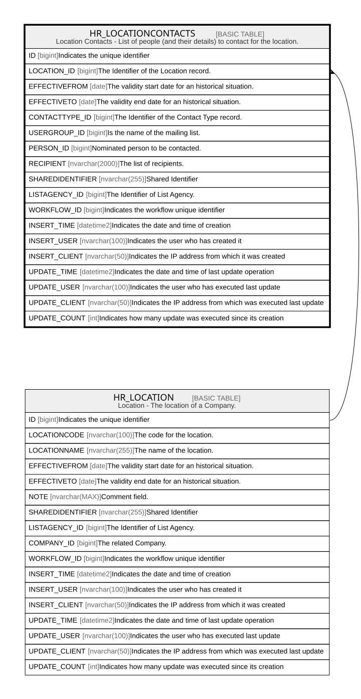

# HR_LOCATIONCONTACTS

## Description

Location Contacts - List of people (and their details) to contact for the location.  

## Columns

| Name | Type | Default | Nullable | Parents | Comment |
| ---- | ---- | ------- | -------- | ------- | ------- |
| ID | bigint |  | false |  | Indicates the unique identifier |
| LOCATION_ID | bigint |  | true | [HR_LOCATION](HR_LOCATION.md) | The Identifier of the Location record. |
| EFFECTIVEFROM | date |  | true |  | The validity start date for an historical situation. |
| EFFECTIVETO | date |  | true |  | The validity end date for an historical situation. |
| CONTACTTYPE_ID | bigint |  | true |  | The Identifier of the Contact Type record. |
| USERGROUP_ID | bigint |  | true |  | Is the name of the mailing list. |
| PERSON_ID | bigint |  | true |  | Nominated person to be contacted. |
| RECIPIENT | nvarchar(2000) |  | true |  | The list of recipients. |
| SHAREDIDENTIFIER | nvarchar(255) |  | true |  | Shared Identifier |
| LISTAGENCY_ID | bigint |  | true |  | The Identifier of List Agency. |
| WORKFLOW_ID | bigint |  | true |  | Indicates the workflow unique identifier |
| INSERT_TIME | datetime2 | (sysutcdatetime()) | false |  | Indicates the date and time of creation |
| INSERT_USER | nvarchar(100) | (N'MAIN') | false |  | Indicates the user who has created it |
| INSERT_CLIENT | nvarchar(50) | (N'localhost') | false |  | Indicates the IP address from which it was created |
| UPDATE_TIME | datetime2 | (sysutcdatetime()) | false |  | Indicates the date and time of last update operation |
| UPDATE_USER | nvarchar(100) | (N'MAIN') | false |  | Indicates the user who has executed last update |
| UPDATE_CLIENT | nvarchar(50) | (N'localhost') | false |  | Indicates the IP address from which was executed last update |
| UPDATE_COUNT | int | ((0)) | false |  | Indicates how many update was executed since its creation |

## Constraints

| Name | Type | Definition |
| ---- | ---- | ---------- |
| PK_LOCATIONCONTACTS | PRIMARY KEY | CLUSTERED, unique, part of a PRIMARY KEY constraint, [ ID ] |
| FK_LOCATIONCONTACTS_LOCATION | FOREIGN KEY | FOREIGN KEY(LOCATION_ID) REFERENCES HR_LOCATION(ID) ON UPDATE NO_ACTION ON DELETE NO_ACTION |

## Indexes

| Name | Definition |
| ---- | ---------- |
| PK_LOCATIONCONTACTS | CLUSTERED, unique, part of a PRIMARY KEY constraint, [ ID ] |
| IDX_LOCCONTACTS_CONTACTTYPE | NONCLUSTERED, [ CONTACTTYPE_ID ] |

## Relations

---

> Generated by [tbls](https://github.com/k1LoW/tbls)
