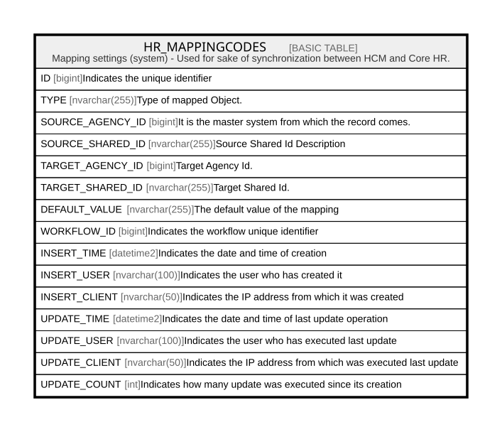

# HR_MAPPINGCODES

## Description

Mapping settings (system) - Used for sake of synchronization between HCM and Core HR.  

## Columns

| Name | Type | Default | Nullable | Comment |
| ---- | ---- | ------- | -------- | ------- |
| ID | bigint |  | false | Indicates the unique identifier |
| TYPE | nvarchar(255) |  | false | Type of mapped Object. |
| SOURCE_AGENCY_ID | bigint |  | false | It is the master system from which the record comes. |
| SOURCE_SHARED_ID | nvarchar(255) |  | false | Source Shared Id Description |
| TARGET_AGENCY_ID | bigint |  | false | Target Agency Id. |
| TARGET_SHARED_ID | nvarchar(255) |  | false | Target Shared Id. |
| DEFAULT_VALUE | nvarchar(255) |  | true | The default value of the mapping |
| WORKFLOW_ID | bigint |  | true | Indicates the workflow unique identifier |
| INSERT_TIME | datetime2 | (sysutcdatetime()) | false | Indicates the date and time of creation |
| INSERT_USER | nvarchar(100) | (N'MAIN') | false | Indicates the user who has created it |
| INSERT_CLIENT | nvarchar(50) | (N'localhost') | false | Indicates the IP address from which it was created |
| UPDATE_TIME | datetime2 | (sysutcdatetime()) | false | Indicates the date and time of last update operation |
| UPDATE_USER | nvarchar(100) | (N'MAIN') | false | Indicates the user who has executed last update |
| UPDATE_CLIENT | nvarchar(50) | (N'localhost') | false | Indicates the IP address from which was executed last update |
| UPDATE_COUNT | int | ((0)) | false | Indicates how many update was executed since its creation |

## Constraints

| Name | Type | Definition |
| ---- | ---- | ---------- |
| PK_HR_MAPPINGCODES | PRIMARY KEY | CLUSTERED, unique, part of a PRIMARY KEY constraint, [ ID ] |

## Indexes

| Name | Definition |
| ---- | ---------- |
| PK_HR_MAPPINGCODES | CLUSTERED, unique, part of a PRIMARY KEY constraint, [ ID ] |
| IDX_HR_MAPPINGCODES | NONCLUSTERED, unique, [ TYPE, SOURCE_SHARED_ID ] |

## Relations

---

> Generated by [tbls](https://github.com/k1LoW/tbls)
