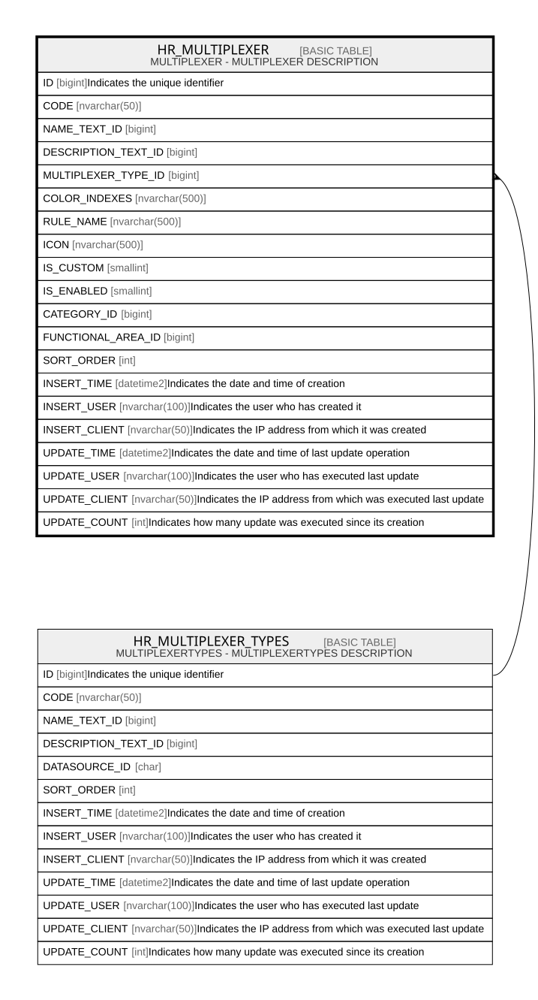

# HR_MULTIPLEXER

## Description

MULTIPLEXER - MULTIPLEXER DESCRIPTION  

## Columns

| Name | Type | Default | Nullable | Parents | Comment |
| ---- | ---- | ------- | -------- | ------- | ------- |
| ID | bigint |  | false |  | Indicates the unique identifier |
| CODE | nvarchar(50) |  | false |  |  |
| NAME_TEXT_ID | bigint |  | true |  |  |
| DESCRIPTION_TEXT_ID | bigint |  | true |  |  |
| MULTIPLEXER_TYPE_ID | bigint |  | false | [HR_MULTIPLEXER_TYPES](HR_MULTIPLEXER_TYPES.md) |  |
| COLOR_INDEXES | nvarchar(500) |  | true |  |  |
| RULE_NAME | nvarchar(500) |  | false |  |  |
| ICON | nvarchar(500) |  | true |  |  |
| IS_CUSTOM | smallint | ((1)) | false |  |  |
| IS_ENABLED | smallint | ((1)) | false |  |  |
| CATEGORY_ID | bigint |  | false |  |  |
| FUNCTIONAL_AREA_ID | bigint |  | true |  |  |
| SORT_ORDER | int | ((0)) | false |  |  |
| INSERT_TIME | datetime2 | (sysutcdatetime()) | true |  | Indicates the date and time of creation |
| INSERT_USER | nvarchar(100) | (N'MAIN') | true |  | Indicates the user who has created it |
| INSERT_CLIENT | nvarchar(50) | (N'localhost') | true |  | Indicates the IP address from which it was created |
| UPDATE_TIME | datetime2 | (sysutcdatetime()) | true |  | Indicates the date and time of last update operation |
| UPDATE_USER | nvarchar(100) | (N'MAIN') | true |  | Indicates the user who has executed last update |
| UPDATE_CLIENT | nvarchar(50) | (N'localhost') | true |  | Indicates the IP address from which was executed last update |
| UPDATE_COUNT | int | ((0)) | true |  | Indicates how many update was executed since its creation |

## Constraints

| Name | Type | Definition |
| ---- | ---- | ---------- |
| PK_MULTIPLEXER | PRIMARY KEY | CLUSTERED, unique, part of a PRIMARY KEY constraint, [ ID ] |
| UQ_MULTIPLEXER_CODE | UNIQUE | NONCLUSTERED, unique, part of a UNIQUE constraint, [ CODE ] |
| FK_MULTIPLEXER_MLTPLTYPES | FOREIGN KEY | FOREIGN KEY(MULTIPLEXER_TYPE_ID) REFERENCES HR_MULTIPLEXER_TYPES(ID) ON UPDATE NO_ACTION ON DELETE NO_ACTION |

## Indexes

| Name | Definition |
| ---- | ---------- |
| PK_MULTIPLEXER | CLUSTERED, unique, part of a PRIMARY KEY constraint, [ ID ] |
| UQ_MULTIPLEXER_CODE | NONCLUSTERED, unique, part of a UNIQUE constraint, [ CODE ] |

## Relations

---

> Generated by [tbls](https://github.com/k1LoW/tbls)
