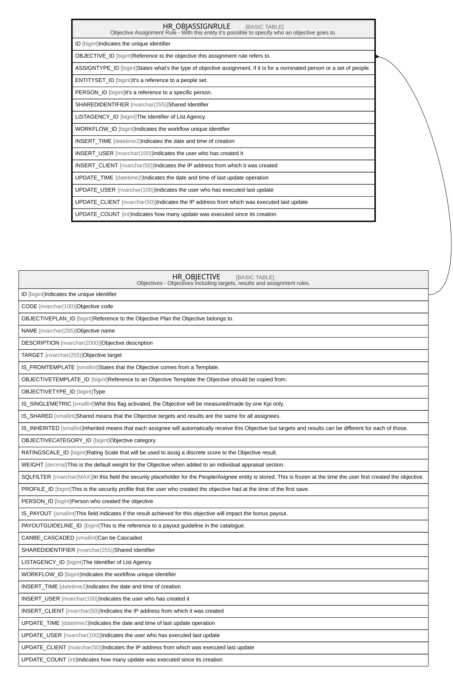

# HR_OBJASSIGNRULE

## Description

Objective Assignment Rule - With this entity it's possible to specify who an objective goes to.  

## Columns

| Name | Type | Default | Nullable | Parents | Comment |
| ---- | ---- | ------- | -------- | ------- | ------- |
| ID | bigint |  | false |  | Indicates the unique identifier |
| OBJECTIVE_ID | bigint |  | false | [HR_OBJECTIVE](HR_OBJECTIVE.md) | Reference to the objective this assignment rule refers to. |
| ASSIGNTYPE_ID | bigint |  | true |  | States what's the type of objective assignment, if it is for a nominated person or a set of people. |
| ENTITYSET_ID | bigint |  | true |  | It's a reference to a people set. |
| PERSON_ID | bigint |  | true |  | It's a reference to a specific person. |
| SHAREDIDENTIFIER | nvarchar(255) |  | true |  | Shared Identifier |
| LISTAGENCY_ID | bigint |  | true |  | The Identifier of List Agency. |
| WORKFLOW_ID | bigint |  | true |  | Indicates the workflow unique identifier |
| INSERT_TIME | datetime2 |  | false |  | Indicates the date and time of creation |
| INSERT_USER | nvarchar(100) |  | false |  | Indicates the user who has created it |
| INSERT_CLIENT | nvarchar(50) |  | false |  | Indicates the IP address from which it was created |
| UPDATE_TIME | datetime2 |  | false |  | Indicates the date and time of last update operation |
| UPDATE_USER | nvarchar(100) |  | false |  | Indicates the user who has executed last update |
| UPDATE_CLIENT | nvarchar(50) |  | false |  | Indicates the IP address from which was executed last update |
| UPDATE_COUNT | int |  | false |  | Indicates how many update was executed since its creation |

## Constraints

| Name | Type | Definition |
| ---- | ---- | ---------- |
| PK_HR_OBJASSIGNRULE | PRIMARY KEY | CLUSTERED, unique, part of a PRIMARY KEY constraint, [ ID ] |
| UQ_OBJASSIGNRULE | UNIQUE | NONCLUSTERED, unique, part of a UNIQUE constraint, [ OBJECTIVE_ID, ENTITYSET_ID, PERSON_ID ] |
| FK_OBJASSIGNRULE_OBJECTIVE | FOREIGN KEY | FOREIGN KEY(OBJECTIVE_ID) REFERENCES HR_OBJECTIVE(ID) ON UPDATE NO_ACTION ON DELETE CASCADE |

## Indexes

| Name | Definition |
| ---- | ---------- |
| PK_HR_OBJASSIGNRULE | CLUSTERED, unique, part of a PRIMARY KEY constraint, [ ID ] |
| UQ_OBJASSIGNRULE | NONCLUSTERED, unique, part of a UNIQUE constraint, [ OBJECTIVE_ID, ENTITYSET_ID, PERSON_ID ] |

## Relations

---

> Generated by [tbls](https://github.com/k1LoW/tbls)
