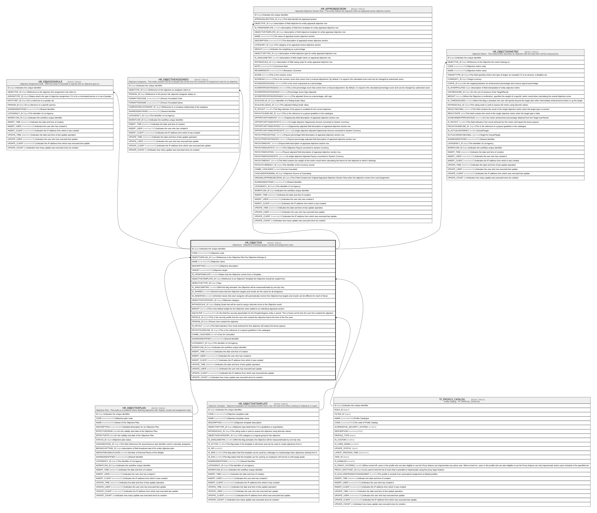

# HR_OBJECTIVE

## Description

Objectives - Objectives including targets, results and assignment rules.  

## Columns

| Name | Type | Default | Nullable | Children | Parents | Comment |
| ---- | ---- | ------- | -------- | -------- | ------- | ------- |
| ID | bigint |  | false | [HR_OBJASSIGNRULE](HR_OBJASSIGNRULE.md) [HR_OBJECTIVEASSIGNEES](HR_OBJECTIVEASSIGNEES.md) [HR_APPROBJSECROW](HR_APPROBJSECROW.md) [HR_OBJECTIVEMETRIC](HR_OBJECTIVEMETRIC.md) |  | Indicates the unique identifier |
| CODE | nvarchar(100) |  | false |  |  | Objective code |
| OBJECTIVEPLAN_ID | bigint |  | false |  | [HR_OBJECTIVEPLAN](HR_OBJECTIVEPLAN.md) | Reference to the Objective Plan the Objective belongs to. |
| NAME | nvarchar(255) |  | true |  |  | Objective name |
| DESCRIPTION | nvarchar(2000) |  | true |  |  | Objective description |
| TARGET | nvarchar(255) |  | true |  |  | Objective target |
| IS_FROMTEMPLATE | smallint |  | true |  |  | States that the Objective comes from a Template. |
| OBJECTIVETEMPLATE_ID | bigint |  | true |  | [HR_OBJECTIVETEMPLATE](HR_OBJECTIVETEMPLATE.md) | Reference to an Objective Template the Objective should be copied from. |
| OBJECTIVETYPE_ID | bigint |  | true |  |  | Type |
| IS_SINGLEMETRIC | smallint |  | true |  |  | Whit this flag activated, the Objective will be measured/made by one Kpi only. |
| IS_SHARED | smallint |  | true |  |  | Shared means that the Objective targets and results are the same for all assignees. |
| IS_INHERITED | smallint |  | true |  |  | Inherited means that each assignee will automatically receive this Objective but targets and results can be different for each of those. |
| OBJECTIVECATEGORY_ID | bigint |  | true |  |  | Objective category. |
| RATINGSCALE_ID | bigint |  | true |  |  | Rating Scale that will be used to assig a discrete score to the Objective result. |
| WEIGHT | decimal |  | true |  |  | This is the default weight for the Objective when added to an individual appraisal section. |
| SQLFILTER | nvarchar(MAX) |  | true |  |  | In this field the security placeholder for the People/Asignee entity is stored. This is frozen at the time the user first created the objective. |
| PROFILE_ID | bigint |  | true |  | [TF_PROFILE_CATALOG](TF_PROFILE_CATALOG.md) | This is the security profile that the user who created the objective had at the time of the first save. |
| PERSON_ID | bigint |  | true |  |  | Person who created the objective |
| IS_PAYOUT | smallint |  | true |  |  | This field indicates if the result achieved for this objective will impact the bonus payout. |
| PAYOUTGUIDELINE_ID | bigint |  | true |  |  | This is the reference to a payout guideline in the catalogue. |
| CANBE_CASCADED | smallint |  | true |  |  | Can be Cascaded |
| SHAREDIDENTIFIER | nvarchar(255) |  | true |  |  | Shared Identifier |
| LISTAGENCY_ID | bigint |  | true |  |  | The Identifier of List Agency. |
| WORKFLOW_ID | bigint |  | true |  |  | Indicates the workflow unique identifier |
| INSERT_TIME | datetime2 |  | false |  |  | Indicates the date and time of creation |
| INSERT_USER | nvarchar(100) |  | false |  |  | Indicates the user who has created it |
| INSERT_CLIENT | nvarchar(50) |  | false |  |  | Indicates the IP address from which it was created |
| UPDATE_TIME | datetime2 |  | false |  |  | Indicates the date and time of last update operation |
| UPDATE_USER | nvarchar(100) |  | false |  |  | Indicates the user who has executed last update |
| UPDATE_CLIENT | nvarchar(50) |  | false |  |  | Indicates the IP address from which was executed last update |
| UPDATE_COUNT | int |  | false |  |  | Indicates how many update was executed since its creation |

## Constraints

| Name | Type | Definition |
| ---- | ---- | ---------- |
| PK_HR_OBJECTIVE | PRIMARY KEY | CLUSTERED, unique, part of a PRIMARY KEY constraint, [ ID ] |
| UQ_OBJECTIVE_CODE | UNIQUE | NONCLUSTERED, unique, part of a UNIQUE constraint, [ CODE, OBJECTIVEPLAN_ID, TARGET ] |
| FK_OBJECTIVE_OBJECTIVEPLAN | FOREIGN KEY | FOREIGN KEY(OBJECTIVEPLAN_ID) REFERENCES HR_OBJECTIVEPLAN(ID) ON UPDATE NO_ACTION ON DELETE CASCADE |
| FK_OBJECTIVE_OBJTEMPLATE | FOREIGN KEY | FOREIGN KEY(OBJECTIVETEMPLATE_ID) REFERENCES HR_OBJECTIVETEMPLATE(ID) ON UPDATE NO_ACTION ON DELETE NO_ACTION |
| FK_OBJECTIVE_PROFILE | FOREIGN KEY | FOREIGN KEY(PROFILE_ID) REFERENCES TF_PROFILE_CATALOG(ID) ON UPDATE NO_ACTION ON DELETE NO_ACTION |

## Indexes

| Name | Definition |
| ---- | ---------- |
| PK_HR_OBJECTIVE | CLUSTERED, unique, part of a PRIMARY KEY constraint, [ ID ] |
| UQ_OBJECTIVE_CODE | NONCLUSTERED, unique, part of a UNIQUE constraint, [ CODE, OBJECTIVEPLAN_ID, TARGET ] |

## Relations

---

> Generated by [tbls](https://github.com/k1LoW/tbls)
