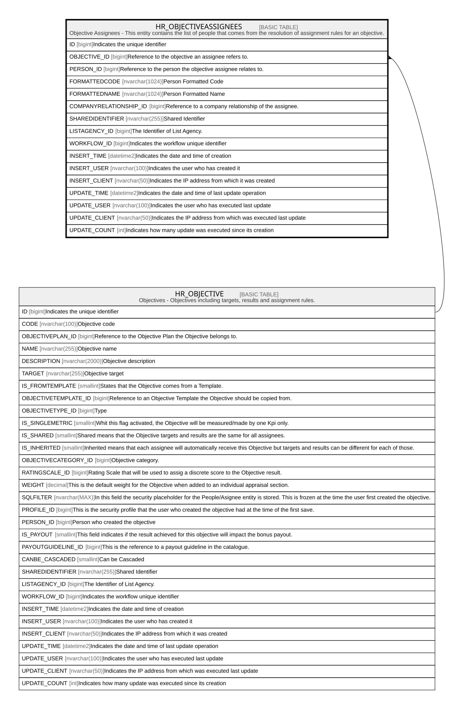

# HR_OBJECTIVEASSIGNEES

## Description

Objective Assignees - This entity contains the list of people that comes from the resolution of assignment rules for an objective.  

## Columns

| Name | Type | Default | Nullable | Parents | Comment |
| ---- | ---- | ------- | -------- | ------- | ------- |
| ID | bigint |  | false |  | Indicates the unique identifier |
| OBJECTIVE_ID | bigint |  | false | [HR_OBJECTIVE](HR_OBJECTIVE.md) | Reference to the objective an assignee refers to. |
| PERSON_ID | bigint |  | true |  | Reference to the person the objective assignee relates to. |
| FORMATTEDCODE | nvarchar(1024) |  | true |  | Person Formatted Code |
| FORMATTEDNAME | nvarchar(1024) |  | true |  | Person Formatted Name |
| COMPANYRELATIONSHIP_ID | bigint |  | true |  | Reference to a company relationship of the assignee. |
| SHAREDIDENTIFIER | nvarchar(255) |  | true |  | Shared Identifier |
| LISTAGENCY_ID | bigint |  | true |  | The Identifier of List Agency. |
| WORKFLOW_ID | bigint |  | true |  | Indicates the workflow unique identifier |
| INSERT_TIME | datetime2 |  | false |  | Indicates the date and time of creation |
| INSERT_USER | nvarchar(100) |  | false |  | Indicates the user who has created it |
| INSERT_CLIENT | nvarchar(50) |  | false |  | Indicates the IP address from which it was created |
| UPDATE_TIME | datetime2 |  | false |  | Indicates the date and time of last update operation |
| UPDATE_USER | nvarchar(100) |  | false |  | Indicates the user who has executed last update |
| UPDATE_CLIENT | nvarchar(50) |  | false |  | Indicates the IP address from which was executed last update |
| UPDATE_COUNT | int |  | false |  | Indicates how many update was executed since its creation |

## Constraints

| Name | Type | Definition |
| ---- | ---- | ---------- |
| PK_HR_OBJECTIVEASSIGNEES | PRIMARY KEY | CLUSTERED, unique, part of a PRIMARY KEY constraint, [ ID ] |
| FK_OBJASSIGNEES_OBJECTIVE | FOREIGN KEY | FOREIGN KEY(OBJECTIVE_ID) REFERENCES HR_OBJECTIVE(ID) ON UPDATE NO_ACTION ON DELETE CASCADE |

## Indexes

| Name | Definition |
| ---- | ---------- |
| PK_HR_OBJECTIVEASSIGNEES | CLUSTERED, unique, part of a PRIMARY KEY constraint, [ ID ] |

## Relations

---

> Generated by [tbls](https://github.com/k1LoW/tbls)
