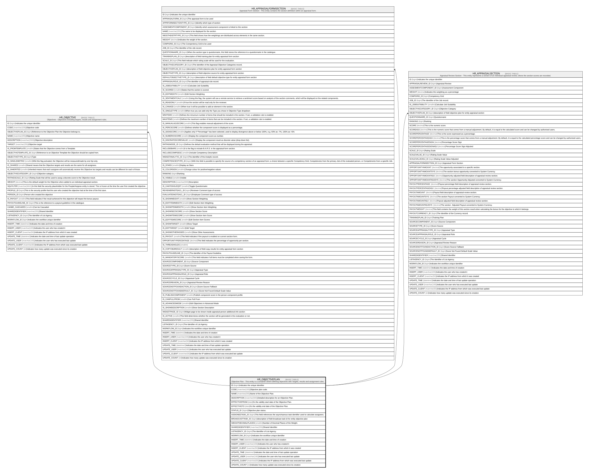

# HR_OBJECTIVEPLAN

## Description

Objective Plan - This entity is a container where defining objectives with Targets, results and assignment rules.  

## Columns

| Name | Type | Default | Nullable | Children | Comment |
| ---- | ---- | ------- | -------- | -------- | ------- |
| ID | bigint |  | false | [HR_OBJECTIVE](HR_OBJECTIVE.md) [HR_APPRAISALFORMSECTION](HR_APPRAISALFORMSECTION.md) [HR_APPRAISALSECTION](HR_APPRAISALSECTION.md) | Indicates the unique identifier |
| CODE | nvarchar(100) |  | false |  | Objective plan code. |
| NAME | nvarchar(255) |  | true |  | Name of the Objective Plan. |
| DESCRIPTION | nvarchar(500) |  | true |  | Detailed description for an Objective Plan. |
| EFFECTIVEFROM | date |  | true |  | It's the validity start date of the Objective Plan. |
| EFFECTIVETO | date |  | true |  | It's the validity end date of the Objective Plan. |
| STATUS_ID | bigint |  | true |  | Objective plan status. |
| ASSIGNEETASK_ID | bigint |  | true |  | This field references the asynchrpnous task identifier used to calculate assignees. |
| BROADCASTTASK_ID | bigint |  | true |  | description of field broadcast task id for entity objective plan |
| WEIGHTDECIMALPLACES | smallint |  | true |  | Number of Decimal Places of the Weight. |
| SHAREDIDENTIFIER | nvarchar(255) |  | true |  | Shared Identifier |
| LISTAGENCY_ID | bigint |  | true |  | The Identifier of List Agency. |
| WORKFLOW_ID | bigint |  | true |  | Indicates the workflow unique identifier |
| INSERT_TIME | datetime2 |  | false |  | Indicates the date and time of creation |
| INSERT_USER | nvarchar(100) |  | false |  | Indicates the user who has created it |
| INSERT_CLIENT | nvarchar(50) |  | false |  | Indicates the IP address from which it was created |
| UPDATE_TIME | datetime2 |  | false |  | Indicates the date and time of last update operation |
| UPDATE_USER | nvarchar(100) |  | false |  | Indicates the user who has executed last update |
| UPDATE_CLIENT | nvarchar(50) |  | false |  | Indicates the IP address from which was executed last update |
| UPDATE_COUNT | int |  | false |  | Indicates how many update was executed since its creation |

## Constraints

| Name | Type | Definition |
| ---- | ---- | ---------- |
| PK_HR_OBJECTIVEPLAN | PRIMARY KEY | CLUSTERED, unique, part of a PRIMARY KEY constraint, [ ID ] |
| UQ_OBJECTIVEPLAN_CODE | UNIQUE | NONCLUSTERED, unique, part of a UNIQUE constraint, [ CODE ] |

## Indexes

| Name | Definition |
| ---- | ---------- |
| PK_HR_OBJECTIVEPLAN | CLUSTERED, unique, part of a PRIMARY KEY constraint, [ ID ] |
| UQ_OBJECTIVEPLAN_CODE | NONCLUSTERED, unique, part of a UNIQUE constraint, [ CODE ] |

## Relations

---

> Generated by [tbls](https://github.com/k1LoW/tbls)
