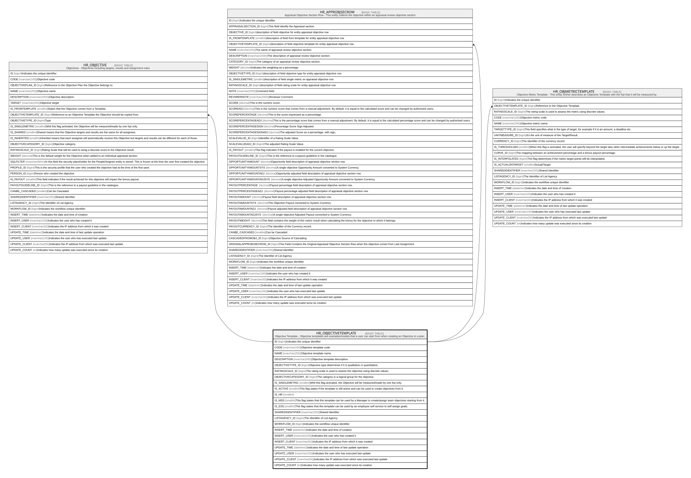

# HR_OBJECTIVETEMPLATE

## Description

Objective Template - Objective templates are examples/models that a user can start from when creating an Objective in a plan.  

## Columns

| Name | Type | Default | Nullable | Children | Comment |
| ---- | ---- | ------- | -------- | -------- | ------- |
| ID | bigint |  | false | [HR_OBJECTIVE](HR_OBJECTIVE.md) [HR_APPROBJSECROW](HR_APPROBJSECROW.md) [HR_OBJMETRICTEMPLATE](HR_OBJMETRICTEMPLATE.md) | Indicates the unique identifier |
| CODE | nvarchar(100) |  | false |  | Objective template code. |
| NAME | nvarchar(255) |  | false |  | Objective template name. |
| DESCRIPTION | nvarchar(500) |  | true |  | Objective template description. |
| OBJECTIVETYPE_ID | bigint |  | true |  | Objective type determines if it is qualitative or quantitative. |
| RATINGSCALE_ID | bigint |  | true |  | The rating scale is used to assess the objective using discrete values. |
| OBJECTIVECATEGORY_ID | bigint |  | true |  | The category is a logical group for the objective. |
| IS_SINGLEMETRIC | smallint |  | true |  | Whit this flag activated, the Objective will be measured/made by one Kpi only. |
| IS_ACTIVE | smallint |  | true |  | This flag states if the template is still active and can be used to create objectives from it. |
| IS_HR | smallint |  | true |  |  |
| IS_MSS | smallint |  | true |  | This flag states that this template can be used by a Manager to create/assign team objectives starting from it. |
| IS_ESS | smallint |  | true |  | This flag states that this template can be used by an employee self service to self assign goals. |
| SHAREDIDENTIFIER | nvarchar(255) |  | true |  | Shared Identifier |
| LISTAGENCY_ID | bigint |  | true |  | The Identifier of List Agency. |
| WORKFLOW_ID | bigint |  | true |  | Indicates the workflow unique identifier |
| INSERT_TIME | datetime2 |  | false |  | Indicates the date and time of creation |
| INSERT_USER | nvarchar(100) |  | false |  | Indicates the user who has created it |
| INSERT_CLIENT | nvarchar(50) |  | false |  | Indicates the IP address from which it was created |
| UPDATE_TIME | datetime2 |  | false |  | Indicates the date and time of last update operation |
| UPDATE_USER | nvarchar(100) |  | false |  | Indicates the user who has executed last update |
| UPDATE_CLIENT | nvarchar(50) |  | false |  | Indicates the IP address from which was executed last update |
| UPDATE_COUNT | int |  | false |  | Indicates how many update was executed since its creation |

## Constraints

| Name | Type | Definition |
| ---- | ---- | ---------- |
| PK_HR_OBJECTIVETEMPLATE | PRIMARY KEY | CLUSTERED, unique, part of a PRIMARY KEY constraint, [ ID ] |
| UQ_OBJECTIVETEMPLATE_CODE | UNIQUE | NONCLUSTERED, unique, part of a UNIQUE constraint, [ CODE ] |

## Indexes

| Name | Definition |
| ---- | ---------- |
| PK_HR_OBJECTIVETEMPLATE | CLUSTERED, unique, part of a PRIMARY KEY constraint, [ ID ] |
| UQ_OBJECTIVETEMPLATE_CODE | NONCLUSTERED, unique, part of a UNIQUE constraint, [ CODE ] |

## Relations

---

> Generated by [tbls](https://github.com/k1LoW/tbls)
