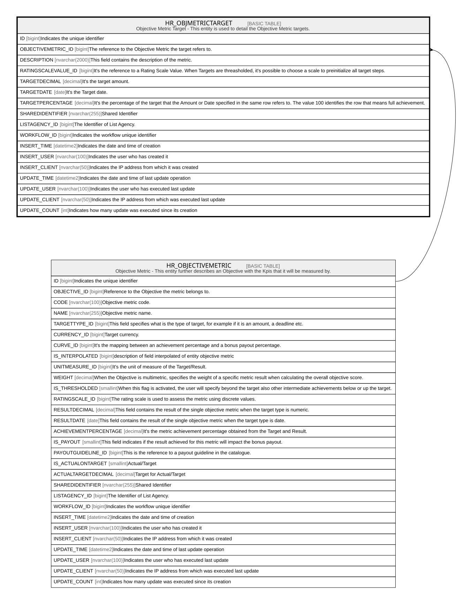

# HR_OBJMETRICTARGET

## Description

Objective Metric Target - This entity is used to detail the Objective Metric targets.  

## Columns

| Name | Type | Default | Nullable | Parents | Comment |
| ---- | ---- | ------- | -------- | ------- | ------- |
| ID | bigint |  | false |  | Indicates the unique identifier |
| OBJECTIVEMETRIC_ID | bigint |  | false | [HR_OBJECTIVEMETRIC](HR_OBJECTIVEMETRIC.md) | The reference to the Objective Metric the target refers to. |
| DESCRIPTION | nvarchar(2000) |  | true |  | This field contains the description of the metric. |
| RATINGSCALEVALUE_ID | bigint |  | true |  | It's the reference to a Rating Scale Value. When Targets are threasholded, it's possible to choose a scale to preinitialize all target steps. |
| TARGETDECIMAL | decimal |  | true |  | It's the target amount. |
| TARGETDATE | date |  | true |  | It's the Target date. |
| TARGETPERCENTAGE | decimal |  | true |  | It's the percentage of the target that the Amount or Date specified in the same row refers to. The value 100 identifies the row that means full achievement. |
| SHAREDIDENTIFIER | nvarchar(255) |  | true |  | Shared Identifier |
| LISTAGENCY_ID | bigint |  | true |  | The Identifier of List Agency. |
| WORKFLOW_ID | bigint |  | true |  | Indicates the workflow unique identifier |
| INSERT_TIME | datetime2 |  | false |  | Indicates the date and time of creation |
| INSERT_USER | nvarchar(100) |  | false |  | Indicates the user who has created it |
| INSERT_CLIENT | nvarchar(50) |  | false |  | Indicates the IP address from which it was created |
| UPDATE_TIME | datetime2 |  | false |  | Indicates the date and time of last update operation |
| UPDATE_USER | nvarchar(100) |  | false |  | Indicates the user who has executed last update |
| UPDATE_CLIENT | nvarchar(50) |  | false |  | Indicates the IP address from which was executed last update |
| UPDATE_COUNT | int |  | false |  | Indicates how many update was executed since its creation |

## Constraints

| Name | Type | Definition |
| ---- | ---- | ---------- |
| PK_HR_OBJMETRICTARGET | PRIMARY KEY | CLUSTERED, unique, part of a PRIMARY KEY constraint, [ ID ] |
| UQ_OBJMETRICTARGET_RATING | UNIQUE | NONCLUSTERED, unique, part of a UNIQUE constraint, [ OBJECTIVEMETRIC_ID, RATINGSCALEVALUE_ID ] |
| FK_OBJMETRICTARGET_OBJMETRIC | FOREIGN KEY | FOREIGN KEY(OBJECTIVEMETRIC_ID) REFERENCES HR_OBJECTIVEMETRIC(ID) ON UPDATE NO_ACTION ON DELETE CASCADE |

## Indexes

| Name | Definition |
| ---- | ---------- |
| PK_HR_OBJMETRICTARGET | CLUSTERED, unique, part of a PRIMARY KEY constraint, [ ID ] |
| UQ_OBJMETRICTARGET_RATING | NONCLUSTERED, unique, part of a UNIQUE constraint, [ OBJECTIVEMETRIC_ID, RATINGSCALEVALUE_ID ] |

## Relations

---

> Generated by [tbls](https://github.com/k1LoW/tbls)
