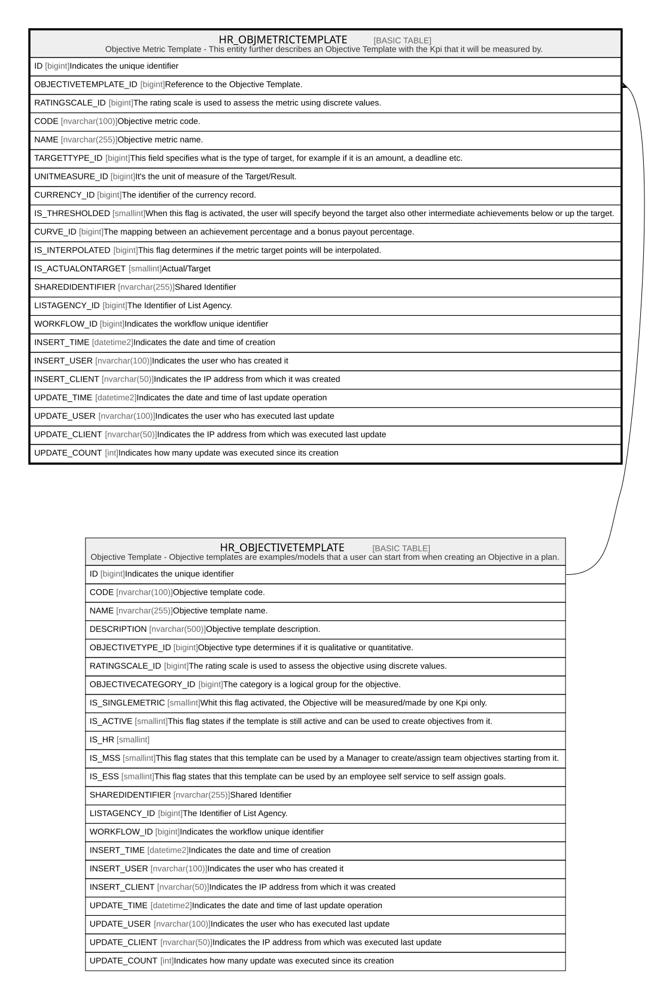

# HR_OBJMETRICTEMPLATE

## Description

Objective Metric Template - This entity further describes an Objective Template with the Kpi that it will be measured by.  

## Columns

| Name | Type | Default | Nullable | Parents | Comment |
| ---- | ---- | ------- | -------- | ------- | ------- |
| ID | bigint |  | false |  | Indicates the unique identifier |
| OBJECTIVETEMPLATE_ID | bigint |  | false | [HR_OBJECTIVETEMPLATE](HR_OBJECTIVETEMPLATE.md) | Reference to the Objective Template. |
| RATINGSCALE_ID | bigint |  | true |  | The rating scale is used to assess the metric using discrete values. |
| CODE | nvarchar(100) |  | false |  | Objective metric code. |
| NAME | nvarchar(255) |  | true |  | Objective metric name. |
| TARGETTYPE_ID | bigint |  | true |  | This field specifies what is the type of target, for example if it is an amount, a deadline etc. |
| UNITMEASURE_ID | bigint |  | true |  | It's the unit of measure of the Target/Result. |
| CURRENCY_ID | bigint |  | true |  | The identifier of the currency record. |
| IS_THRESHOLDED | smallint |  | true |  | When this flag is activated, the user will specify beyond the target also other intermediate achievements below or up the target. |
| CURVE_ID | bigint |  | true |  | The mapping between an achievement percentage and a bonus payout percentage. |
| IS_INTERPOLATED | bigint |  | true |  | This flag determines if the metric target points will be interpolated. |
| IS_ACTUALONTARGET | smallint |  | true |  | Actual/Target |
| SHAREDIDENTIFIER | nvarchar(255) |  | true |  | Shared Identifier |
| LISTAGENCY_ID | bigint |  | true |  | The Identifier of List Agency. |
| WORKFLOW_ID | bigint |  | true |  | Indicates the workflow unique identifier |
| INSERT_TIME | datetime2 |  | false |  | Indicates the date and time of creation |
| INSERT_USER | nvarchar(100) |  | false |  | Indicates the user who has created it |
| INSERT_CLIENT | nvarchar(50) |  | false |  | Indicates the IP address from which it was created |
| UPDATE_TIME | datetime2 |  | false |  | Indicates the date and time of last update operation |
| UPDATE_USER | nvarchar(100) |  | false |  | Indicates the user who has executed last update |
| UPDATE_CLIENT | nvarchar(50) |  | false |  | Indicates the IP address from which was executed last update |
| UPDATE_COUNT | int |  | false |  | Indicates how many update was executed since its creation |

## Constraints

| Name | Type | Definition |
| ---- | ---- | ---------- |
| PK_HR_OBJMETRICTEMPLATE | PRIMARY KEY | CLUSTERED, unique, part of a PRIMARY KEY constraint, [ ID ] |
| UQ_OBJMETRICTEMPLATE_CODE | UNIQUE | NONCLUSTERED, unique, part of a UNIQUE constraint, [ CODE, OBJECTIVETEMPLATE_ID ] |
| FK_OBJMETRICTEMP_OBJTEMP | FOREIGN KEY | FOREIGN KEY(OBJECTIVETEMPLATE_ID) REFERENCES HR_OBJECTIVETEMPLATE(ID) ON UPDATE NO_ACTION ON DELETE NO_ACTION |

## Indexes

| Name | Definition |
| ---- | ---------- |
| PK_HR_OBJMETRICTEMPLATE | CLUSTERED, unique, part of a PRIMARY KEY constraint, [ ID ] |
| UQ_OBJMETRICTEMPLATE_CODE | NONCLUSTERED, unique, part of a UNIQUE constraint, [ CODE, OBJECTIVETEMPLATE_ID ] |

## Relations

---

> Generated by [tbls](https://github.com/k1LoW/tbls)
