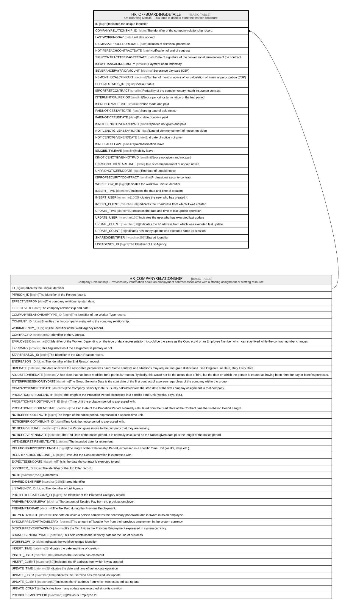

# HR_OFFBOARDINGDETAILS

## Description

Off Boarding Details - This table is used to store the worker departure  

## Columns

| Name | Type | Default | Nullable | Parents | Comment |
| ---- | ---- | ------- | -------- | ------- | ------- |
| ID | bigint |  | false |  | Indicates the unique identifier |
| COMPANYRELATIONSHIP_ID | bigint |  | false | [HR_COMPANYRELATIONSHIP](HR_COMPANYRELATIONSHIP.md) | The identifier of the company relationship record. |
| LASTWORKINGDAY | date |  | false |  | Last day worked |
| DISMISSALPROCEDUREDATE | date |  | true |  | Initiation of dismissal procedure |
| NOTIFBREACHCONTRACTDATE | date |  | true |  | Notification of end of contract |
| SIGNCONTRACTTERMAGREEDATE | date |  | true |  | Date of signature of the conventional termination of the contract |
| ISPAYTRANSACINDEMNITY | smallint |  | true |  | Payment of an indemnity |
| SEVERANCEPAYPAIDAMOUNT | decimal |  | true |  | Severance pay paid (CSP) |
| NBMONTHSCALCFINPART | decimal |  | true |  | Number of months' notice of for calculation of financial participation (CSP) |
| SPECIALSTATUS_ID | bigint |  | true |  | Special Status |
| ISPORTRETCONTRACT | smallint |  | true |  | Portability of the complementary health insurance contract |
| ISTERMINTRIALPERIOD | smallint |  | true |  | Notice period for termination of the trial period |
| ISPRENOTMADEPAID | smallint |  | true |  | Notice made and paid |
| PAIDNOTICESTARTDATE | date |  | true |  | Starting date of paid notice |
| PAIDNOTICEENDDATE | date |  | true |  | End date of notice paid |
| ISNOTICENOTGIVENANDPAID | smallint |  | true |  | Notice not given and paid |
| NOTICENOTGIVENSTARTDATE | date |  | true |  | Date of commencement of notice not given |
| NOTICENOTGIVENENDDATE | date |  | true |  | End date of notice not given |
| ISRECLASSLEAVE | smallint |  | true |  | Reclassification leave |
| ISMOBILITYLEAVE | smallint |  | true |  | Mobility leave |
| ISNOTICENOTGIVENNOTPAID | smallint |  | true |  | Notice not given and not paid |
| UNPAIDNOTICESTARTDATE | date |  | true |  | Date of commencement of unpaid notice |
| UNPAIDNOTICEENDDATE | date |  | true |  | End date of unpaid notice |
| ISPROFSECURITYCONTRACT | smallint |  | true |  | Professional security contract |
| WORKFLOW_ID | bigint |  | true |  | Indicates the workflow unique identifier |
| INSERT_TIME | datetime2 | (sysutcdatetime()) | false |  | Indicates the date and time of creation |
| INSERT_USER | nvarchar(100) | (N'MAIN') | false |  | Indicates the user who has created it |
| INSERT_CLIENT | nvarchar(50) | (N'localhost') | false |  | Indicates the IP address from which it was created |
| UPDATE_TIME | datetime2 | (sysutcdatetime()) | false |  | Indicates the date and time of last update operation |
| UPDATE_USER | nvarchar(100) | (N'MAIN') | false |  | Indicates the user who has executed last update |
| UPDATE_CLIENT | nvarchar(50) | (N'localhost') | false |  | Indicates the IP address from which was executed last update |
| UPDATE_COUNT | int | ((0)) | false |  | Indicates how many update was executed since its creation |
| SHAREDIDENTIFIER | nvarchar(255) |  | true |  | Shared Identifier |
| LISTAGENCY_ID | bigint |  | true |  | The Identifier of List Agency |

## Constraints

| Name | Type | Definition |
| ---- | ---- | ---------- |
| PK_OFFBOARDINGDETAILS | PRIMARY KEY | CLUSTERED, unique, part of a PRIMARY KEY constraint, [ ID ] |
| FK_OFFBOARDINGDET_COMPANYREL | FOREIGN KEY | FOREIGN KEY(COMPANYRELATIONSHIP_ID) REFERENCES HR_COMPANYRELATIONSHIP(ID) ON UPDATE NO_ACTION ON DELETE CASCADE |

## Indexes

| Name | Definition |
| ---- | ---------- |
| PK_OFFBOARDINGDETAILS | CLUSTERED, unique, part of a PRIMARY KEY constraint, [ ID ] |

## Relations

---

> Generated by [tbls](https://github.com/k1LoW/tbls)
