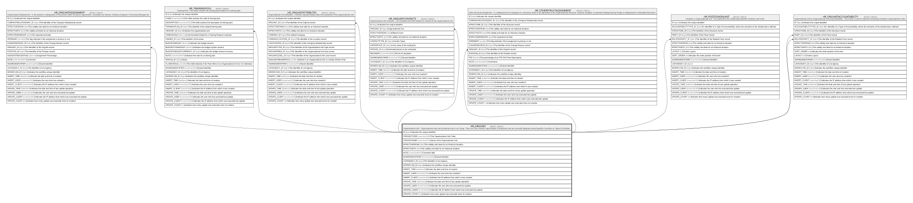

# HR_ORGUNIT

## Description

Organizational Unit - Organizational units are functional units in an Group. They can cross several Legal entities (Companies) and are normally designed around specific Functions or Types of Activities.  

## Columns

| Name | Type | Default | Nullable | Children | Comment |
| ---- | ---- | ------- | -------- | -------- | ------- |
| ID | bigint |  | false | [HR_ORGUNITASSIGNMENT](HR_ORGUNITASSIGNMENT.md) [HR_TRAININGPOOL](HR_TRAININGPOOL.md) [HR_ORGUNITATTRIBUTES](HR_ORGUNITATTRIBUTES.md) [HR_ORGUNITCONTACTS](HR_ORGUNITCONTACTS.md) [HR_OTHERSTRUCTASSIGNMENT](HR_OTHERSTRUCTASSIGNMENT.md) [HR_POSITIONSINUNIT](HR_POSITIONSINUNIT.md) [HR_ORGUNITACCOUNTABILITY](HR_ORGUNITACCOUNTABILITY.md) | Indicates the unique identifier |
| ORGUNITCODE | nvarchar(100) |  | false |  | The Organizational Unit Code. |
| ORGUNITNAME | nvarchar(255) |  | false |  | Name of the Organizational Unit.  |
| EFFECTIVEFROM | date |  | false |  | The validity start date for an historical situation. |
| EFFECTIVETO | date |  | true |  | The validity end date for an historical situation. |
| NOTE | nvarchar(MAX) |  | true |  | Comment field. |
| SHAREDIDENTIFIER | nvarchar(255) |  | true |  | Shared Identifier |
| LISTAGENCY_ID | bigint |  | true |  | The Identifier of List Agency. |
| WORKFLOW_ID | bigint |  | true |  | Indicates the workflow unique identifier |
| INSERT_TIME | datetime2 | (sysutcdatetime()) | false |  | Indicates the date and time of creation |
| INSERT_USER | nvarchar(100) | (N'MAIN') | false |  | Indicates the user who has created it |
| INSERT_CLIENT | nvarchar(50) | (N'localhost') | false |  | Indicates the IP address from which it was created |
| UPDATE_TIME | datetime2 | (sysutcdatetime()) | false |  | Indicates the date and time of last update operation |
| UPDATE_USER | nvarchar(100) | (N'MAIN') | false |  | Indicates the user who has executed last update |
| UPDATE_CLIENT | nvarchar(50) | (N'localhost') | false |  | Indicates the IP address from which was executed last update |
| UPDATE_COUNT | int | ((0)) | false |  | Indicates how many update was executed since its creation |

## Constraints

| Name | Type | Definition |
| ---- | ---- | ---------- |
| PK_ORGUNIT | PRIMARY KEY | CLUSTERED, unique, part of a PRIMARY KEY constraint, [ ID ] |
| UQ_ORGUNIT | UNIQUE | NONCLUSTERED, unique, part of a UNIQUE constraint, [ ORGUNITCODE, ORGUNITNAME ] |

## Indexes

| Name | Definition |
| ---- | ---------- |
| PK_ORGUNIT | CLUSTERED, unique, part of a PRIMARY KEY constraint, [ ID ] |
| UQ_ORGUNIT | NONCLUSTERED, unique, part of a UNIQUE constraint, [ ORGUNITCODE, ORGUNITNAME ] |
| IDX_ORGUNIT_ORGUNITCODE | NONCLUSTERED, unique, [ ORGUNITCODE ] |
| IDX_ORGUNIT_SHAREDLIST | NONCLUSTERED, unique, [ SHAREDIDENTIFIER, LISTAGENCY_ID ] |

## Relations

---

> Generated by [tbls](https://github.com/k1LoW/tbls)
