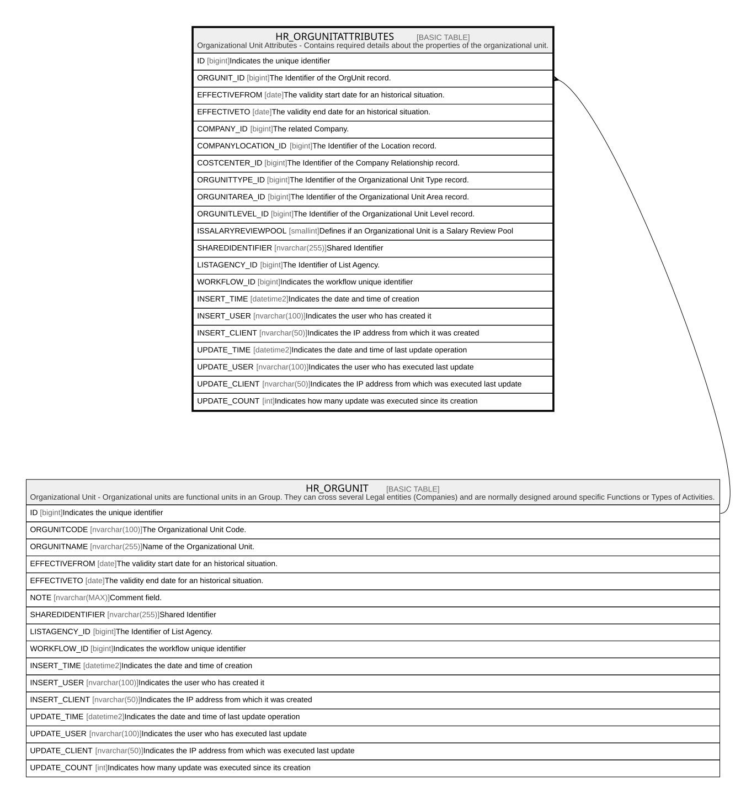

# HR_ORGUNITATTRIBUTES

## Description

Organizational Unit Attributes - Contains required details about the properties of the organizational unit.  

## Columns

| Name | Type | Default | Nullable | Parents | Comment |
| ---- | ---- | ------- | -------- | ------- | ------- |
| ID | bigint |  | false |  | Indicates the unique identifier |
| ORGUNIT_ID | bigint |  | false | [HR_ORGUNIT](HR_ORGUNIT.md) | The Identifier of the OrgUnit record. |
| EFFECTIVEFROM | date |  | false |  | The validity start date for an historical situation. |
| EFFECTIVETO | date |  | true |  | The validity end date for an historical situation. |
| COMPANY_ID | bigint |  | true |  | The related Company. |
| COMPANYLOCATION_ID | bigint |  | true |  | The Identifier of the Location record. |
| COSTCENTER_ID | bigint |  | true |  | The Identifier of the Company Relationship record. |
| ORGUNITTYPE_ID | bigint |  | true |  | The Identifier of the Organizational Unit Type record. |
| ORGUNITAREA_ID | bigint |  | true |  | The Identifier of the Organizational Unit Area record. |
| ORGUNITLEVEL_ID | bigint |  | true |  | The Identifier of the Organizational Unit Level record. |
| ISSALARYREVIEWPOOL | smallint |  | true |  | Defines if an Organizational Unit is a Salary Review Pool |
| SHAREDIDENTIFIER | nvarchar(255) |  | true |  | Shared Identifier |
| LISTAGENCY_ID | bigint |  | true |  | The Identifier of List Agency. |
| WORKFLOW_ID | bigint |  | true |  | Indicates the workflow unique identifier |
| INSERT_TIME | datetime2 | (sysutcdatetime()) | false |  | Indicates the date and time of creation |
| INSERT_USER | nvarchar(100) | (N'MAIN') | false |  | Indicates the user who has created it |
| INSERT_CLIENT | nvarchar(50) | (N'localhost') | false |  | Indicates the IP address from which it was created |
| UPDATE_TIME | datetime2 | (sysutcdatetime()) | false |  | Indicates the date and time of last update operation |
| UPDATE_USER | nvarchar(100) | (N'MAIIN') | false |  | Indicates the user who has executed last update |
| UPDATE_CLIENT | nvarchar(50) | (N'localhost') | false |  | Indicates the IP address from which was executed last update |
| UPDATE_COUNT | int | ((0)) | false |  | Indicates how many update was executed since its creation |

## Constraints

| Name | Type | Definition |
| ---- | ---- | ---------- |
| PK_ORGUNITATTRIBUTES | PRIMARY KEY | CLUSTERED, unique, part of a PRIMARY KEY constraint, [ ID ] |
| FK_ORGUNITATTRIBUTES_ORGUNIT | FOREIGN KEY | FOREIGN KEY(ORGUNIT_ID) REFERENCES HR_ORGUNIT(ID) ON UPDATE NO_ACTION ON DELETE NO_ACTION |

## Indexes

| Name | Definition |
| ---- | ---------- |
| PK_ORGUNITATTRIBUTES | CLUSTERED, unique, part of a PRIMARY KEY constraint, [ ID ] |
| IDX_ORGUNITATTRIBUTES_ORGIDEFF | NONCLUSTERED, unique, [ ORGUNIT_ID, EFFECTIVEFROM ] |
| IDX_ORGUNITATTRIBUTES_AREA | NONCLUSTERED, [ ORGUNITAREA_ID ] |
| IDX_ORGUNITATTRIBUTES_LEVEL | NONCLUSTERED, [ ORGUNITLEVEL_ID ] |
| IDX_ORGUNITATTRIBUTES_TYPE | NONCLUSTERED, [ ORGUNITTYPE_ID ] |

## Relations

---

> Generated by [tbls](https://github.com/k1LoW/tbls)
