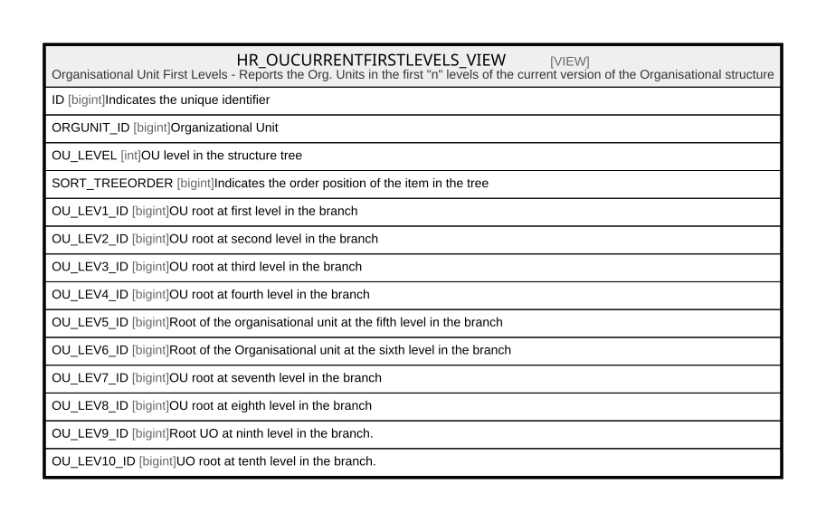

# HR_OUCURRENTFIRSTLEVELS_VIEW

## Description

Organisational Unit First Levels - Reports the Org. Units in the first "n" levels of the current version of the Organisational structure  


<details>
<summary><strong>Table Definition</strong></summary>

```sql
-- Talentia Software - All right reserved
-- Type: VIEW                     Name: HR_OUCURRENTFIRSTLEVELS_VIEW
-- Date: 09-04-2026 07:27:59 (UTC)
-- 
-- ChangeLogId: 00000000-0000-0000-0000-000000000000
-- ChangeSetId: 1183400b-2a3a-4203-acd7-5560bc6eece5
-- Original file name: C:\repos\Talentia-Software\hcm-core/DB/ProductDB/EDM\Schema\Views\HR_OUCURRENTFIRSTLEVELS_VIEW.xml


CREATE VIEW [HR_OUCURRENTFIRSTLEVELS_VIEW]
 ( ID, ORGUNIT_ID, OU_LEVEL, SORT_TREEORDER, OU_LEV1_ID, OU_LEV2_ID, OU_LEV3_ID, OU_LEV4_ID, OU_LEV5_ID, OU_LEV6_ID, OU_LEV7_ID, OU_LEV8_ID, OU_LEV9_ID, OU_LEV10_ID ) 
 AS 
 WITH
 OU_InTheTree (OU, OU_LEVEL, OU_UPCHAIN, OU_STRUCTURE_ID, OU_LEV1_ID, OU_LEV2_ID, OU_LEV3_ID, OU_LEV4_ID, OU_LEV5_ID, OU_LEV6_ID, OU_LEV7_ID , OU_LEV8_ID , OU_LEV9_ID , OU_LEV10_ID ) AS (
	 SELECT 
		HR_ORGUNITACCOUNTABILITY.PARTY_ID AS OU
		,1 AS OU_LEVEL
		,CAST(STR(ROW_NUMBER() OVER(ORDER BY HR_ORGUNITACCOUNTABILITY.SORT_ORDER, HR_ORGUNIT.ORGUNITCODE), 6) as nvarchar(300)) as OU_UPCHAIN
		,HR_ORGUNITACCOUNTABILITY.STRUCTURE_ID AS OU_STRUCTURE_ID
		,HR_ORGUNITACCOUNTABILITY.PARTY_ID	AS OU_Lev1_ID
		,CAST(NULL AS Bigint)				AS OU_Lev2_ID
		,CAST(NULL AS Bigint)				AS OU_Lev3_ID
		,CAST(NULL AS Bigint)				AS OU_Lev4_ID
		,CAST(NULL AS Bigint)				AS OU_Lev5_ID
		,CAST(NULL AS Bigint)				AS OU_Lev6_ID
		,CAST(NULL AS Bigint)				AS OU_Lev7_ID
		,CAST(NULL AS Bigint)				AS OU_Lev8_ID
		,CAST(NULL AS Bigint)				AS OU_Lev9_ID
		,CAST(NULL AS Bigint)				AS OU_Lev10_ID
	FROM HR_ORGUNITACCOUNTABILITY 
	INNER JOIN HR_STRUCTURE ON (HR_STRUCTURE.ID = HR_ORGUNITACCOUNTABILITY.STRUCTURE_ID AND HR_STRUCTURE.STRUCTURETYPE_ID = 1000002 AND HR_STRUCTURE.PARTIALVIEW = 0)
	INNER JOIN HR_ORGUNIT ON (HR_ORGUNIT.ID = HR_ORGUNITACCOUNTABILITY.PARTY_ID)
	Where HR_ORGUNITACCOUNTABILITY.RELATEDPARTY_ID IS NULL
	AND CAST(GetDate() AS DATE) Between HR_ORGUNITACCOUNTABILITY.EFFECTIVEFROM AND HR_ORGUNITACCOUNTABILITY.EFFECTIVETO

	UNION ALL


	SELECT HR_ORGUNITACCOUNTABILITY.PARTY_ID AS OU
	,OU_InTheTree.OU_LEVEL + 1 AS OU_LEVEL
	,cast(OU_InTheTree.OU_UPCHAIN + STR(ROW_NUMBER() OVER(ORDER BY HR_ORGUNITACCOUNTABILITY.SORT_ORDER, HR_ORGUNIT.ORGUNITCODE), 6) as nvarchar(300)) as OU_UPCHAIN
	,OU_InTheTree.OU_STRUCTURE_ID AS OU_STRUCTURE_ID 
	,OU_InTheTree.OU_Lev1_ID																						   AS OU_Lev1_ID
	,CASE WHEN (OU_InTheTree.OU_LEVEL + 1) = 2 THEN HR_ORGUNITACCOUNTABILITY.PARTY_ID ELSE OU_InTheTree.OU_Lev2_ID END AS OU_Lev2_ID
	,CASE WHEN (OU_InTheTree.OU_LEVEL + 1) = 3 THEN HR_ORGUNITACCOUNTABILITY.PARTY_ID ELSE OU_InTheTree.OU_Lev3_ID END AS OU_Lev3_ID
	,CASE WHEN (OU_InTheTree.OU_LEVEL + 1) = 4 THEN HR_ORGUNITACCOUNTABILITY.PARTY_ID ELSE OU_InTheTree.OU_Lev4_ID END AS OU_Lev4_ID
	,CASE WHEN (OU_InTheTree.OU_LEVEL + 1) = 5 THEN HR_ORGUNITACCOUNTABILITY.PARTY_ID ELSE OU_InTheTree.OU_Lev5_ID END AS OU_Lev5_ID
	,CASE WHEN (OU_InTheTree.OU_LEVEL + 1) = 6 THEN HR_ORGUNITACCOUNTABILITY.PARTY_ID ELSE OU_InTheTree.OU_Lev6_ID END AS OU_Lev6_ID
	,CASE WHEN (OU_InTheTree.OU_LEVEL + 1) = 7 THEN HR_ORGUNITACCOUNTABILITY.PARTY_ID ELSE OU_InTheTree.OU_Lev7_ID END AS OU_Lev7_ID
	,CASE WHEN (OU_InTheTree.OU_LEVEL + 1) = 8 THEN HR_ORGUNITACCOUNTABILITY.PARTY_ID ELSE OU_InTheTree.OU_Lev8_ID END AS OU_Lev8_ID
	,CASE WHEN (OU_InTheTree.OU_LEVEL + 1) = 9 THEN HR_ORGUNITACCOUNTABILITY.PARTY_ID ELSE OU_InTheTree.OU_Lev9_ID END AS OU_Lev9_ID
	,CASE WHEN (OU_InTheTree.OU_LEVEL + 1) = 10 THEN HR_ORGUNITACCOUNTABILITY.PARTY_ID ELSE OU_InTheTree.OU_Lev10_ID END AS OU_Lev10_ID

	FROM HR_ORGUNITACCOUNTABILITY 
	INNER JOIN OU_InTheTree ON (OU_InTheTree.OU = HR_ORGUNITACCOUNTABILITY.RELATEDPARTY_ID AND CAST(GetDate() AS DATE) Between HR_ORGUNITACCOUNTABILITY.EFFECTIVEFROM AND HR_ORGUNITACCOUNTABILITY.EFFECTIVETO AND OU_InTheTree.OU_STRUCTURE_ID = HR_ORGUNITACCOUNTABILITY.STRUCTURE_ID)
	INNER JOIN HR_ORGUNIT  ON (HR_ORGUNIT.ID = HR_ORGUNITACCOUNTABILITY.PARTY_ID)
	WHERE OU_InTheTree.OU_LEVEL < = 50

)

Select 
OU				AS ID
,OU				AS ORGUNIT_ID
,OU_LEVEL	AS OU_Level
,ROW_NUMBER() OVER(ORDER BY OU_UPCHAIN) AS SORT_TREEORDER
,OU_LEV1_ID		AS OU_Lev1_ID
,OU_LEV2_ID		AS OU_Lev2_ID
,OU_LEV3_ID		AS OU_Lev3_ID
,OU_LEV4_ID		AS OU_Lev4_ID
,OU_LEV5_ID		AS OU_Lev5_ID
,OU_LEV6_ID		AS OU_Lev6_ID
,OU_LEV7_ID		AS OU_Lev7_ID
,OU_LEV8_ID		AS OU_Lev8_ID
,OU_LEV9_ID		AS OU_Lev9_ID
,OU_LEV10_ID		AS OU_Lev10_ID
FROM OU_InTheTree 

```

</details>

## Columns

| Name | Type | Default | Nullable | Comment |
| ---- | ---- | ------- | -------- | ------- |
| ID | bigint |  | true | Indicates the unique identifier |
| ORGUNIT_ID | bigint |  | true | Organizational Unit |
| OU_LEVEL | int |  | true | OU level in the structure tree |
| SORT_TREEORDER | bigint |  | true | Indicates the order position of the item in the tree |
| OU_LEV1_ID | bigint |  | true | OU root at first level in the branch |
| OU_LEV2_ID | bigint |  | true | OU root at second level in the branch |
| OU_LEV3_ID | bigint |  | true | OU root at third level in the branch |
| OU_LEV4_ID | bigint |  | true | OU root at fourth level in the branch |
| OU_LEV5_ID | bigint |  | true | Root of the organisational unit at the fifth level in the branch |
| OU_LEV6_ID | bigint |  | true | Root of the Organisational unit at the sixth level in the branch |
| OU_LEV7_ID | bigint |  | true | OU root at seventh level in the branch |
| OU_LEV8_ID | bigint |  | true | OU root at eighth level in the branch |
| OU_LEV9_ID | bigint |  | true | Root UO at ninth level in the branch. |
| OU_LEV10_ID | bigint |  | true | UO root at tenth level in the branch. |

## Referenced Tables

| Name | Columns | Comment | Type |
| ---- | ------- | ------- | ---- |
| [HR_ORGUNITACCOUNTABILITY](HR_ORGUNITACCOUNTABILITY.md) | 19 | Organizational Unit to Organizational Unit Accountabilities - This Entity is used to represent hierarchies between Organizational Units.<br /> | BASIC TABLE |
| [HR_STRUCTURE](HR_STRUCTURE.md) | 27 | STRUCTURES - STRUCTURES<br /> | BASIC TABLE |
| [HR_ORGUNIT](HR_ORGUNIT.md) | 16 | Organizational Unit - Organizational units are functional units in an Group. They can cross several Legal entities (Companies) and are normally designed around specific Functions or Types of Activities.<br /> | BASIC TABLE |

## Relations



---

> Generated by [tbls](https://github.com/k1LoW/tbls)
