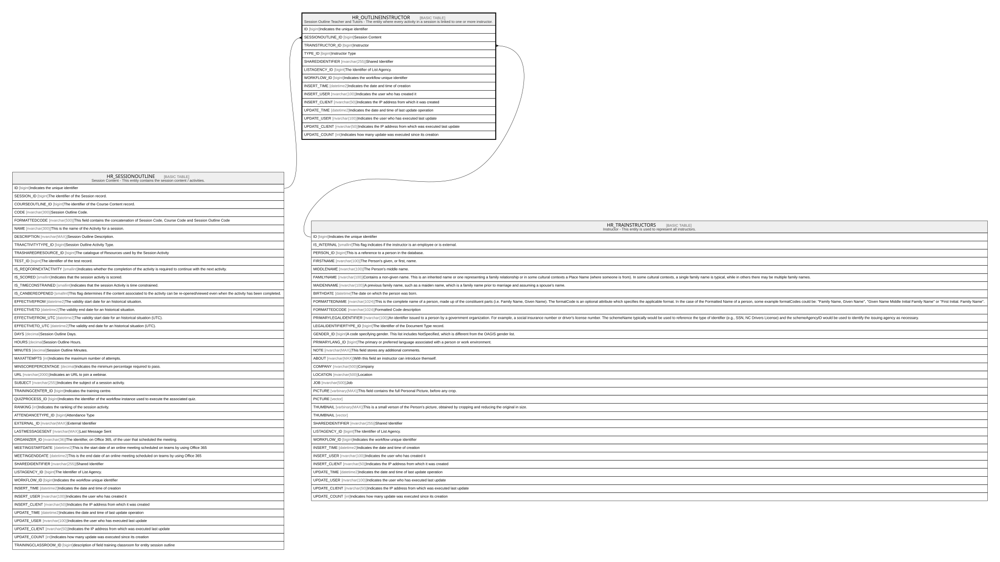

# HR_OUTLINEINSTRUCTOR

## Description

Session Outline Teacher and Tutors - The entity where every activity in a session is linked to one or more instructor.  

## Columns

| Name | Type | Default | Nullable | Parents | Comment |
| ---- | ---- | ------- | -------- | ------- | ------- |
| ID | bigint |  | false |  | Indicates the unique identifier |
| SESSIONOUTLINE_ID | bigint |  | false | [HR_SESSIONOUTLINE](HR_SESSIONOUTLINE.md) | Session Content |
| TRAINSTRUCTOR_ID | bigint |  | false | [HR_TRAINSTRUCTORS](HR_TRAINSTRUCTORS.md) | Instructor |
| TYPE_ID | bigint |  | true |  | Instructor Type |
| SHAREDIDENTIFIER | nvarchar(255) |  | true |  | Shared Identifier |
| LISTAGENCY_ID | bigint |  | true |  | The Identifier of List Agency. |
| WORKFLOW_ID | bigint |  | true |  | Indicates the workflow unique identifier |
| INSERT_TIME | datetime2 | (sysutcdatetime()) | false |  | Indicates the date and time of creation |
| INSERT_USER | nvarchar(100) | (N'MAIN') | false |  | Indicates the user who has created it |
| INSERT_CLIENT | nvarchar(50) | (N'localhost') | false |  | Indicates the IP address from which it was created |
| UPDATE_TIME | datetime2 | (sysutcdatetime()) | false |  | Indicates the date and time of last update operation |
| UPDATE_USER | nvarchar(100) | (N'MAIN') | false |  | Indicates the user who has executed last update |
| UPDATE_CLIENT | nvarchar(50) | (N'localhost') | false |  | Indicates the IP address from which was executed last update |
| UPDATE_COUNT | int | ((0)) | false |  | Indicates how many update was executed since its creation |

## Constraints

| Name | Type | Definition |
| ---- | ---- | ---------- |
| PK_HR_SESSIONOUTLINEINSTRUCTOR | PRIMARY KEY | CLUSTERED, unique, part of a PRIMARY KEY constraint, [ ID ] |
| UQ_HR_SESSIONOUTLINEINSTRUCTOR | UNIQUE | NONCLUSTERED, unique, part of a UNIQUE constraint, [ SESSIONOUTLINE_ID, TRAINSTRUCTOR_ID, TYPE_ID ] |
| FK_OUTLINEINST_SESSIONOUTLINE | FOREIGN KEY | FOREIGN KEY(SESSIONOUTLINE_ID) REFERENCES HR_SESSIONOUTLINE(ID) ON UPDATE NO_ACTION ON DELETE NO_ACTION |
| FK_OUTLINEINST_TRAINSTRUCTORS | FOREIGN KEY | FOREIGN KEY(TRAINSTRUCTOR_ID) REFERENCES HR_TRAINSTRUCTORS(ID) ON UPDATE NO_ACTION ON DELETE NO_ACTION |

## Indexes

| Name | Definition |
| ---- | ---------- |
| PK_HR_SESSIONOUTLINEINSTRUCTOR | CLUSTERED, unique, part of a PRIMARY KEY constraint, [ ID ] |
| UQ_HR_SESSIONOUTLINEINSTRUCTOR | NONCLUSTERED, unique, part of a UNIQUE constraint, [ SESSIONOUTLINE_ID, TRAINSTRUCTOR_ID, TYPE_ID ] |

## Relations

---

> Generated by [tbls](https://github.com/k1LoW/tbls)
