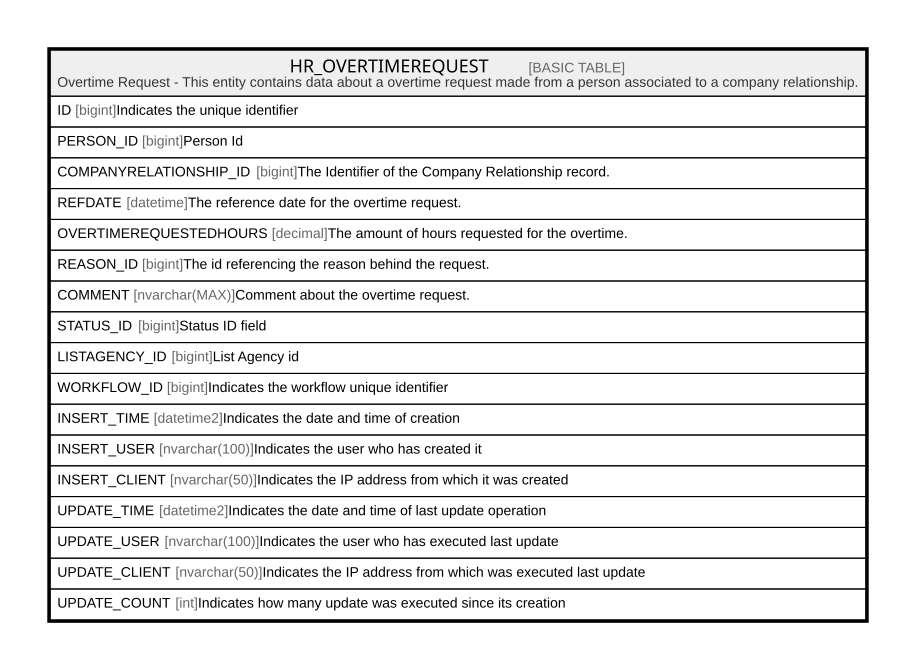

# HR_OVERTIMEREQUEST

## Description

Overtime Request - This entity contains data about a overtime request made from a person associated to a company relationship.  

## Columns

| Name | Type | Default | Nullable | Comment |
| ---- | ---- | ------- | -------- | ------- |
| ID | bigint |  | false | Indicates the unique identifier |
| PERSON_ID | bigint |  | false | Person Id |
| COMPANYRELATIONSHIP_ID | bigint |  | false | The Identifier of the Company Relationship record. |
| REFDATE | datetime |  | true | The reference date for the overtime request. |
| OVERTIMEREQUESTEDHOURS | decimal |  | true | The amount of hours requested for the overtime. |
| REASON_ID | bigint |  | true | The id referencing the reason behind the request. |
| COMMENT | nvarchar(MAX) |  | true | Comment about the overtime request. |
| STATUS_ID | bigint |  | true | Status ID field |
| LISTAGENCY_ID | bigint |  | true | List Agency id |
| WORKFLOW_ID | bigint |  | true | Indicates the workflow unique identifier |
| INSERT_TIME | datetime2 | (sysutcdatetime()) | false | Indicates the date and time of creation |
| INSERT_USER | nvarchar(100) | (N'MAIN') | false | Indicates the user who has created it |
| INSERT_CLIENT | nvarchar(50) | (N'localhost') | false | Indicates the IP address from which it was created |
| UPDATE_TIME | datetime2 | (sysutcdatetime()) | false | Indicates the date and time of last update operation |
| UPDATE_USER | nvarchar(100) | (N'MAIN') | false | Indicates the user who has executed last update |
| UPDATE_CLIENT | nvarchar(50) | (N'localhost') | false | Indicates the IP address from which was executed last update |
| UPDATE_COUNT | int | ((0)) | false | Indicates how many update was executed since its creation |

## Constraints

| Name | Type | Definition |
| ---- | ---- | ---------- |
| PK_HR_OVERTIMEREQUEST | PRIMARY KEY | CLUSTERED, unique, part of a PRIMARY KEY constraint, [ ID ] |

## Indexes

| Name | Definition |
| ---- | ---------- |
| PK_HR_OVERTIMEREQUEST | CLUSTERED, unique, part of a PRIMARY KEY constraint, [ ID ] |

## Relations

---

> Generated by [tbls](https://github.com/k1LoW/tbls)
