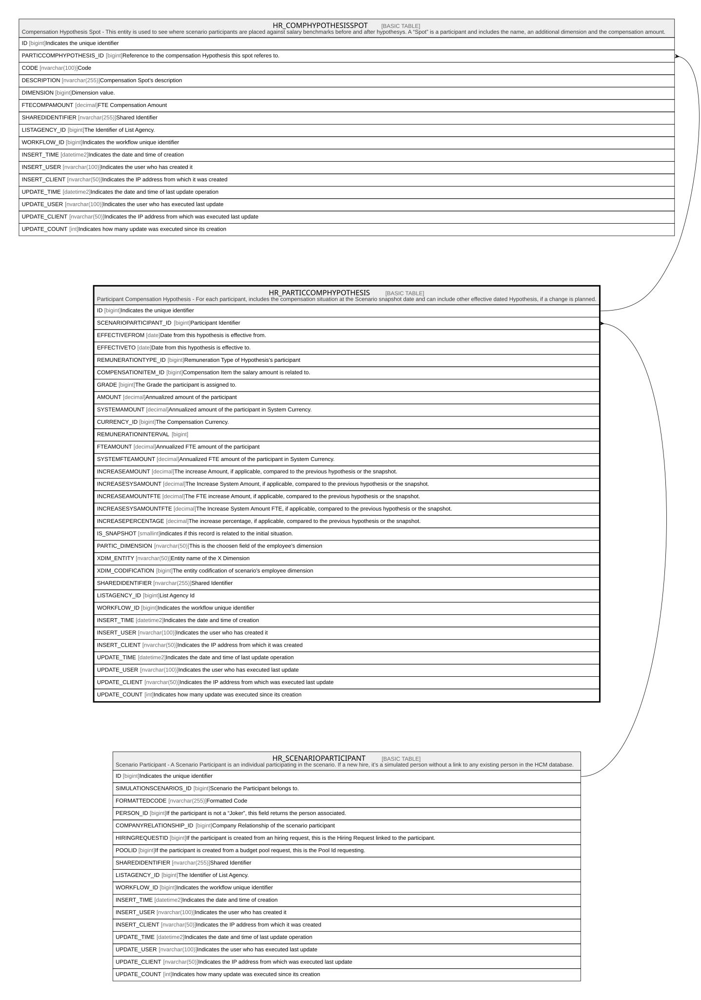

# HR_PARTICCOMPHYPOTHESIS

## Description

Participant Compensation Hypothesis - For each participant, includes the compensation situation at the Scenario snapshot date and can include other effective dated Hypothesis, if a change is planned.  

## Columns

| Name | Type | Default | Nullable | Children | Parents | Comment |
| ---- | ---- | ------- | -------- | -------- | ------- | ------- |
| ID | bigint |  | false | [HR_COMPHYPOTHESISSPOT](HR_COMPHYPOTHESISSPOT.md) |  | Indicates the unique identifier |
| SCENARIOPARTICIPANT_ID | bigint |  | false |  | [HR_SCENARIOPARTICIPANT](HR_SCENARIOPARTICIPANT.md) | Participant Identifier |
| EFFECTIVEFROM | date |  | true |  |  | Date from this hypothesis is effective from. |
| EFFECTIVETO | date |  | true |  |  | Date from this hypothesis is effective to. |
| REMUNERATIONTYPE_ID | bigint |  | true |  |  | Remuneration Type of Hypothesis's participant |
| COMPENSATIONITEM_ID | bigint |  | true |  |  | Compensation Item the salary amount is related to. |
| GRADE | bigint |  | true |  |  | The Grade the participant is assigned to. |
| AMOUNT | decimal |  | true |  |  | Annualized amount of the participant |
| SYSTEMAMOUNT | decimal |  | true |  |  | Annualized amount of the participant in System Currency. |
| CURRENCY_ID | bigint |  | true |  |  | The Compensation Currency. |
| REMUNERATIONINTERVAL | bigint |  | true |  |  |  |
| FTEAMOUNT | decimal |  | true |  |  | Annualized FTE amount of the participant |
| SYSTEMFTEAMOUNT | decimal |  | true |  |  | Annualized FTE amount of the participant in System Currency. |
| INCREASEAMOUNT | decimal |  | true |  |  | The increase Amount, if applicable, compared to the previous hypothesis or the snapshot. |
| INCREASESYSAMOUNT | decimal |  | true |  |  | The Increase System Amount, if applicable, compared to the previous hypothesis or the snapshot. |
| INCREASEAMOUNTFTE | decimal |  | true |  |  | The FTE increase Amount, if applicable, compared to the previous hypothesis or the snapshot. |
| INCREASESYSAMOUNTFTE | decimal |  | true |  |  | The Increase System Amount FTE, if applicable, compared to the previous hypothesis or the snapshot. |
| INCREASEPERCENTAGE | decimal |  | true |  |  | The increase percentage, if applicable, compared to the previous hypothesis or the snapshot. |
| IS_SNAPSHOT | smallint |  | true |  |  | indicates if this record is related to the initial situation. |
| PARTIC_DIMENSION | nvarchar(50) |  | true |  |  | This is the choosen field of the employee's dimension |
| XDIM_ENTITY | nvarchar(50) |  | true |  |  | Entity name of the X Dimension |
| XDIM_CODIFICATION | bigint |  | true |  |  | The entity codification of scenario's employee dimension |
| SHAREDIDENTIFIER | nvarchar(255) |  | true |  |  | Shared Identifier |
| LISTAGENCY_ID | bigint |  | true |  |  | List Agency Id |
| WORKFLOW_ID | bigint |  | true |  |  | Indicates the workflow unique identifier |
| INSERT_TIME | datetime2 | (sysutcdatetime()) | false |  |  | Indicates the date and time of creation |
| INSERT_USER | nvarchar(100) | (N'MAIN') | false |  |  | Indicates the user who has created it |
| INSERT_CLIENT | nvarchar(50) | (N'localhost') | false |  |  | Indicates the IP address from which it was created |
| UPDATE_TIME | datetime2 | (sysutcdatetime()) | false |  |  | Indicates the date and time of last update operation |
| UPDATE_USER | nvarchar(100) | (N'MAIN') | false |  |  | Indicates the user who has executed last update |
| UPDATE_CLIENT | nvarchar(50) | (N'localhost') | false |  |  | Indicates the IP address from which was executed last update |
| UPDATE_COUNT | int | ((0)) | false |  |  | Indicates how many update was executed since its creation |

## Constraints

| Name | Type | Definition |
| ---- | ---- | ---------- |
| PK_HR_PARTICCOMPHYPOTHESIS | PRIMARY KEY | CLUSTERED, unique, part of a PRIMARY KEY constraint, [ ID ] |
| UQ_PARTICCOMPHYP | UNIQUE | NONCLUSTERED, unique, part of a UNIQUE constraint, [ SCENARIOPARTICIPANT_ID, IS_SNAPSHOT ] |
| FK_PARTICCOMPHYP_SCENPART | FOREIGN KEY | FOREIGN KEY(SCENARIOPARTICIPANT_ID) REFERENCES HR_SCENARIOPARTICIPANT(ID) ON UPDATE NO_ACTION ON DELETE CASCADE |

## Indexes

| Name | Definition |
| ---- | ---------- |
| PK_HR_PARTICCOMPHYPOTHESIS | CLUSTERED, unique, part of a PRIMARY KEY constraint, [ ID ] |
| UQ_PARTICCOMPHYP | NONCLUSTERED, unique, part of a UNIQUE constraint, [ SCENARIOPARTICIPANT_ID, IS_SNAPSHOT ] |
| IDX_PARTICCOMPHYPOTHES_PARTIC | NONCLUSTERED, [ SCENARIOPARTICIPANT_ID ] |
| IDX_PARTICCOMPHYPOTHESIS_SNAP | NONCLUSTERED, [ IS_SNAPSHOT ] |

## Relations

---

> Generated by [tbls](https://github.com/k1LoW/tbls)
