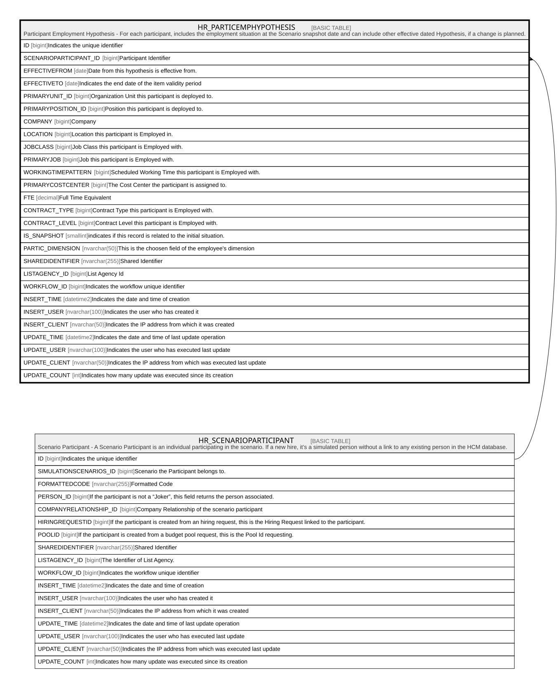

# HR_PARTICEMPHYPOTHESIS

## Description

Participant Employment Hypothesis - For each participant, includes the employment situation at the Scenario snapshot date and can include other effective dated Hypothesis, if a change is planned.  

## Columns

| Name | Type | Default | Nullable | Parents | Comment |
| ---- | ---- | ------- | -------- | ------- | ------- |
| ID | bigint |  | false |  | Indicates the unique identifier |
| SCENARIOPARTICIPANT_ID | bigint |  | false | [HR_SCENARIOPARTICIPANT](HR_SCENARIOPARTICIPANT.md) | Participant Identifier |
| EFFECTIVEFROM | date |  | true |  | Date from this hypothesis is effective from. |
| EFFECTIVETO | date |  | true |  | Indicates the end date of the item validity period |
| PRIMARYUNIT_ID | bigint |  | true |  | Organization Unit this participant is deployed to. |
| PRIMARYPOSITION_ID | bigint |  | true |  | Position this participant is deployed to. |
| COMPANY | bigint |  | true |  | Company |
| LOCATION | bigint |  | true |  | Location this participant is Employed in. |
| JOBCLASS | bigint |  | true |  | Job Class this participant is Employed with. |
| PRIMARYJOB | bigint |  | true |  | Job this participant is Employed with. |
| WORKINGTIMEPATTERN | bigint |  | true |  | Scheduled Working Time this participant is Employed with. |
| PRIMARYCOSTCENTER | bigint |  | true |  | The Cost Center the participant is assigned to. |
| FTE | decimal |  | true |  | Full Time Equivalent |
| CONTRACT_TYPE | bigint |  | true |  | Contract Type this participant is Employed with. |
| CONTRACT_LEVEL | bigint |  | true |  | Contract Level this participant is Employed with. |
| IS_SNAPSHOT | smallint |  | true |  | indicates if this record is related to the initial situation. |
| PARTIC_DIMENSION | nvarchar(50) |  | true |  | This is the choosen field of the employee's dimension |
| SHAREDIDENTIFIER | nvarchar(255) |  | true |  | Shared Identifier |
| LISTAGENCY_ID | bigint |  | true |  | List Agency Id |
| WORKFLOW_ID | bigint |  | true |  | Indicates the workflow unique identifier |
| INSERT_TIME | datetime2 | (sysutcdatetime()) | false |  | Indicates the date and time of creation |
| INSERT_USER | nvarchar(100) | (N'MAIN') | false |  | Indicates the user who has created it |
| INSERT_CLIENT | nvarchar(50) | (N'localhost') | false |  | Indicates the IP address from which it was created |
| UPDATE_TIME | datetime2 | (sysutcdatetime()) | false |  | Indicates the date and time of last update operation |
| UPDATE_USER | nvarchar(100) | (N'MAIN') | false |  | Indicates the user who has executed last update |
| UPDATE_CLIENT | nvarchar(50) | (N'localhost') | false |  | Indicates the IP address from which was executed last update |
| UPDATE_COUNT | int | ((0)) | false |  | Indicates how many update was executed since its creation |

## Constraints

| Name | Type | Definition |
| ---- | ---- | ---------- |
| PK_HR_PARTICEMPHYPOTHESIS | PRIMARY KEY | CLUSTERED, unique, part of a PRIMARY KEY constraint, [ ID ] |
| UQ_PARTICEMPHYP | UNIQUE | NONCLUSTERED, unique, part of a UNIQUE constraint, [ SCENARIOPARTICIPANT_ID, IS_SNAPSHOT ] |
| FK_PARTICEMPHYP_SCENPART | FOREIGN KEY | FOREIGN KEY(SCENARIOPARTICIPANT_ID) REFERENCES HR_SCENARIOPARTICIPANT(ID) ON UPDATE NO_ACTION ON DELETE CASCADE |

## Indexes

| Name | Definition |
| ---- | ---------- |
| PK_HR_PARTICEMPHYPOTHESIS | CLUSTERED, unique, part of a PRIMARY KEY constraint, [ ID ] |
| UQ_PARTICEMPHYP | NONCLUSTERED, unique, part of a UNIQUE constraint, [ SCENARIOPARTICIPANT_ID, IS_SNAPSHOT ] |

## Relations

---

> Generated by [tbls](https://github.com/k1LoW/tbls)
