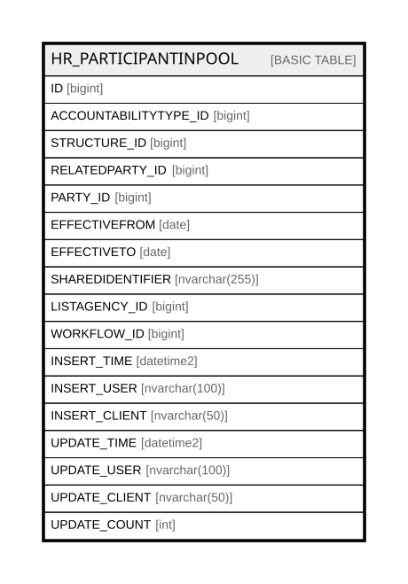

# HR_PARTICIPANTINPOOL

## Columns

| Name | Type | Default | Nullable | Comment |
| ---- | ---- | ------- | -------- | ------- |
| ID | bigint |  | false |  |
| ACCOUNTABILITYTYPE_ID | bigint |  | false |  |
| STRUCTURE_ID | bigint |  | false |  |
| RELATEDPARTY_ID | bigint |  | true |  |
| PARTY_ID | bigint |  | false |  |
| EFFECTIVEFROM | date |  | false |  |
| EFFECTIVETO | date |  | true |  |
| SHAREDIDENTIFIER | nvarchar(255) |  | true |  |
| LISTAGENCY_ID | bigint |  | true |  |
| WORKFLOW_ID | bigint |  | true |  |
| INSERT_TIME | datetime2 | (sysutcdatetime()) | false |  |
| INSERT_USER | nvarchar(100) | (N'MAIN') | false |  |
| INSERT_CLIENT | nvarchar(50) | (N'localhost') | false |  |
| UPDATE_TIME | datetime2 | (sysutcdatetime()) | false |  |
| UPDATE_USER | nvarchar(100) | (N'MAIN') | false |  |
| UPDATE_CLIENT | nvarchar(50) | (N'localhost') | false |  |
| UPDATE_COUNT | int | ((0)) | false |  |

## Constraints

| Name | Type | Definition |
| ---- | ---- | ---------- |
| PK_PARTICIPANTIINPOOL | PRIMARY KEY | CLUSTERED, unique, part of a PRIMARY KEY constraint, [ ID ] |

## Indexes

| Name | Definition |
| ---- | ---------- |
| PK_PARTICIPANTIINPOOL | CLUSTERED, unique, part of a PRIMARY KEY constraint, [ ID ] |

## Relations

---

> Generated by [tbls](https://github.com/k1LoW/tbls)
