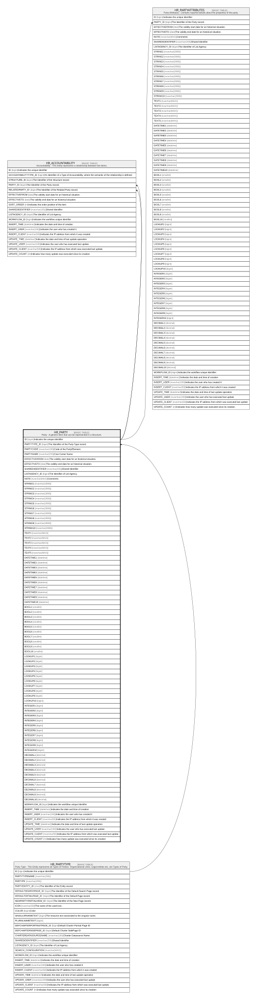

# HR_PARTY

## Description

Party - A generic Item that can be represented in a Structure.  

## Columns

| Name | Type | Default | Nullable | Children | Parents | Comment |
| ---- | ---- | ------- | -------- | -------- | ------- | ------- |
| ID | bigint |  | false | [HR_ACCOUNTABILITY](HR_ACCOUNTABILITY.md) [HR_PARTYATTRIBUTES](HR_PARTYATTRIBUTES.md) |  | Indicates the unique identifier |
| PARTYTYPE_ID | bigint |  | true |  | [HR_PARTYTYPE](HR_PARTYTYPE.md) | The Identifier of the Party Type record. |
| PARTYCODE | nvarchar(100) |  | true |  |  | Code of the Party/Element. |
| PARTYNAME | nvarchar(255) |  | true |  |  | Cost Center Name. |
| EFFECTIVEFROM | date |  | false |  |  | The validity start date for an historical situation. |
| EFFECTIVETO | date |  | true |  |  | The validity end date for an historical situation. |
| SHAREDIDENTIFIER | nvarchar(255) |  | true |  |  | Shared Identifier |
| LISTAGENCY_ID | bigint |  | true |  |  | The Identifier of List Agency. |
| NOTE | nvarchar(MAX) |  | true |  |  | Comments |
| STRING1 | nvarchar(2000) |  | true |  |  |  |
| STRING2 | nvarchar(2000) |  | true |  |  |  |
| STRING3 | nvarchar(2000) |  | true |  |  |  |
| STRING4 | nvarchar(2000) |  | true |  |  |  |
| STRING5 | nvarchar(2000) |  | true |  |  |  |
| STRING6 | nvarchar(2000) |  | true |  |  |  |
| STRING7 | nvarchar(2000) |  | true |  |  |  |
| STRING8 | nvarchar(2000) |  | true |  |  |  |
| STRING9 | nvarchar(2000) |  | true |  |  |  |
| STRING10 | nvarchar(2000) |  | true |  |  |  |
| TEXT1 | nvarchar(MAX) |  | true |  |  |  |
| TEXT2 | nvarchar(MAX) |  | true |  |  |  |
| TEXT3 | nvarchar(MAX) |  | true |  |  |  |
| TEXT4 | nvarchar(MAX) |  | true |  |  |  |
| TEXT5 | nvarchar(MAX) |  | true |  |  |  |
| DATETIME1 | datetime |  | true |  |  |  |
| DATETIME2 | datetime |  | true |  |  |  |
| DATETIME3 | datetime |  | true |  |  |  |
| DATETIME4 | datetime |  | true |  |  |  |
| DATETIME5 | datetime |  | true |  |  |  |
| DATETIME6 | datetime |  | true |  |  |  |
| DATETIME7 | datetime |  | true |  |  |  |
| DATETIME8 | datetime |  | true |  |  |  |
| DATETIME9 | datetime |  | true |  |  |  |
| DATETIME10 | datetime |  | true |  |  |  |
| BOOL1 | smallint |  | true |  |  |  |
| BOOL2 | smallint |  | true |  |  |  |
| BOOL3 | smallint |  | true |  |  |  |
| BOOL4 | smallint |  | true |  |  |  |
| BOOL5 | smallint |  | true |  |  |  |
| BOOL6 | smallint |  | true |  |  |  |
| BOOL7 | smallint |  | true |  |  |  |
| BOOL8 | smallint |  | true |  |  |  |
| BOOL9 | smallint |  | true |  |  |  |
| BOOL10 | smallint |  | true |  |  |  |
| LOOKUP1 | bigint |  | true |  |  |  |
| LOOKUP2 | bigint |  | true |  |  |  |
| LOOKUP3 | bigint |  | true |  |  |  |
| LOOKUP4 | bigint |  | true |  |  |  |
| LOOKUP5 | bigint |  | true |  |  |  |
| LOOKUP6 | bigint |  | true |  |  |  |
| LOOKUP7 | bigint |  | true |  |  |  |
| LOOKUP8 | bigint |  | true |  |  |  |
| LOOKUP9 | bigint |  | true |  |  |  |
| LOOKUP10 | bigint |  | true |  |  |  |
| INTEGER1 | bigint |  | true |  |  |  |
| INTEGER2 | bigint |  | true |  |  |  |
| INTEGER3 | bigint |  | true |  |  |  |
| INTEGER4 | bigint |  | true |  |  |  |
| INTEGER5 | bigint |  | true |  |  |  |
| INTEGER6 | bigint |  | true |  |  |  |
| INTEGER7 | bigint |  | true |  |  |  |
| INTEGER8 | bigint |  | true |  |  |  |
| INTEGER9 | bigint |  | true |  |  |  |
| INTEGER10 | bigint |  | true |  |  |  |
| DECIMAL1 | decimal |  | true |  |  |  |
| DECIMAL2 | decimal |  | true |  |  |  |
| DECIMAL3 | decimal |  | true |  |  |  |
| DECIMAL4 | decimal |  | true |  |  |  |
| DECIMAL5 | decimal |  | true |  |  |  |
| DECIMAL6 | decimal |  | true |  |  |  |
| DECIMAL7 | decimal |  | true |  |  |  |
| DECIMAL8 | decimal |  | true |  |  |  |
| DECIMAL9 | decimal |  | true |  |  |  |
| DECIMAL10 | decimal |  | true |  |  |  |
| WORKFLOW_ID | bigint |  | true |  |  | Indicates the workflow unique identifier |
| INSERT_TIME | datetime2 | (sysutcdatetime()) | false |  |  | Indicates the date and time of creation |
| INSERT_USER | nvarchar(100) | (N'MAIN') | false |  |  | Indicates the user who has created it |
| INSERT_CLIENT | nvarchar(50) | (N'localhost') | false |  |  | Indicates the IP address from which it was created |
| UPDATE_TIME | datetime2 | (sysutcdatetime()) | false |  |  | Indicates the date and time of last update operation |
| UPDATE_USER | nvarchar(100) | (N'MAIN') | false |  |  | Indicates the user who has executed last update |
| UPDATE_CLIENT | nvarchar(50) | (N'localhost') | false |  |  | Indicates the IP address from which was executed last update |
| UPDATE_COUNT | int | ((0)) | false |  |  | Indicates how many update was executed since its creation |

## Constraints

| Name | Type | Definition |
| ---- | ---- | ---------- |
| PK_PARTY | PRIMARY KEY | CLUSTERED, unique, part of a PRIMARY KEY constraint, [ ID ] |
| FK_PARTY_PARTYTYPE | FOREIGN KEY | FOREIGN KEY(PARTYTYPE_ID) REFERENCES HR_PARTYTYPE(ID) ON UPDATE NO_ACTION ON DELETE NO_ACTION |

## Indexes

| Name | Definition |
| ---- | ---------- |
| PK_PARTY | CLUSTERED, unique, part of a PRIMARY KEY constraint, [ ID ] |
| IDX_PARTY_PARTYID_EFFFROM | NONCLUSTERED, unique, [ PARTYTYPE_ID, PARTYCODE ] |

## Relations

---

> Generated by [tbls](https://github.com/k1LoW/tbls)
