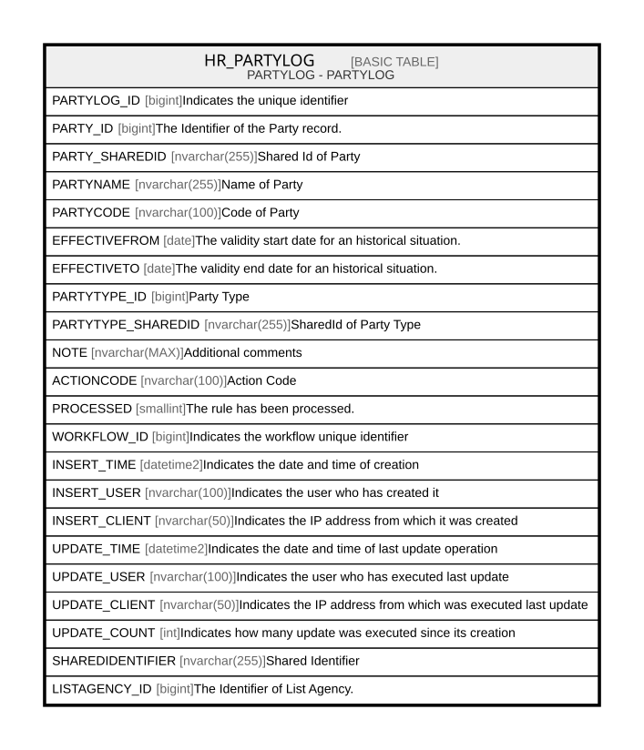

# HR_PARTYLOG

## Description

PARTYLOG - PARTYLOG  

## Columns

| Name | Type | Default | Nullable | Comment |
| ---- | ---- | ------- | -------- | ------- |
| PARTYLOG_ID | bigint |  | false | Indicates the unique identifier |
| PARTY_ID | bigint |  | true | The Identifier of the Party record. |
| PARTY_SHAREDID | nvarchar(255) |  | true | Shared Id of Party |
| PARTYNAME | nvarchar(255) |  | true | Name of Party |
| PARTYCODE | nvarchar(100) |  | true | Code of Party |
| EFFECTIVEFROM | date |  | true | The validity start date for an historical situation. |
| EFFECTIVETO | date |  | true | The validity end date for an historical situation. |
| PARTYTYPE_ID | bigint |  | true | Party Type |
| PARTYTYPE_SHAREDID | nvarchar(255) |  | true | SharedId of Party Type |
| NOTE | nvarchar(MAX) |  | true | Additional comments |
| ACTIONCODE | nvarchar(100) |  | true | Action Code |
| PROCESSED | smallint |  | true | The rule has been processed. |
| WORKFLOW_ID | bigint |  | true | Indicates the workflow unique identifier |
| INSERT_TIME | datetime2 | (sysutcdatetime()) | false | Indicates the date and time of creation |
| INSERT_USER | nvarchar(100) | (N'MAIN') | false | Indicates the user who has created it |
| INSERT_CLIENT | nvarchar(50) | (N'localhost') | false | Indicates the IP address from which it was created |
| UPDATE_TIME | datetime2 | (sysutcdatetime()) | false | Indicates the date and time of last update operation |
| UPDATE_USER | nvarchar(100) | (N'MAIN') | false | Indicates the user who has executed last update |
| UPDATE_CLIENT | nvarchar(50) | (N'localhost') | false | Indicates the IP address from which was executed last update |
| UPDATE_COUNT | int | ((0)) | false | Indicates how many update was executed since its creation |
| SHAREDIDENTIFIER | nvarchar(255) |  | true | Shared Identifier |
| LISTAGENCY_ID | bigint |  | true | The Identifier of List Agency. |

## Constraints

| Name | Type | Definition |
| ---- | ---- | ---------- |
| PK_PARTYLOG | PRIMARY KEY | CLUSTERED, unique, part of a PRIMARY KEY constraint, [ PARTYLOG_ID ] |

## Indexes

| Name | Definition |
| ---- | ---------- |
| PK_PARTYLOG | CLUSTERED, unique, part of a PRIMARY KEY constraint, [ PARTYLOG_ID ] |

## Relations

---

> Generated by [tbls](https://github.com/k1LoW/tbls)
