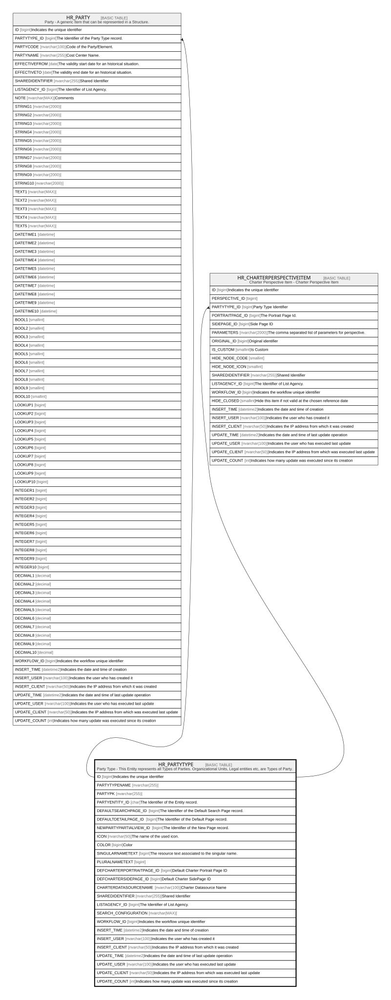

# HR_PARTYTYPE

## Description

Party Type - This Entity represents all Types of Parties. Organizational Units, Legal entities etc, are Types of Party.  

## Columns

| Name | Type | Default | Nullable | Children | Comment |
| ---- | ---- | ------- | -------- | -------- | ------- |
| ID | bigint |  | false | [HR_PARTY](HR_PARTY.md) [HR_CHARTERPERSPECTIVEITEM](HR_CHARTERPERSPECTIVEITEM.md) | Indicates the unique identifier |
| PARTYTYPENAME | nvarchar(255) |  | false |  |  |
| PARTYPK | nvarchar(255) |  | true |  |  |
| PARTYENTITY_ID | char |  | true |  | The Identifier of the Entity record. |
| DEFAULTSEARCHPAGE_ID | bigint |  | true |  | The Identifier of the Default Search Page record. |
| DEFAULTDETAILPAGE_ID | bigint |  | true |  | The Identifier of the Default Page record. |
| NEWPARTYPARTIALVIEW_ID | bigint |  | true |  | The Identifier of the New Page record. |
| ICON | nvarchar(50) |  | true |  | The name of the used icon. |
| COLOR | bigint |  | true |  | Color |
| SINGULARNAMETEXT | bigint |  | true |  | The resource text associated to the singular name. |
| PLURALNAMETEXT | bigint |  | true |  |  |
| DEFCHARTERPORTRAITPAGE_ID | bigint |  | true |  | Default Charter Portrait Page ID |
| DEFCHARTERSIDEPAGE_ID | bigint |  | true |  | Default Charter SidePage ID |
| CHARTERDATASOURCENAME | nvarchar(100) |  | true |  | Charter Datasource Name |
| SHAREDIDENTIFIER | nvarchar(255) |  | true |  | Shared Identifier |
| LISTAGENCY_ID | bigint |  | true |  | The Identifier of List Agency. |
| SEARCH_CONFIGURATION | nvarchar(MAX) |  | true |  |  |
| WORKFLOW_ID | bigint |  | true |  | Indicates the workflow unique identifier |
| INSERT_TIME | datetime2 | (sysutcdatetime()) | false |  | Indicates the date and time of creation |
| INSERT_USER | nvarchar(100) | (N'MAIN') | false |  | Indicates the user who has created it |
| INSERT_CLIENT | nvarchar(50) | (N'localhost') | false |  | Indicates the IP address from which it was created |
| UPDATE_TIME | datetime2 | (sysutcdatetime()) | false |  | Indicates the date and time of last update operation |
| UPDATE_USER | nvarchar(100) | (N'MAIN') | false |  | Indicates the user who has executed last update |
| UPDATE_CLIENT | nvarchar(50) | (N'localhost') | false |  | Indicates the IP address from which was executed last update |
| UPDATE_COUNT | int | ((0)) | false |  | Indicates how many update was executed since its creation |

## Constraints

| Name | Type | Definition |
| ---- | ---- | ---------- |
| PK_PARTYTYPE | PRIMARY KEY | CLUSTERED, unique, part of a PRIMARY KEY constraint, [ ID ] |

## Indexes

| Name | Definition |
| ---- | ---------- |
| PK_PARTYTYPE | CLUSTERED, unique, part of a PRIMARY KEY constraint, [ ID ] |
| IDX_PARTYTYPEINDEX | NONCLUSTERED, unique, [ PARTYTYPENAME ] |

## Relations

---

> Generated by [tbls](https://github.com/k1LoW/tbls)
