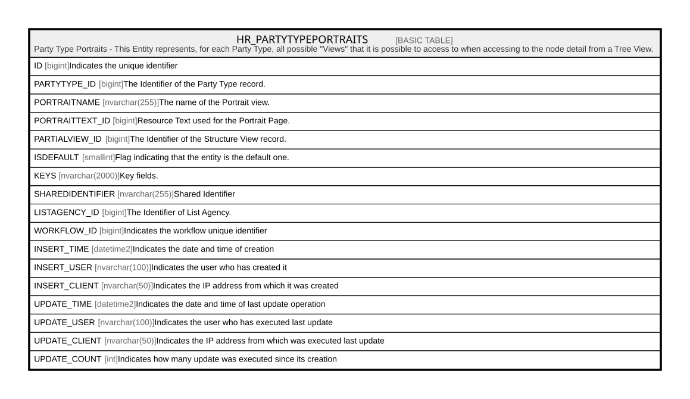

# HR_PARTYTYPEPORTRAITS

## Description

Party Type Portraits - This Entity represents, for each Party Type, all possible "Views" that it is possible to access to when accessing to the node detail from a Tree View.  

## Columns

| Name | Type | Default | Nullable | Comment |
| ---- | ---- | ------- | -------- | ------- |
| ID | bigint |  | false | Indicates the unique identifier |
| PARTYTYPE_ID | bigint |  | false | The Identifier of the Party Type record. |
| PORTRAITNAME | nvarchar(255) |  | false | The name of the Portrait view. |
| PORTRAITTEXT_ID | bigint |  | true | Resource Text used for the Portrait Page. |
| PARTIALVIEW_ID | bigint |  | true | The Identifier of the Structure View record. |
| ISDEFAULT | smallint |  | false | Flag indicating that the entity is the default one. |
| KEYS | nvarchar(2000) |  | true | Key fields. |
| SHAREDIDENTIFIER | nvarchar(255) |  | true | Shared Identifier |
| LISTAGENCY_ID | bigint |  | true | The Identifier of List Agency. |
| WORKFLOW_ID | bigint |  | true | Indicates the workflow unique identifier |
| INSERT_TIME | datetime2 | (sysutcdatetime()) | false | Indicates the date and time of creation |
| INSERT_USER | nvarchar(100) | (N'MAIN') | false | Indicates the user who has created it |
| INSERT_CLIENT | nvarchar(50) | (N'localhost') | false | Indicates the IP address from which it was created |
| UPDATE_TIME | datetime2 | (sysutcdatetime()) | false | Indicates the date and time of last update operation |
| UPDATE_USER | nvarchar(100) | (N'MAIN') | false | Indicates the user who has executed last update |
| UPDATE_CLIENT | nvarchar(50) | (N'localhost') | false | Indicates the IP address from which was executed last update |
| UPDATE_COUNT | int | ((0)) | false | Indicates how many update was executed since its creation |

## Constraints

| Name | Type | Definition |
| ---- | ---- | ---------- |
| PK_PARTYTYPEPORTRAITS | PRIMARY KEY | CLUSTERED, unique, part of a PRIMARY KEY constraint, [ ID ] |

## Indexes

| Name | Definition |
| ---- | ---------- |
| PK_PARTYTYPEPORTRAITS | CLUSTERED, unique, part of a PRIMARY KEY constraint, [ ID ] |

## Relations

---

> Generated by [tbls](https://github.com/k1LoW/tbls)
