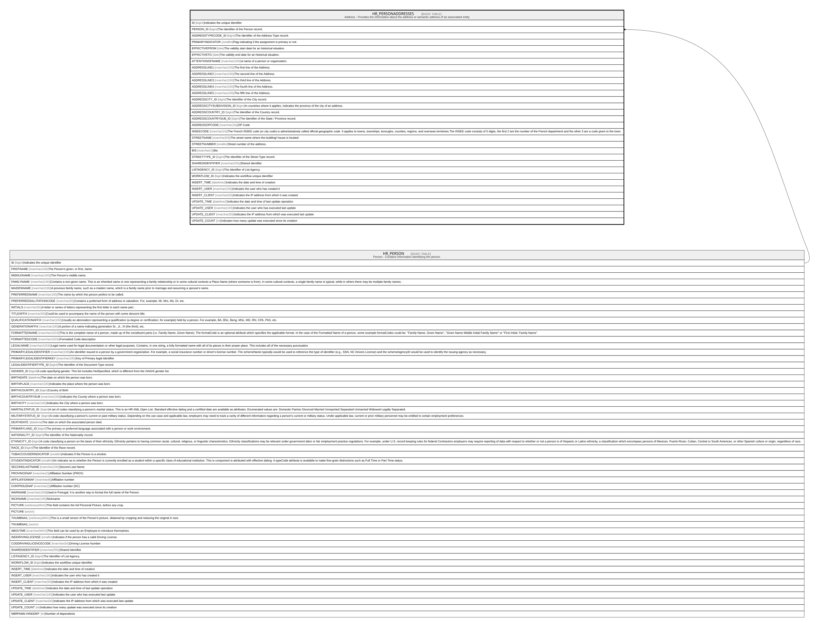

# HR_PERSONADDRESSES

## Description

Address - Provides the information about the address or semantic address of an associated entity  

## Columns

| Name | Type | Default | Nullable | Parents | Comment |
| ---- | ---- | ------- | -------- | ------- | ------- |
| ID | bigint |  | false |  | Indicates the unique identifier |
| PERSON_ID | bigint |  | false | [HR_PERSON](HR_PERSON.md) | The Identifier of the Person record. |
| ADDRESSTYPECODE_ID | bigint |  | true |  | The Identifier of the Address Type record. |
| PRIMARYINDICATOR | smallint |  | true |  | Flag indicating if the assignment is primary or not. |
| EFFECTIVEFROM | date |  | false |  | The validity start date for an historical situation. |
| EFFECTIVETO | date |  | true |  | The validity end date for an historical situation. |
| ATTENTIONOFNAME | nvarchar(100) |  | true |  | A name of a person or organization. |
| ADDRESSLINE1 | nvarchar(100) |  | true |  | The first line of the Address.  |
| ADDRESSLINE2 | nvarchar(100) |  | true |  | The second line of the Address.  |
| ADDRESSLINE3 | nvarchar(100) |  | true |  | The third line of the Address.  |
| ADDRESSLINE4 | nvarchar(100) |  | true |  | The fourth line of the Address.  |
| ADDRESSLINE5 | nvarchar(100) |  | true |  | The fifth line of the Address.  |
| ADDRESSCITY_ID | bigint |  | true |  | The Identifier of the City record. |
| ADDRESSCITYSUBDIVISION_ID | bigint |  | true |  | In countries where it applies, indicates the province of the city of an address. |
| ADDRESSCOUNTRY_ID | bigint |  | true |  | The Identifier of the Country record. |
| ADDRESSCOUNTRYSUB_ID | bigint |  | true |  | The Identifier of the State / Province record. |
| ADDRESSZIPCODE | nvarchar(16) |  | true |  | ZIP Code |
| INSEECODE | nvarchar(15) |  | true |  | The French INSEE code (or city code) is administratively called official geographic code. It applies to towns, townships, boroughs, counties, regions, and overseas territories.The INSEE code consists of 5 digits, the first 2 are the number of the French department and the other 3 are a code given to the town. |
| STREETNAME | nvarchar(50) |  | true |  | The street name where the building/ house is located |
| STREETNUMBER | smallint |  | true |  | Street number of the address. |
| BIS | nvarchar(1) |  | true |  | Bis |
| STREETTYPE_ID | bigint |  | true |  | The Identifier of the Street Type record. |
| SHAREDIDENTIFIER | nvarchar(255) |  | true |  | Shared Identifier |
| LISTAGENCY_ID | bigint |  | true |  | The Identifier of List Agency. |
| WORKFLOW_ID | bigint |  | true |  | Indicates the workflow unique identifier |
| INSERT_TIME | datetime2 | (sysutcdatetime()) | false |  | Indicates the date and time of creation |
| INSERT_USER | nvarchar(100) | (N'TEST_ORM') | false |  | Indicates the user who has created it |
| INSERT_CLIENT | nvarchar(50) | (N'localhost') | false |  | Indicates the IP address from which it was created |
| UPDATE_TIME | datetime2 | (sysutcdatetime()) | false |  | Indicates the date and time of last update operation |
| UPDATE_USER | nvarchar(100) | (N'TEST_ORM') | false |  | Indicates the user who has executed last update |
| UPDATE_CLIENT | nvarchar(50) | (N'localhost') | false |  | Indicates the IP address from which was executed last update |
| UPDATE_COUNT | int | ((0)) | false |  | Indicates how many update was executed since its creation |

## Constraints

| Name | Type | Definition |
| ---- | ---- | ---------- |
| PK_PERSONADDRESSES | PRIMARY KEY | CLUSTERED, unique, part of a PRIMARY KEY constraint, [ ID ] |
| FK_PERSONADDRESSES | FOREIGN KEY | FOREIGN KEY(PERSON_ID) REFERENCES HR_PERSON(ID) ON UPDATE NO_ACTION ON DELETE CASCADE |

## Indexes

| Name | Definition |
| ---- | ---------- |
| PK_PERSONADDRESSES | CLUSTERED, unique, part of a PRIMARY KEY constraint, [ ID ] |
| IDX_PERSONADDRESSES | NONCLUSTERED, unique, [ PERSON_ID, ADDRESSTYPECODE_ID, EFFECTIVEFROM, ADDRESSLINE1 ] |
| IDX_PERSONADDRESSES_CITY | NONCLUSTERED, [ ADDRESSCITY_ID ] |
| IDX_PERSONADDRESSES_CITYSUB | NONCLUSTERED, [ ADDRESSCITYSUBDIVISION_ID ] |
| IDX_PERSONADDRESSES_COUNTRY | NONCLUSTERED, [ ADDRESSCOUNTRY_ID ] |
| IDX_PERSONADDRESSES_COUSUB | NONCLUSTERED, [ ADDRESSCOUNTRYSUB_ID ] |
| IDX_PERSONADDRESSES_TYPE | NONCLUSTERED, [ ADDRESSTYPECODE_ID ] |
| IDX_PERSONADDRESSES_STREET | NONCLUSTERED, [ STREETTYPE_ID ] |

## Relations

---

> Generated by [tbls](https://github.com/k1LoW/tbls)
