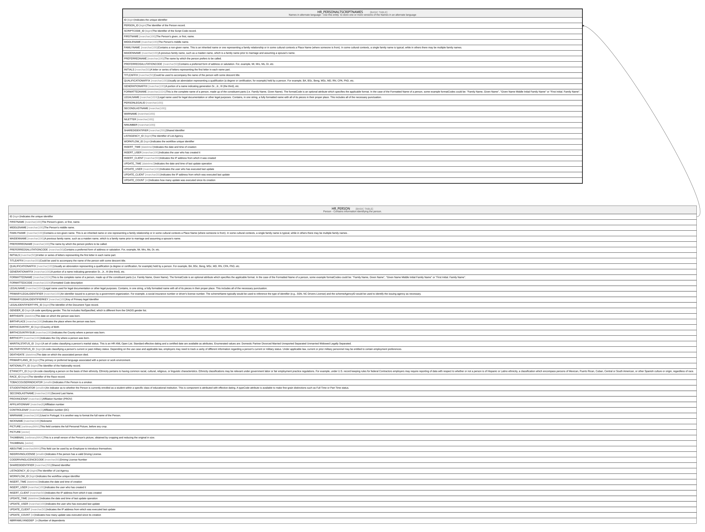

# HR_PERSONALTSCRIPTNAMES

## Description

Names in alternate language - Use this entity  to store one or more versions of the Names in an alternate language  

## Columns

| Name | Type | Default | Nullable | Parents | Comment |
| ---- | ---- | ------- | -------- | ------- | ------- |
| ID | bigint |  | false |  | Indicates the unique identifier |
| PERSON_ID | bigint |  | false | [HR_PERSON](HR_PERSON.md) | The Identifier of the Person record. |
| SCRIPTCODE_ID | bigint |  | false |  | The Identifier of the Script Code record. |
| FIRSTNAME | nvarchar(100) |  | false |  | The Person's given, or first, name. |
| MIDDLENAME | nvarchar(100) |  | true |  | The Person's middle name. |
| FAMILYNAME | nvarchar(100) |  | false |  | Contains a non-given name. This is an inherited name or one representing a family relationship or in some cultural contexts a Place Name (where someone is from). In some cultural contexts, a single family name is typical, while in others there may be multiple family names. |
| MAIDENNAME | nvarchar(100) |  | true |  | A previous family name, such as a maiden name, which is a family name prior to marriage and assuming a spouse's name. |
| PREFERREDNAME | nvarchar(100) |  | true |  | The name by which the person prefers to be called. |
| PREFERREDSALUTATIONCODE | nvarchar(50) |  | true |  | Contains a preferred form of address or salutation. For, example, Mr, Mrs, Ms, Dr, etc. |
| INITIALS | nvarchar(50) |  | true |  | A letter or series of letters representing the first letter in each name part. |
| TITLEAFFIX | nvarchar(50) |  | true |  | Could be used to accompany the name of the person with some descent title. |
| QUALIFICATIONAFFIX | nvarchar(100) |  | true |  | Usually an abreviation representing a qualification (a degree or certification, for example) held by a person. For example, BA, BSc, Beng, MSc, MD, RN, CPA, PhD, etc. |
| GENERATIONAFFIX | nvarchar(100) |  | true |  | A portion of a name indicating generation Sr., Jr., III (the third), etc. |
| FORMATTEDNAME | nvarchar(1024) |  | true |  | This is the complete name of a person, made up of the constituent parts (i.e. Family Name, Given Name). The formatCode is an optional attribute which specifies the applicable format. In the case of the Formatted Name of a person, some example formatCodes could be: ''Family Name, Given Name'', ''Given Name Middle Initial Family Name'' or ''First Initial. Family Name''. |
| LEGALNAME | nvarchar(1024) |  | true |  | Legal name used for legal documentation or other legal purposes. Contains, in one string, a fully formatted name with all of its pieces in their proper place. This includes all of the necessary punctuation. |
| PERSONLEGALID | nvarchar(100) |  | true |  |  |
| SECONDLASTNAME | nvarchar(100) |  | true |  |  |
| WARNAME | nvarchar(100) |  | true |  |  |
| NILETTER | nvarchar(100) |  | true |  |  |
| NINUMBER | nvarchar(100) |  | true |  |  |
| SHAREDIDENTIFIER | nvarchar(255) |  | true |  | Shared Identifier |
| LISTAGENCY_ID | bigint |  | true |  | The Identifier of List Agency. |
| WORKFLOW_ID | bigint |  | true |  | Indicates the workflow unique identifier |
| INSERT_TIME | datetime2 | (sysutcdatetime()) | false |  | Indicates the date and time of creation |
| INSERT_USER | nvarchar(100) | (N'MAIN') | false |  | Indicates the user who has created it |
| INSERT_CLIENT | nvarchar(50) | (N'localhost') | false |  | Indicates the IP address from which it was created |
| UPDATE_TIME | datetime2 | (sysutcdatetime()) | false |  | Indicates the date and time of last update operation |
| UPDATE_USER | nvarchar(100) | (N'MAIN') | false |  | Indicates the user who has executed last update |
| UPDATE_CLIENT | nvarchar(50) |  | false |  | Indicates the IP address from which was executed last update |
| UPDATE_COUNT | int | ((0)) | false |  | Indicates how many update was executed since its creation |

## Constraints

| Name | Type | Definition |
| ---- | ---- | ---------- |
| PK_PERSONALTSCRIPTNAMES | PRIMARY KEY | CLUSTERED, unique, part of a PRIMARY KEY constraint, [ ID ] |
| FK_PERSONALTSCRIPTNAMES | FOREIGN KEY | FOREIGN KEY(PERSON_ID) REFERENCES HR_PERSON(ID) ON UPDATE NO_ACTION ON DELETE CASCADE |

## Indexes

| Name | Definition |
| ---- | ---------- |
| PK_PERSONALTSCRIPTNAMES | CLUSTERED, unique, part of a PRIMARY KEY constraint, [ ID ] |
| IDX_PERSONALTSCRIPTNAMES | NONCLUSTERED, unique, [ PERSON_ID, SCRIPTCODE_ID ] |
| IDX_PERSONALTSCRIPT_SCRIPT | NONCLUSTERED, [ SCRIPTCODE_ID ] |

## Relations

---

> Generated by [tbls](https://github.com/k1LoW/tbls)
