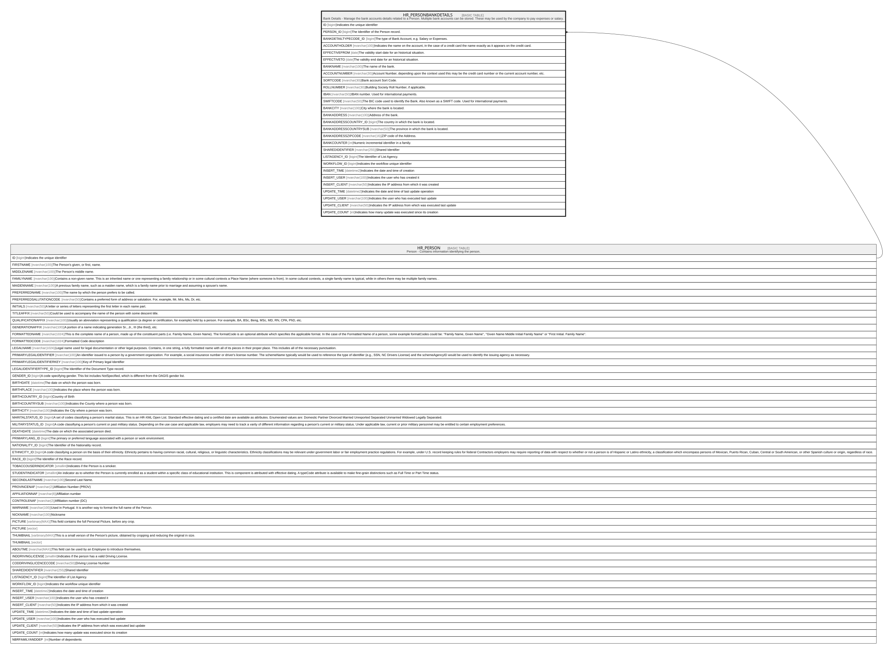

# HR_PERSONBANKDETAILS

## Description

Bank Details - Manage the bank accounts details related to a Person. Multiple bank accounts can be stored. These may be used by the company to pay expenses or salary.  

## Columns

| Name | Type | Default | Nullable | Parents | Comment |
| ---- | ---- | ------- | -------- | ------- | ------- |
| ID | bigint |  | false |  | Indicates the unique identifier |
| PERSON_ID | bigint |  | false | [HR_PERSON](HR_PERSON.md) | The Identifier of the Person record. |
| BANKDETAILTYPECODE_ID | bigint |  | false |  | The type of Bank Account, e.g. Salary or Expenses. |
| ACCOUNTHOLDER | nvarchar(100) |  | true |  | Indicates the name on the account, in the case of a credit card the name exactly as it appears on the credit card. |
| EFFECTIVEFROM | date |  | false |  | The validity start date for an historical situation. |
| EFFECTIVETO | date |  | true |  | The validity end date for an historical situation. |
| BANKNAME | nvarchar(100) |  | true |  | The name of the bank. |
| ACCOUNTNUMBER | nvarchar(30) |  | true |  | Account Number, depending upon the context used this may be the credit card number or the current account number, etc. |
| SORTCODE | nvarchar(30) |  | true |  | Bank account Sort Code. |
| ROLLNUMBER | nvarchar(30) |  | true |  | Building Society Roll Number, if applicable. |
| IBAN | nvarchar(50) |  | true |  | IBAN number. Used for international payments. |
| SWIFTCODE | nvarchar(50) |  | true |  | The BIC code used to identify the Bank. Also known as a SWIFT code. Used for international payments. |
| BANKCITY | nvarchar(100) |  | true |  | City where the bank is located. |
| BANKADDRESS | nvarchar(100) |  | true |  | Address of the bank. |
| BANKADDRESSCOUNTRY_ID | bigint |  | true |  | The country in which the bank is located. |
| BANKADDRESSCOUNTRYSUB | nvarchar(50) |  | true |  | The province in which the bank is located. |
| BANKADDRESSZIPCODE | nvarchar(16) |  | true |  | ZIP code of the Address. |
| BANKCOUNTER | int |  | true |  | Numeric incremental identifier in a family. |
| SHAREDIDENTIFIER | nvarchar(255) |  | true |  | Shared Identifier |
| LISTAGENCY_ID | bigint |  | true |  | The Identifier of List Agency. |
| WORKFLOW_ID | bigint |  | true |  | Indicates the workflow unique identifier |
| INSERT_TIME | datetime2 | (sysutcdatetime()) | false |  | Indicates the date and time of creation |
| INSERT_USER | nvarchar(100) | (N'MAIN') | false |  | Indicates the user who has created it |
| INSERT_CLIENT | nvarchar(50) | (N'localhost') | false |  | Indicates the IP address from which it was created |
| UPDATE_TIME | datetime2 | (sysutcdatetime()) | false |  | Indicates the date and time of last update operation |
| UPDATE_USER | nvarchar(100) | (N'MAIN') | false |  | Indicates the user who has executed last update |
| UPDATE_CLIENT | nvarchar(50) | (N'localhost') | false |  | Indicates the IP address from which was executed last update |
| UPDATE_COUNT | int | ((0)) | false |  | Indicates how many update was executed since its creation |

## Constraints

| Name | Type | Definition |
| ---- | ---- | ---------- |
| PK_BANKDETAILS | PRIMARY KEY | CLUSTERED, unique, part of a PRIMARY KEY constraint, [ ID ] |
| FK_BANKDETAILS_PERSON | FOREIGN KEY | FOREIGN KEY(PERSON_ID) REFERENCES HR_PERSON(ID) ON UPDATE NO_ACTION ON DELETE CASCADE |

## Indexes

| Name | Definition |
| ---- | ---------- |
| PK_BANKDETAILS | CLUSTERED, unique, part of a PRIMARY KEY constraint, [ ID ] |
| IDX_PERSONBANKDETAILS | NONCLUSTERED, unique, [ PERSON_ID, BANKDETAILTYPECODE_ID, EFFECTIVEFROM ] |
| IDX_PERSONBANKDETAILS_COUNTRY | NONCLUSTERED, [ BANKADDRESSCOUNTRY_ID ] |
| IDX_PERSONBANKDETAILS_TYPE | NONCLUSTERED, [ BANKDETAILTYPECODE_ID ] |

## Relations

---

> Generated by [tbls](https://github.com/k1LoW/tbls)
