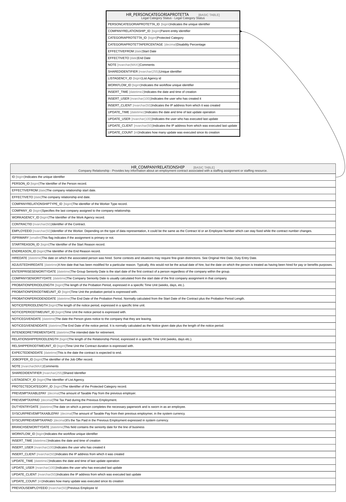

# HR_PERSONCATEGORIAPROTETTA

## Description

Legal Category Status - Legal Category Status  

## Columns

| Name | Type | Default | Nullable | Parents | Comment |
| ---- | ---- | ------- | -------- | ------- | ------- |
| PERSONCATEGORIAPROTETTA_ID | bigint |  | false |  | Indicates the unique identifier |
| COMPANYRELATIONSHIP_ID | bigint |  | false | [HR_COMPANYRELATIONSHIP](HR_COMPANYRELATIONSHIP.md) | Parent entity identifier |
| CATEGORIAPROTETTA_ID | bigint |  | false |  | Protected Category |
| CATEGORIAPROTETTAPERCENTAGE | decimal |  | true |  | Disability Percentage |
| EFFECTIVEFROM | date |  | false |  | Start Date |
| EFFECTIVETO | date |  | true |  | End Date |
| NOTE | nvarchar(MAX) |  | true |  | Comments |
| SHAREDIDENTIFIER | nvarchar(255) |  | true |  | Unique identifier |
| LISTAGENCY_ID | bigint |  | true |  | List Agency id |
| WORKFLOW_ID | bigint |  | true |  | Indicates the workflow unique identifier |
| INSERT_TIME | datetime2 | (sysutcdatetime()) | false |  | Indicates the date and time of creation |
| INSERT_USER | nvarchar(100) | (N'MAIN') | false |  | Indicates the user who has created it |
| INSERT_CLIENT | nvarchar(50) | (N'localhost') | false |  | Indicates the IP address from which it was created |
| UPDATE_TIME | datetime2 | (sysutcdatetime()) | false |  | Indicates the date and time of last update operation |
| UPDATE_USER | nvarchar(100) | (N'MAIN') | false |  | Indicates the user who has executed last update |
| UPDATE_CLIENT | nvarchar(50) | (N'localhost') | false |  | Indicates the IP address from which was executed last update |
| UPDATE_COUNT | int | ((0)) | false |  | Indicates how many update was executed since its creation |

## Constraints

| Name | Type | Definition |
| ---- | ---- | ---------- |
| PK_PERSONCATEGORIAPROTETTA | PRIMARY KEY | CLUSTERED, unique, part of a PRIMARY KEY constraint, [ PERSONCATEGORIAPROTETTA_ID ] |
| FK_PERSONCATEGORIAPROTETTA | FOREIGN KEY | FOREIGN KEY(COMPANYRELATIONSHIP_ID) REFERENCES HR_COMPANYRELATIONSHIP(ID) ON UPDATE NO_ACTION ON DELETE CASCADE |

## Indexes

| Name | Definition |
| ---- | ---------- |
| PK_PERSONCATEGORIAPROTETTA | CLUSTERED, unique, part of a PRIMARY KEY constraint, [ PERSONCATEGORIAPROTETTA_ID ] |
| IDX_PERSONCATEGORIAPROTETTA_S | NONCLUSTERED, [ COMPANYRELATIONSHIP_ID, EFFECTIVEFROM, EFFECTIVETO ] |

## Relations

---

> Generated by [tbls](https://github.com/k1LoW/tbls)
