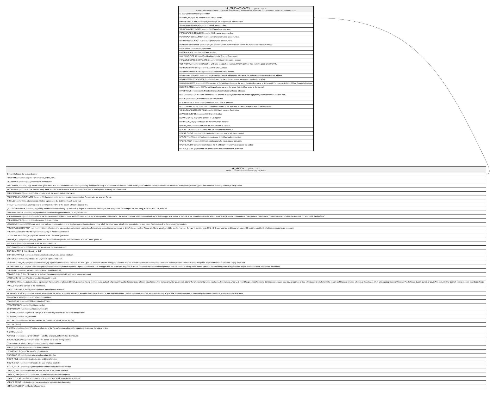

# HR_PERSONCONTACTS

## Description

Contact Information - Contact Information for the Person, including email addresses, phone numbers and social media accounts.  

## Columns

| Name | Type | Default | Nullable | Parents | Comment |
| ---- | ---- | ------- | -------- | ------- | ------- |
| ID | bigint |  | false |  | Indicates the unique identifier |
| PERSON_ID | bigint |  | false | [HR_PERSON](HR_PERSON.md) | The Identifier of the Person record. |
| PRIMARYINDICATOR | smallint |  | false |  | Flag indicating if the assignment is primary or not. |
| WORKPHONENUMBER | nvarchar(30) |  | true |  | Work phone number. |
| WORKPHONEEXTENSION | nvarchar(30) |  | true |  | Work phone extension. |
| PERSONALPHONENUMBER | nvarchar(30) |  | true |  | Personal phone number. |
| PERSONALMOBILENUMBER | nvarchar(30) |  | true |  | Personal mobile phone number. |
| WORKMOBILENUMBER | nvarchar(30) |  | true |  | Work mobile phone number. |
| OTHERPHONENUMBER | nvarchar(30) |  | true |  | An additional phone number which is neither the main personal or work number. |
| FAXNUMBER | nvarchar(30) |  | true |  | Fax number. |
| PAGERNUMBER | nvarchar(30) |  | true |  | Pager Number |
| IMCHANNELTYPE_ID | bigint |  | true |  | The Identifier of the IM Channel Type record. |
| INSTANTMESSAGINGCONTACTID | nvarchar(100) |  | true |  | Instant Messaging contact. |
| WEBSITEURL | nvarchar(200) |  | true |  | Web Site URL for a contact. For example, if the Person has their own web page, enter the URL. |
| WORKEMAILADDRESS | nvarchar(100) |  | true |  | Work Email Address. |
| PERSONALEMAILADDRESS | nvarchar(100) |  | true |  | Personal e-mail address. |
| OTHEREMAILADDRESS | nvarchar(100) |  | true |  | An additional e-mail address which is neither the main personal or the work e-mail address. |
| HTMLPREFERREDINDICATOR | smallint |  | true |  | Indicates that the preferred content for the associated entity is HTML. |
| BUILDINGNUMBER | nvarchar(50) |  | true |  | The number of the building or house on the street that identifies where to deliver mail. For example, Building 300 on Standards Parkway |
| BUILDINGNAME | nvarchar(50) |  | true |  | The building or house name on the street that identifies where to deliver mail. |
| STREETNAME | nvarchar(100) |  | true |  | The street name where the building/ house is located |
| UNIT | nvarchar(50) |  | true |  | In a Contact information, can be used to specify which Unit  the Person is physically Located or can be reached from. |
| FLOOR | nvarchar(50) |  | true |  | The floor where the flat is located. |
| POSTOFFICEBOX | nvarchar(50) |  | true |  | Identifies a Post Office Box number. |
| DELIVERYPOINTCODE | nvarchar(50) |  | true |  | Identifies the Dock or the Mail Stop or Lane or any other specific Delivery Point. |
| WORKLOCATIONDESCRIPTION | nvarchar(200) |  | true |  | Work Location Description. |
| SHAREDIDENTIFIER | nvarchar(255) |  | true |  | Shared Identifier |
| LISTAGENCY_ID | bigint |  | true |  | The Identifier of List Agency. |
| WORKFLOW_ID | bigint |  | true |  | Indicates the workflow unique identifier |
| INSERT_TIME | datetime2 | (sysutcdatetime()) | false |  | Indicates the date and time of creation |
| INSERT_USER | nvarchar(100) | (N'MAIN') | false |  | Indicates the user who has created it |
| INSERT_CLIENT | nvarchar(50) | (N'localhost') | false |  | Indicates the IP address from which it was created |
| UPDATE_TIME | datetime2 | (sysutcdatetime()) | false |  | Indicates the date and time of last update operation |
| UPDATE_USER | nvarchar(100) | (N'MAIN') | false |  | Indicates the user who has executed last update |
| UPDATE_CLIENT | nvarchar(50) |  | false |  | Indicates the IP address from which was executed last update |
| UPDATE_COUNT | int | ((0)) | false |  | Indicates how many update was executed since its creation |

## Constraints

| Name | Type | Definition |
| ---- | ---- | ---------- |
| PK_PERSONCONTACTS | PRIMARY KEY | CLUSTERED, unique, part of a PRIMARY KEY constraint, [ ID ] |
| FK_PERSONCONTACTS | FOREIGN KEY | FOREIGN KEY(PERSON_ID) REFERENCES HR_PERSON(ID) ON UPDATE NO_ACTION ON DELETE CASCADE |

## Indexes

| Name | Definition |
| ---- | ---------- |
| PK_PERSONCONTACTS | CLUSTERED, unique, part of a PRIMARY KEY constraint, [ ID ] |
| IDX_PERSONCONTACTS | NONCLUSTERED, unique, [ PERSON_ID, PRIMARYINDICATOR ] |
| IDX_PERSONCONTACTS_CHANNEL | NONCLUSTERED, [ IMCHANNELTYPE_ID ] |

## Relations

---

> Generated by [tbls](https://github.com/k1LoW/tbls)
