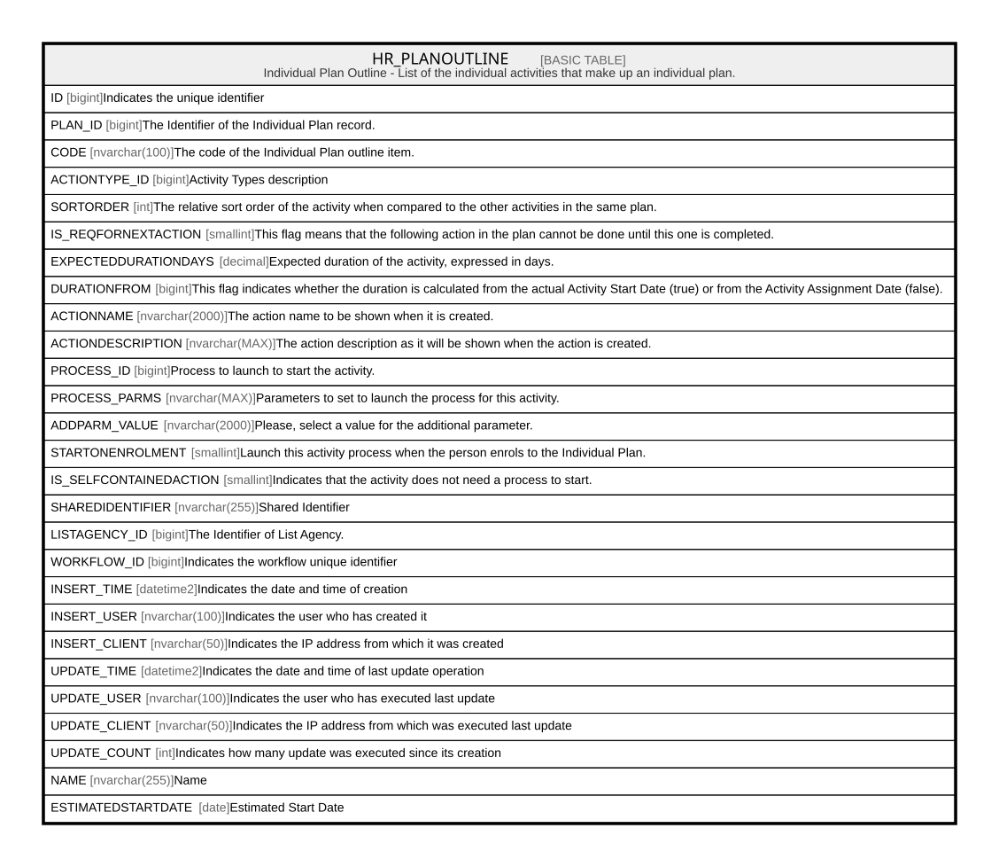

# HR_PLANOUTLINE

## Description

Individual Plan Outline - List of the individual activities that make up an individual plan.  

## Columns

| Name | Type | Default | Nullable | Comment |
| ---- | ---- | ------- | -------- | ------- |
| ID | bigint |  | false | Indicates the unique identifier |
| PLAN_ID | bigint |  | false | The Identifier of the Individual Plan record. |
| CODE | nvarchar(100) |  | false | The code of the Individual Plan outline item. |
| ACTIONTYPE_ID | bigint |  | false | Activity Types description |
| SORTORDER | int |  | true | The relative sort order of the activity when compared to the other activities in the same plan. |
| IS_REQFORNEXTACTION | smallint |  | true | This flag means that the following action in the plan cannot be done until this one is completed. |
| EXPECTEDDURATIONDAYS | decimal |  | true | Expected duration of the activity, expressed in days. |
| DURATIONFROM | bigint |  | true | This flag indicates whether the duration is calculated from the actual Activity Start Date (true) or from the Activity Assignment Date (false). |
| ACTIONNAME | nvarchar(2000) |  | true | The action name to be shown when it is created. |
| ACTIONDESCRIPTION | nvarchar(MAX) |  | true | The action description as it will be shown when the action is created. |
| PROCESS_ID | bigint |  | true | Process to launch to start the activity. |
| PROCESS_PARMS | nvarchar(MAX) |  | true | Parameters to set to launch the process for this activity. |
| ADDPARM_VALUE | nvarchar(2000) |  | true | Please, select a value for the additional parameter. |
| STARTONENROLMENT | smallint |  | true | Launch this activity process when the person enrols to the Individual Plan. |
| IS_SELFCONTAINEDACTION | smallint |  | true | Indicates that the activity does not need a process to start. |
| SHAREDIDENTIFIER | nvarchar(255) |  | true | Shared Identifier |
| LISTAGENCY_ID | bigint |  | true | The Identifier of List Agency. |
| WORKFLOW_ID | bigint |  | true | Indicates the workflow unique identifier |
| INSERT_TIME | datetime2 | (sysutcdatetime()) | false | Indicates the date and time of creation |
| INSERT_USER | nvarchar(100) | (N'MAIN') | false | Indicates the user who has created it |
| INSERT_CLIENT | nvarchar(50) | (N'localhost') | false | Indicates the IP address from which it was created |
| UPDATE_TIME | datetime2 | (sysutcdatetime()) | false | Indicates the date and time of last update operation |
| UPDATE_USER | nvarchar(100) | (N'MAIN') | false | Indicates the user who has executed last update |
| UPDATE_CLIENT | nvarchar(50) | (N'localhost') | false | Indicates the IP address from which was executed last update |
| UPDATE_COUNT | int | ((0)) | false | Indicates how many update was executed since its creation |
| NAME | nvarchar(255) |  | false | Name |
| ESTIMATEDSTARTDATE | date |  | true | Estimated Start Date |

## Constraints

| Name | Type | Definition |
| ---- | ---- | ---------- |
| PK_HR_PLANOUTLINE | PRIMARY KEY | CLUSTERED, unique, part of a PRIMARY KEY constraint, [ ID ] |
| UQ_PLANOUTLINE | UNIQUE | NONCLUSTERED, unique, part of a UNIQUE constraint, [ PLAN_ID, CODE ] |

## Indexes

| Name | Definition |
| ---- | ---------- |
| PK_HR_PLANOUTLINE | CLUSTERED, unique, part of a PRIMARY KEY constraint, [ ID ] |
| UQ_PLANOUTLINE | NONCLUSTERED, unique, part of a UNIQUE constraint, [ PLAN_ID, CODE ] |

## Relations

---

> Generated by [tbls](https://github.com/k1LoW/tbls)
