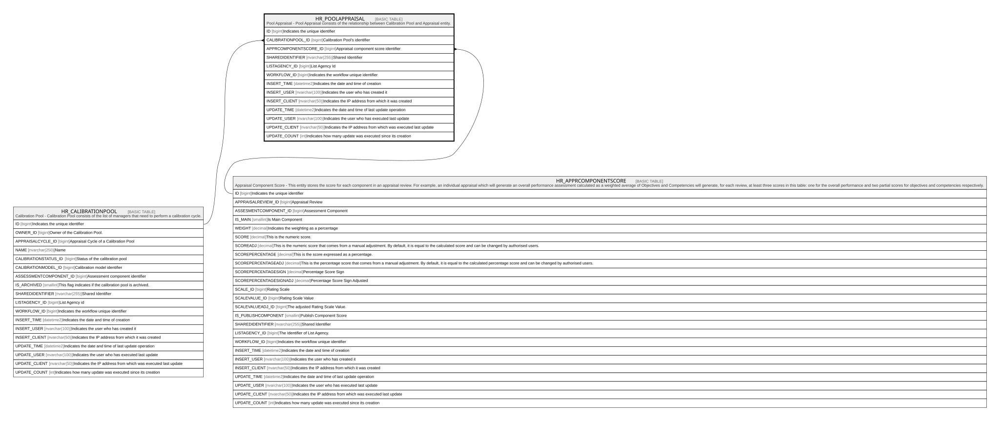

# HR_POOLAPPRAISAL

## Description

Pool Appraisal - Pool Appraisal consists of the relationship between Calibration Pool and Appraisal entity.  

## Columns

| Name | Type | Default | Nullable | Parents | Comment |
| ---- | ---- | ------- | -------- | ------- | ------- |
| ID | bigint |  | false |  | Indicates the unique identifier |
| CALIBRATIONPOOL_ID | bigint |  | false | [HR_CALIBRATIONPOOL](HR_CALIBRATIONPOOL.md) | Calibration Pool's identifier |
| APPRCOMPONENTSCORE_ID | bigint |  | false | [HR_APPRCOMPONENTSCORE](HR_APPRCOMPONENTSCORE.md) | Appraisal component score identifier |
| SHAREDIDENTIFIER | nvarchar(255) |  | true |  | Shared Identifier |
| LISTAGENCY_ID | bigint |  | true |  | List Agency Id |
| WORKFLOW_ID | bigint |  | true |  | Indicates the workflow unique identifier |
| INSERT_TIME | datetime2 |  | false |  | Indicates the date and time of creation |
| INSERT_USER | nvarchar(100) |  | false |  | Indicates the user who has created it |
| INSERT_CLIENT | nvarchar(50) |  | false |  | Indicates the IP address from which it was created |
| UPDATE_TIME | datetime2 |  | false |  | Indicates the date and time of last update operation |
| UPDATE_USER | nvarchar(100) |  | false |  | Indicates the user who has executed last update |
| UPDATE_CLIENT | nvarchar(50) |  | false |  | Indicates the IP address from which was executed last update |
| UPDATE_COUNT | int |  | false |  | Indicates how many update was executed since its creation |

## Constraints

| Name | Type | Definition |
| ---- | ---- | ---------- |
| PK_HR_POOLAPPRAISAL | PRIMARY KEY | CLUSTERED, unique, part of a PRIMARY KEY constraint, [ ID ] |
| UQ_POOLAPPRAISAL | UNIQUE | NONCLUSTERED, unique, part of a UNIQUE constraint, [ APPRCOMPONENTSCORE_ID ] |
| FK_POOLAPPRAISAL_APPRCOMPSCORE | FOREIGN KEY | FOREIGN KEY(APPRCOMPONENTSCORE_ID) REFERENCES HR_APPRCOMPONENTSCORE(ID) ON UPDATE NO_ACTION ON DELETE CASCADE |
| FK_POOLAPPRAISAL_CALPOOL | FOREIGN KEY | FOREIGN KEY(CALIBRATIONPOOL_ID) REFERENCES HR_CALIBRATIONPOOL(ID) ON UPDATE NO_ACTION ON DELETE CASCADE |

## Indexes

| Name | Definition |
| ---- | ---------- |
| PK_HR_POOLAPPRAISAL | CLUSTERED, unique, part of a PRIMARY KEY constraint, [ ID ] |
| UQ_POOLAPPRAISAL | NONCLUSTERED, unique, part of a UNIQUE constraint, [ APPRCOMPONENTSCORE_ID ] |

## Relations

---

> Generated by [tbls](https://github.com/k1LoW/tbls)
