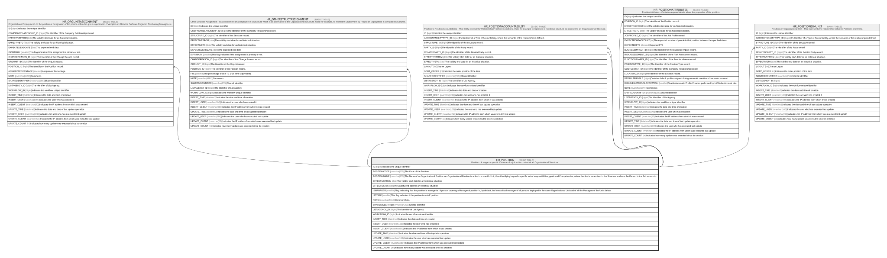

# HR_POSITION

## Description

Position - A single or specific instance of a job in the context of an Organizational Structure.  

## Columns

| Name | Type | Default | Nullable | Children | Comment |
| ---- | ---- | ------- | -------- | -------- | ------- |
| ID | bigint |  | false | [HR_ORGUNITASSIGNMENT](HR_ORGUNITASSIGNMENT.md) [HR_OTHERSTRUCTASSIGNMENT](HR_OTHERSTRUCTASSIGNMENT.md) [HR_POSITIONACCOUNTABILITY](HR_POSITIONACCOUNTABILITY.md) [HR_POSITIONATTRIBUTES](HR_POSITIONATTRIBUTES.md) [HR_POSITIONSINUNIT](HR_POSITIONSINUNIT.md) | Indicates the unique identifier |
| POSITIONCODE | nvarchar(255) |  | false |  | The Code of the Position. |
| POSITIONNAME | nvarchar(255) |  | false |  | The Name of an Organizational Position. An Organizational Position is a Job in a specific Unit, thus identifying beyond a specific set of responsibilities, goals and Competencies, where the Job is excercised in the Structure and who the Person in the Job reports to. |
| EFFECTIVEFROM | date |  | false |  | The validity start date for an historical situation. |
| EFFECTIVETO | date |  | true |  | The validity end date for an historical situation. |
| ISMANAGER | smallint |  | true |  | Flag indicating that the position is managerial. A person covering a Managerial position is, by default, the hierarchical manager of all persons deployed in the same Organizational Unit and of all the Managers of the Units below. |
| ISSTAFF | smallint |  | true |  | This flag indicates if the position is a staff position. |
| NOTE | nvarchar(MAX) |  | true |  | Comment field. |
| SHAREDIDENTIFIER | nvarchar(255) |  | true |  | Shared Identifier |
| LISTAGENCY_ID | bigint |  | true |  | The Identifier of List Agency. |
| WORKFLOW_ID | bigint |  | true |  | Indicates the workflow unique identifier |
| INSERT_TIME | datetime2 | (sysutcdatetime()) | false |  | Indicates the date and time of creation |
| INSERT_USER | nvarchar(100) | (N'MAIN') | false |  | Indicates the user who has created it |
| INSERT_CLIENT | nvarchar(50) | (N'localhost') | false |  | Indicates the IP address from which it was created |
| UPDATE_TIME | datetime2 | (sysutcdatetime()) | false |  | Indicates the date and time of last update operation |
| UPDATE_USER | nvarchar(100) | (N'MAIN') | false |  | Indicates the user who has executed last update |
| UPDATE_CLIENT | nvarchar(50) | (N'localhost') | false |  | Indicates the IP address from which was executed last update |
| UPDATE_COUNT | int | ((0)) | false |  | Indicates how many update was executed since its creation |

## Constraints

| Name | Type | Definition |
| ---- | ---- | ---------- |
| PK_POSITION | PRIMARY KEY | CLUSTERED, unique, part of a PRIMARY KEY constraint, [ ID ] |

## Indexes

| Name | Definition |
| ---- | ---------- |
| PK_POSITION | CLUSTERED, unique, part of a PRIMARY KEY constraint, [ ID ] |
| IDX_POSITION_POSITIONCODE | NONCLUSTERED, unique, [ POSITIONCODE ] |
| IDX_POSITION_SHAREDIDLIST | NONCLUSTERED, unique, [ SHAREDIDENTIFIER, LISTAGENCY_ID ] |

## Relations

---

> Generated by [tbls](https://github.com/k1LoW/tbls)
