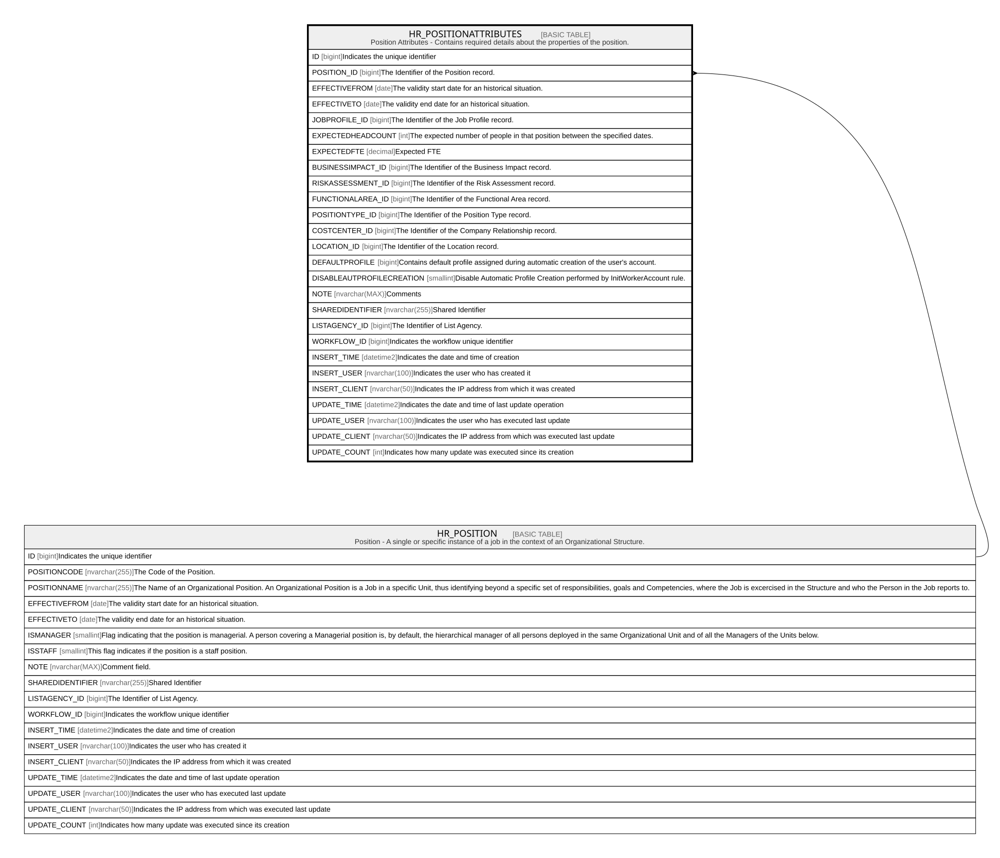

# HR_POSITIONATTRIBUTES

## Description

Position Attributes - Contains required details about the properties of the position.  

## Columns

| Name | Type | Default | Nullable | Parents | Comment |
| ---- | ---- | ------- | -------- | ------- | ------- |
| ID | bigint |  | false |  | Indicates the unique identifier |
| POSITION_ID | bigint |  | false | [HR_POSITION](HR_POSITION.md) | The Identifier of the Position record. |
| EFFECTIVEFROM | date |  | false |  | The validity start date for an historical situation. |
| EFFECTIVETO | date |  | true |  | The validity end date for an historical situation. |
| JOBPROFILE_ID | bigint |  | true |  | The Identifier of the Job Profile record. |
| EXPECTEDHEADCOUNT | int |  | true |  | The expected number of people in that position between the specified dates. |
| EXPECTEDFTE | decimal |  | true |  | Expected FTE |
| BUSINESSIMPACT_ID | bigint |  | true |  | The Identifier of the Business Impact record. |
| RISKASSESSMENT_ID | bigint |  | true |  | The Identifier of the Risk Assessment record. |
| FUNCTIONALAREA_ID | bigint |  | true |  | The Identifier of the Functional Area record. |
| POSITIONTYPE_ID | bigint |  | true |  | The Identifier of the Position Type record. |
| COSTCENTER_ID | bigint |  | true |  | The Identifier of the Company Relationship record. |
| LOCATION_ID | bigint |  | true |  | The Identifier of the Location record. |
| DEFAULTPROFILE | bigint |  | true |  | Contains default profile assigned during automatic creation of the user's account. |
| DISABLEAUTPROFILECREATION | smallint |  | true |  | Disable Automatic Profile Creation performed by InitWorkerAccount rule. |
| NOTE | nvarchar(MAX) |  | true |  | Comments |
| SHAREDIDENTIFIER | nvarchar(255) |  | true |  | Shared Identifier |
| LISTAGENCY_ID | bigint |  | true |  | The Identifier of List Agency. |
| WORKFLOW_ID | bigint |  | true |  | Indicates the workflow unique identifier |
| INSERT_TIME | datetime2 | (sysutcdatetime()) | false |  | Indicates the date and time of creation |
| INSERT_USER | nvarchar(100) | (N'MAIN') | false |  | Indicates the user who has created it |
| INSERT_CLIENT | nvarchar(50) | (N'localhost') | false |  | Indicates the IP address from which it was created |
| UPDATE_TIME | datetime2 | (sysutcdatetime()) | false |  | Indicates the date and time of last update operation |
| UPDATE_USER | nvarchar(100) | (N'MAIN') | false |  | Indicates the user who has executed last update |
| UPDATE_CLIENT | nvarchar(50) | (N'localhost') | false |  | Indicates the IP address from which was executed last update |
| UPDATE_COUNT | int | ((0)) | false |  | Indicates how many update was executed since its creation |

## Constraints

| Name | Type | Definition |
| ---- | ---- | ---------- |
| PK_POSITIONATTRIBUTES | PRIMARY KEY | CLUSTERED, unique, part of a PRIMARY KEY constraint, [ ID ] |
| FK_POSITIONATTRIBUTES_POSITION | FOREIGN KEY | FOREIGN KEY(POSITION_ID) REFERENCES HR_POSITION(ID) ON UPDATE NO_ACTION ON DELETE NO_ACTION |

## Indexes

| Name | Definition |
| ---- | ---------- |
| PK_POSITIONATTRIBUTES | CLUSTERED, unique, part of a PRIMARY KEY constraint, [ ID ] |
| IDX_POSITIONATTR_POSIDEFF | NONCLUSTERED, unique, [ POSITION_ID, EFFECTIVEFROM ] |
| IDX_POSITIONATTR_IMPACT | NONCLUSTERED, [ BUSINESSIMPACT_ID ] |
| IDX_POSITIONATTR_FUNAREA | NONCLUSTERED, [ FUNCTIONALAREA_ID ] |
| IDX_POSITIONATTR_POSTYPE | NONCLUSTERED, [ POSITIONTYPE_ID ] |
| IDX_POSITIONATTR_RISK | NONCLUSTERED, [ RISKASSESSMENT_ID ] |

## Relations

---

> Generated by [tbls](https://github.com/k1LoW/tbls)
