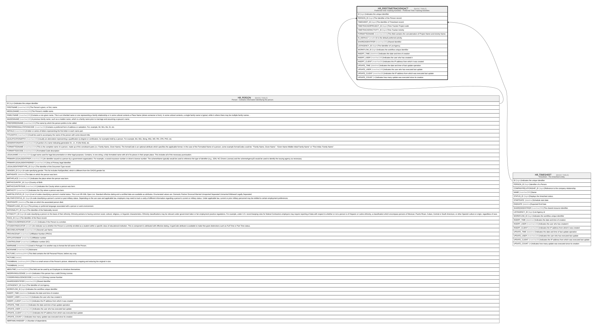

# HR_PREFTIMETRACKINGACT

## Description

Preferred Time Tracking Activities - Preferred Time Tracking Activities  

## Columns

| Name | Type | Default | Nullable | Parents | Comment |
| ---- | ---- | ------- | -------- | ------- | ------- |
| ID | bigint |  | false |  | Indicates the unique identifier |
| PERSON_ID | bigint |  | true | [HR_PERSON](HR_PERSON.md) | The Identifier of the Person record. |
| TIMESHEET_ID | bigint |  | true | [HR_TIMESHEET](HR_TIMESHEET.md) | The identifier of Timesheet record. |
| TIMETRACKERPROJECT_ID | bigint |  | true |  | Time Tracker Project code |
| TIMETRACKERACTIVITY_ID | bigint |  | true |  | Time Tracker Activity |
| FORMATTEDNAME | nvarchar(1024) |  | true |  | This field contains the concatenation of Project Name and Activity Name. |
| IS_DEFAULT | smallint |  | true |  | It is the default preferred activity. |
| SHAREDIDENTIFIER | nvarchar(255) |  | true |  | Shared Identifier |
| LISTAGENCY_ID | bigint |  | true |  | The Identifier of List Agency. |
| WORKFLOW_ID | bigint |  | true |  | Indicates the workflow unique identifier |
| INSERT_TIME | datetime2 |  | false |  | Indicates the date and time of creation |
| INSERT_USER | nvarchar(100) |  | false |  | Indicates the user who has created it |
| INSERT_CLIENT | nvarchar(50) |  | false |  | Indicates the IP address from which it was created |
| UPDATE_TIME | datetime2 |  | false |  | Indicates the date and time of last update operation |
| UPDATE_USER | nvarchar(100) |  | false |  | Indicates the user who has executed last update |
| UPDATE_CLIENT | nvarchar(50) |  | false |  | Indicates the IP address from which was executed last update |
| UPDATE_COUNT | int |  | false |  | Indicates how many update was executed since its creation |

## Constraints

| Name | Type | Definition |
| ---- | ---- | ---------- |
| PK_HR_PREFTIMETRACKINGACT | PRIMARY KEY | CLUSTERED, unique, part of a PRIMARY KEY constraint, [ ID ] |
| UQ_PREFTTACT | UNIQUE | NONCLUSTERED, unique, part of a UNIQUE constraint, [ PERSON_ID, TIMESHEET_ID, TIMETRACKERPROJECT_ID, TIMETRACKERACTIVITY_ID ] |
| FK_PREFTIMETRACKINGACT_PERSON | FOREIGN KEY | FOREIGN KEY(PERSON_ID) REFERENCES HR_PERSON(ID) ON UPDATE NO_ACTION ON DELETE NO_ACTION |
| FK_PREFTTGACT_TIMESHEET | FOREIGN KEY | FOREIGN KEY(TIMESHEET_ID) REFERENCES HR_TIMESHEET(ID) ON UPDATE NO_ACTION ON DELETE CASCADE |

## Indexes

| Name | Definition |
| ---- | ---------- |
| PK_HR_PREFTIMETRACKINGACT | CLUSTERED, unique, part of a PRIMARY KEY constraint, [ ID ] |
| UQ_PREFTTACT | NONCLUSTERED, unique, part of a UNIQUE constraint, [ PERSON_ID, TIMESHEET_ID, TIMETRACKERPROJECT_ID, TIMETRACKERACTIVITY_ID ] |

## Relations

---

> Generated by [tbls](https://github.com/k1LoW/tbls)
